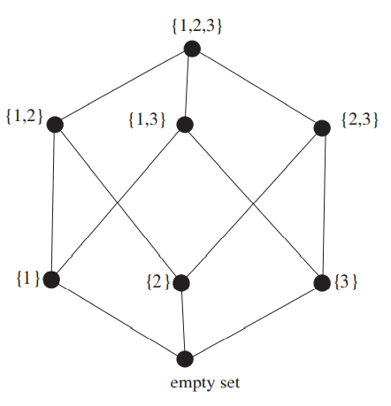

##  The Notion of Partially Ordered Set
假设你正在看航空公司的机票。除了机票的价格，时间也是需要考虑的因素。如果$X$航空公司提供的机票相较于$Y$航空公司的机票而言，既便宜时间又短，那么显然$X$是更好的选择。  
假设有如下五个航空公司的票可以选择
```
A 600 dollars, 9 hours 20 minutes,
B 650 dollars, 8 hours 40 minutes,
C 550 dollars, 9 hours 10 minutes,
D 575 dollars, 8 hours 20 minutes,
E 660 dollars, 9 hours 5 minutes.
```
$D$相比$E$是更好的选择，但是$C$和$D$之间就没有那么容易比较了。我们可以把整个场景表示成如下的图  
  
如果$X$比$Y$好，那么$X$在$Y$的上方，且有一条从$X$到$Y$的路径。  
这是一个偏序集合(`partially ordered set`)的例子。从名字我们可以看出，集合中的部分元素，不必是全部元素，可以相互比较。

**Definition 16.1.** 令$P$是一个集合，$\leq$是$P$上的关系，那么
(a) $\leq$是自反的，$x\leq x$  
(b) $\leq$是传递的，如果$x\leq y, y\leq z$，那么$x\leq z$  
(c) $\leq$是反对称的，如果$x\leq y, y\leq x$，那么$x=y$  
那么我们称$P_\leq =(P,\leq)$是偏序集，$\leq$是$P$上的偏序。  
如果在没有歧异的情况下，将$P_\leq$简写作$P$。如果$P$中的两个元素$x,y$，$x\leq y, y\leq$都不满足，我们称$x,y$是不可比较的。

**Example 16.2.** 令$P$是$[n]$的所有子集的集合。如果$A\subseteq B$，$A\leq B$。那么$P_\leq$是偏序集。记作$B_n$，称为$n$阶布尔代数。  
**Example 16.3.** 向量空间的所有子空间的集合，按照 containment（不确定应该翻译成啥） 排序，也是一个偏序集。  
**Example 16.4.** 令$P$是所有正整数的集合，如果$x$是$y$的因数，$x\leq y$，那么$P_\leq$是偏序集。  
**Example 16.5.** 令$P=\boldsymbol{R}$，即实数集。令$\leq$就是实数的比较运算。$P_\leq$是偏序集，且没有两个元素之间是不可比较的。我们称$R$是全序(`total order`)或链(`chian`)。  
**Example 16.6.** 令$P$是$[n]$所有分割的集合。令$\alpha,\beta$是$P$的两个元素，如果$\beta$的每一块都能由$\alpha$的一些集合取并集得到，$\alpha\leq\beta$。比如$n=6$时，$\{1,4\}\{2,3\}\{5\}\{6\}\leq\{1,4,6\}\{2,3,5\}$。$P_\leq$是偏序集，记作$\Pi_n$，称作`refinement order`。

如果$x\in P$，没有$y\in P$使得$x\leq y$，我们称$x$是极大值(`maximal element`)，如果对于所有的$z\in P$，都有$z\leq x$，那么$x$是最大值(`maximum`)。极小值(`minimal element`)和最小值(`minimum`)类似的定义。所有的偏序集都有极大值和极小值，但是不一定有最大值和最小值。比如图`16.1`就没有最大值和最小值。如果存在最小值，记作$\hat{0}$，如果存在最大值，记作$\hat{1}$。  
如果$x< y$，且不存在$z\in P$，使得$x<z<y$，称$y$覆盖(`cover`)$x$。这个概念可以帮助定义哈斯图(`Hasse diagrams`)，如前面的示例图。  
$P$的哈斯图是用顶点表示元素，如果$x<y$，那么$y$在$x$的上面。如果$y$覆盖$x$，$x,y$之间有一条边。如果要精确表示“上面”这个概念，可以使用有向图来表示。  
**Example 16.7.** $B_3$如下图所示  


哈斯图是可视化偏序集属性的工具，也能帮助判断两个很小的偏序集是否是同构的。如果存在一个双射$f:P\to Q$，任意两个$P$中的元素$x,y$，$x\leq_P y$成立当且仅当$f(x)\leq_Q f(y)$，那么两个偏序集$P,Q$是同构的。  
很容易验证只有一个一个元素的偏序集，两个两个元素的偏序集，五个三个元素的偏序集（如下图）和十六个四个元素的偏序集。  
  
**Example 16.5**定义了链。看一个有限集合$B_4$，子集的集合$\{\{2,3\},\{3\},\{1,2,3,4\}\}$是一个链，$\{3\}\leq\{2,3\}\leq\{1,2,3,4\}$。  
反链是链的对偶。如果子集$S\subseteq P$没有任何两个元素可以比较，那么$S$是反链(`antichain`)。例如$\{\{2,3\},\{1,3\},\{3,4\},\{2,4\}\}$是$B_4$的一个反链。  
链的任意子集也是链，反链的任意子集还是反链。偏序集的覆盖链(`chain cover`)是不相交的链的集合，它们的并集是偏序集本身。覆盖链的大小就是链的个数。直觉上，如果一个偏序集有一个很大的反链，那么它不可能被很少的链覆盖，反之亦然。下面的定理会给出一个精确的分析。  
如果$P$没有比$X$更大的链，那么$X$是$P$的最大链(`maximum`)。如果$X$不能被扩展，也就是无法不破坏链而增加新的元素，那么$X$是极大值(`maximal`)。反链也有类似定义。

**Theorem 16.8 (Dilworth's Theorem).** 对于有限偏序集$P$，任意最大反链的大小等于任意最小覆盖链中链的数量。  
**Proof.** 令$P$中最大的反链$A$大小是$a$，$P$的最小覆盖链的大小是$b$。显然$a\leq b$，因为覆盖链必须包含反链的每一个元素。  
下面证明反向的情况。如果$P$最大的反链的大小是$k$，那么$P$能够被分解成$k$个链的并集。基于$P$的元素的个数$n$来递归证明。$n=1$时显然成立。假设对于小于$n$的时候都成立。下面分两种情况讨论。  
(1) $P$的最大反链$A$至少包含一个非极大值和一个非极小值。那么可以根据$A$把$P$分成两个部分，$U$中的元素大于等于至少一个$A$中的元素，$L$中的元素小于等于至少一个$A$中的元素。那么$U\cap L=A$。由于$A$包含非极大值和非极小值，那么$U,L$都不是空集，也都是偏序集。此外，它们元素的个数都小于$n$，根据假设，它们有都可以分解成$k$个链的并集。$U$中的$k$个链的每一个，都对应有$A$中$k$个元素之一，位于其下方（小于等于$U$中的链）；类似的，$L$中的$k$个链的每一个，都有对应的$A$中的元素位于其上方。那么这$2k$个链可以组成$k$链，覆盖$P$。  
(2) 第二种情况就是和(1)相反，也就是说$P$的最大反链只包含极大值或者只包含极小值。隐含着反链包含所有的最大值或者所有的最小值。令$x$是$P$的极小值，$y$是$P$的极大值，存在一对这样的值有$x\leq y$。如果$P$自身是反链的话，这里的关系是$x=y$。从$P$中删除$x,y$得到$P'$，其最大反链有$k-1$个元素，因为其没能包含$P$中所有的极大值或者极小值。由于$P'$的元素个数小于$n$，根据假设，可以分解成$k-1$个链的并集。加上$x\leq y$，那么$P$就能分解成$k$个链的并集。

偏序集$P$最大反链的大小被称为$P$的宽度(`width`)。  
如果$P$是有$n$个元素的偏序集，$P$的线性延伸(`linear extension`)是在集合$[n]$上保持有序性(`order-preserving`)的$P$的双射。也就是说，如果在$P$中$x\leq y$，那么$f(x)\leq f(y)$。

**Example 16.9.** 下图的左边的偏序集展示了两个线性延伸，$f,g$，因为$f(A)=g(A)=4,f(D)=g(D)=1,f(B)=g(C)=2,f(C)=g(B)=3$。右边的偏序集有四个线性延伸，上面两个点$E,F$可以是$3,4$中的一个，同理下面的$G,H$可以是$1,2$中的一个。  

