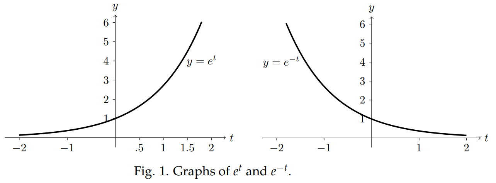

Of primary importance in this course is the exponential function
$$x(t)=e^{at}$$
where $a$ is a constant. We will assume you are completely familiar with the properties and graphs of this function.

### Properties
1. $e^0=1$
2. $e^{at+c}=e^ce^{at}$
3. $e^{at}$ is never 0
4. If $a>0$, then $\lim_{t \to \infty} e^{at}=\infty$ and $\lim_{t \to -\infty} e^{at}=0$
5. If $a<0$, then $\lim_{t \to \infty} e^{at}=0$ and $\lim_{t \to -\infty} e^{at}=\infty$
6. For any positive $a, e^{at}$ grows much faster than any polynomial. Examples
$$\lim_{t \to \infty} e^t/t^3=\infty, \lim_{t \to \infty} te^{-t}=0$$

### Graphs

