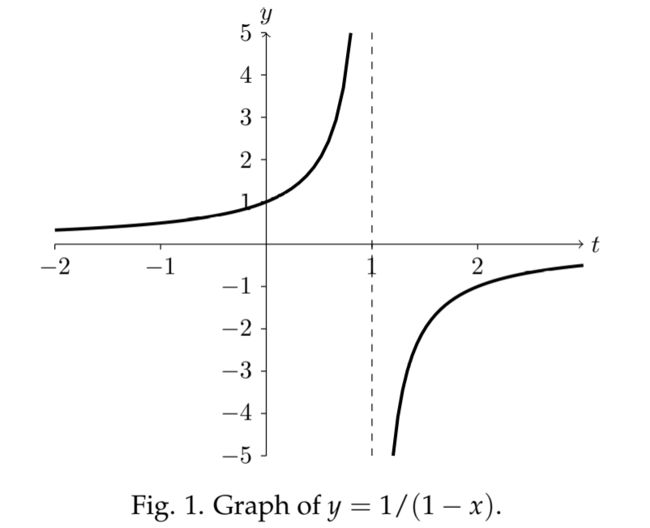

**Example 1.** Solve the IVP $y'=y^2, y(0)=1$.  
**Solution.** We can solve this using separation of variables.
Separate: $\frac{dy}{y^2}=dx$  
Integrate: $-\frac{1}{y}=x+C$  
Solve for $y$: $y=-1/(x+C)$  
Find $C$ using the IC: $y(0) = 1 = -1/C$, therefore $C = -1$.  
Solution: $y=-1/(x-1)=1/(1-x)$  
The graph has a vertical asympote at $x = 1$.  
  
Starting at $x = 0$ the graph goes to infinity as $x \rarr 1$. Informally, we say $y$ *blows up at* $x = 1$. The graph has two pieces. One is defined on $(-\infty, 1)$ and the other is defined on $(1, \infty)$. For technical reasons we prefer to say that we actually have *two* solutions to the DE. We indicate this by carefully specifying the domain of each.
$$y(x) = 1/(1 - x) \text{ $x$ in the interval } (-\infty, 1)\tag{1}$$
$$y(x) = 1/(1 - x) \text{ $x$ in the interval } (1, \infty)\tag{2}$$
Thus, the solution to the IVP in this example is solution $(1)$.  
The rule being followed here is that *solutions* to ODE's *have domain consisting of a single interval*. The example shows one reason for this: starting at $(0, 1)$ on solution $(1)$ there is no way to follow the solution continuously to solution $(2)$.
