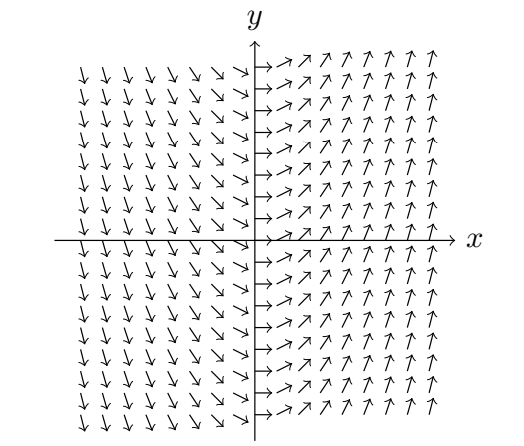
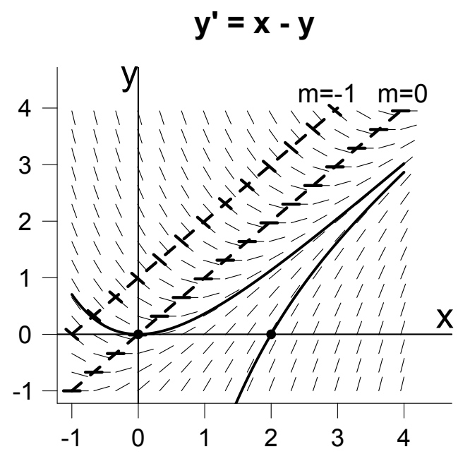

Graphical methods are based on the construction of what is called a *direction field* for the equation $y' = f(x, y)$. To get this, we imagine that through each point $(x, y)$ of the plane is drawn a little line segment whose slope is $f(x, y)$.  
**Example.** $\frac{dy}{dx}=2x$.  
  
Notice that the slope $f(x, y)$ does not depend on $y$ here. It is invariant under vertical translation.  
In practice, the segments are drawn in at a representative set of points in the plane; if a computer draws them, the points are (usually) evenly spaced in both directions. If drawn by hand, however, they are not, because a different procedure is used, better adapted to human speed. To construct a direction field by hand, draw in lightly (or in dashed lines) what are called the **isoclines** for the equation $y' = f(x, y)$. These are the one-parameter family of curves given by the equations
$$f (x, y) = m, m \text{ constant}$$
Along a given isocline, the line segments all have the same slope $m$; this makes it easy to draw in those line segments, and you can put in as many as you want. (Note: "iso-cline" = "equal slope".)  
**Example.** The figure below shows a direction field for the equation
$$y' = x - y$$
The isoclines are the lines $x - y = m$, two of which are shown in dashed lines, corresponding to the values $m = 0, -1$.  
  
The $m = 0$ isocline is of special interest, as the  direction field is horizontal along it; it is called the nullcline.  
Once you have sketched the direction field for the equation $y' = f (x, y)$ by drawing some isoclines and drawing in little line segments along each of them, the next step is to draw in (with a solid line) curves which are at each point tangent to the line segment at that point. Such curves are called integral curves or solution curves for the direction field. Their significance is this:  
*The integral curves are the graphs of the solutions to* $y' = f (x, y)$.  
By definition, this is the curve $y = y(t)$ defined so that its slope at the point $(x, y)$ is $f (x, y)$.  
Two integral curves (in solid lines) have been drawn for the equation $y' = x - y$. Notice they have the same slope as the direction field at every point they pass through.  
**Remark.** While it is not compulsory to use light or dashed lines for isoclines, and solid lines for integral curves, it is a very good habit, especially when working by hand.
