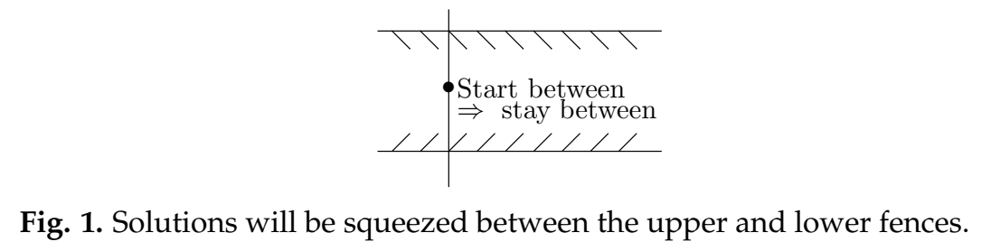

In the video on the Isoclines applet we studied some of the features of the long-term behavior of the integral curves; among others, the terms fence, funnel and separatrix were introduced.  
Fences and funnels are used to find out for certain where trajectories go at scales you can't see: small scales (where the picture is too small to decide on crossings) and the largest scales (off the screen) that are relevant to long-term behavior. Let us start by defining what a fence is.

### Fences
A lower fence for the equation $y' = f(x, y)$ is a curve that 'blocks' an integral curve from crossing from above. To find such a fence look for a curve so that all the direction field elements along the curve point up from it. The figure below shows two curves with the direction field sketched along them. The lower curve is a lower fence. Since any integral curve crossing the fence must cross tangent to the slope field it cannot cross it from above.  
Likewise an **upper fence** is a curve that blocks integral curves from crossing from below.  
  
Technically a lower fence is a curve $y = L(x)$ such that $L'(x) < f(x, L(x))$. (This may look difficult, but it just says the slope of the curve is always less than the slope of the direction field at each point.)  
**Remark 1.** Fences needn't be defined for all $x$; for instance, they could be defined only on an interval. The best sort of fences for understanding long-term behavior are defined for all $x \geq c$, for a fairly small constant $c$.  
**Remark 2.** Since integral curves can't cross an integral curve itself is both an upper and a lower fence.  
**Remark 3.** Of course, there are many ways of constructing pieces of fences. Two of the most useful are using pieces of isoclines and using straight line segments.  
**Example.** In the isoclines applet video we found fences for the equation
$$y' = y^2 - x$$
Here is a screenshot showing the isoclines $m = 0$ and $m = -1$ and some integral curves. (The isoclines are the yellow, sideways pointing parabolas.)  
  
Notice that the bottom half of the isocline $m = 0$ is a lower fence and for $x$ large enough the bottom half of the isocline $m = -1$ is an upper fence.  
Notice the bottom half of the isocline $m = -1$ becomes an upper fence only for $x$ is large enough. If you look carefully you'll see one of the integral curves crossing it from above near $x = 1$.

### Funnels
An important use of fences is to construct funnels. A **funnel** for the equation $y' = f(x, y)$ consists of a pair of fences; one lower fence $L(x)$ and one upper fence $U(x)$, with the properties:
1. For $x$ large the lower fence is below the upper fence, i.e. $L(x) < U(x)$.
2. The two fences come together asymptotically, i.e. $U(x) - L(x)$ is small for large $x$.

In figure 2 above the bottom parts of the two isoclines $m = 0$ and $m = -1$ act as a funnel once $x$ is large enough. (It is clear from the picture that $x > 2$ will work.) Thus the integral curves that end up between them are trapped there. The bottom half of the isocline $m = 0$ is $y = -\sqrt{x}$ and the bottom half of $m = -1$ is $y = -\sqrt{x - 1}$. Thus, for the solutions between them we have the highly accurate estimates
$$-\sqrt{x}<y(x)<-\sqrt{x-1}$$
which is valid for large $x$.  
**Exercise.** Use algebra to show that $U(x) = -\sqrt{x-1}$ and $L(x) = -\sqrt{x}$ satsify the 'funnel condition' $U(x)-L(x) \rarr 0$ as $x\rarr \infty$.  
**Solution.**
$$\lim_{x \to \infty} -\sqrt{x-1}-(-\sqrt{x})=\lim_{x \to \infty} \frac{1}{\sqrt{x}+\sqrt{x-1}}=0$$
**Caution.** Not all pairs of 'close' upper/lower fences form a funnel. For example, if figure 2 the upper and lower branches of the isocline $m = 0$ are upper and lower fences. So solutions that lie between them, stay between them. It is not a funnel, because the two curves don't come asymptotically together as $x$ gets large.  
Here is another example. Consider the differential equation $y' = x - 2y$. (This is one of the ones available on the isoclines applet.) One upper fence is the nullcline, with equation $y = x/2$; one lower fence is the $m = 2$ isocline, with equation $y = x/2-1$. These two fences do not form a funnel: they are parallel, at constant distance one apart.

### Separatrices
**Definition.** A **separatrix** is an integral curve such that integral curves above it behave entirely differently from integral curves below it as $x$ increases to infinity.  
**Example.** In the isoclines applet video, we saw that there was one special solution, which as time increases just gets closer and closer to the upper branch of the nullcline - that is, to the function $y = \sqrt{x}$. All solutions below it are eventually asymototic to $y = -\sqrt{x}$, while all solutions above it take off for $+\infty$ at some point. This integral curve is called a **sepatratrix**. On the screenshot in figure 2 the sepatratrix is marked with red dots.  
The name *separatrix* comes from the fact that it separates solutions with radically different behavior.
