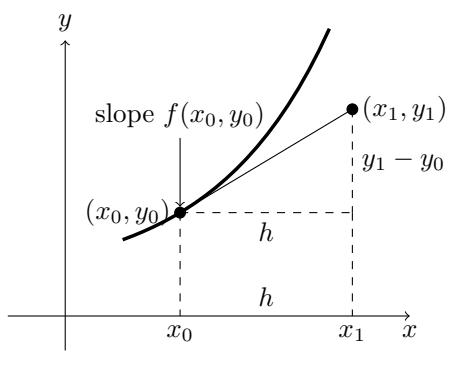
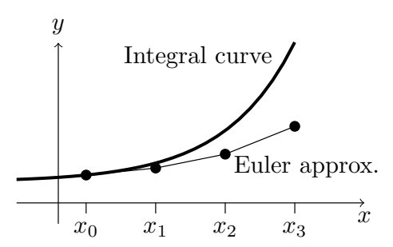

### What Would One Use Numerical Methods For?
The graphical methods described in the previous session give one a quick feel for how the solutions to a differential equation behave; they can also be very accurate at predicting long-term behaviour, e.g. in the presence of funnels. However, when the 'medium range' solutions must be known accurately, and the equation cannot be solved exactly, numerical methods are usually the best option.
Also, even when an equation can be solved with an exact formula, it still might not be straightforward to compute values of a solution. For example, the equation $y' = y$ with initial condition $y(0) = 1$ can be solved exactly: $y(x) = e^x$. The number $e$ is the value $y(1)$. But how do you find out that in fact $e = 2.718282828459045...$? Here, too, you would use some kind of numerical methods. For ODE's the simplest numerical method is called **Euler's method**.

### Review: The Tangent Line Approximation
Consider a function $y(x)$, and a point $(a, y(a))$ on its graph. Call $T_a(x)$ the function describing the tangent line to the graph at this point, The slope of the tangent line is $y'(a)$ and it satisfies the equation
$$T_a(a+h)=y(a)+y'(a)\cdot h$$
Suppose we are given a differential equation $y' = f(x, y)$, with initial condition $y(a) = c$. One simple way to approximate $y$ near $a$ is to use the tangent line at $a$:
$$y(a+h)\approx y(a)+y'(a)\cdot h$$
For example, consider the differential equation $y' = y$, with initial condition $y(0) = 1$. The tangent line approximation gives:
$$y(1)\approx y(0)+y'(0)\cdot 1=1+1=2$$
Of course, we know $y(x) = e^x$, so $y(1) = e \approx 2.718$. So, our estimate of 2 is rather crude. Suppose instead we were trying to approximate $\sqrt{e}(= 1.649...)$. We get
$$\sqrt{e}=y(1/2)\approx y(0)+y'(0)\cdot 0.5=1+0.5=1.5$$
a better estimate. Graphically, we can see the tangent line separates from the curve. The bigger the step $h$ in the $x$ direction the farther away the tangent line is from the curve.  
The point is that the tangent line approximation works best for small $h$. The idea behind Euler's method is to use a sequence of successive tangent line approximations, each of them with a fairly 'small' $h$.

### Euler's method
We want to estimate the solution (integral curve) to $y' = f(x, y)$ passing through $(x_0, y_0)$. It is shown as a curve in the picture. We first choose a step size, denoted $h$. Starting at $(x_0, y_0)$ we approximate the integral curve over the interval $[x_0, x_0 + h]$ by the tangent line, which has slope $f(x_0, y_0)$. (This is the slope of the integral curve, since $y' = f(x, y)$.) This takes us as far as the point $(x_1, y_1)$, which is calculated by the equations (see the picture)
$$x_1=x_0+h,y_1=y_0+hf(x_0,y_0)$$
  
Now we are at $(x_1, y_1)$. We repeat the process, using as the new approximation to the integral curve the line segment having slope $f(x_1, y_1)$. This takes us as far as the next point $(x_2, y_2)$, where
$$x_2=x_1+h,y_2=y_1+hf(x_1,y_1)$$
We continue in the same way. The general formulas telling us how to get from the $(n - 1)$-st point to the $n$-th point are
$$x_n=x_{n-1}+h,y_n=y_{n-1}+hf(x_{n-1},y_{n-1})\tag{1}$$
In this way, we get an approximation to the integral curve consisting of line segments joining the points $(x_0, y_0), (x_1, y_1), \ldots$ as shown in the figure below.  
  
We will call the line segments "Euler struts", and their union the Euler polygon. It is an approximation to the integral curve $y = y(x)$.  
In doing a few steps of Euler's method by hand, as you are asked to do in some of the exercises to get a feel for the method, it's best to arrange the work systematically in a table.  
**Example.** For the IVP: $y' = x^2 - y^2, y(1) = 0$, use Euler's method with step size 0.1 to find $y(1.2)$.  
**Solution.** We use $f(x, y) = x^2 - y^2, h = 0.1$, and $(1)$ above to find xn and $y_n$.  
|n|$x_n$|$y_n$|$f(x_n,y_n)$|$hf(x_n,y_n)$|
|---|---|---|---|---|
|0|1|0|1|0.1|
|1|1.1|0.1|1.20|0.12|
|2|1.2|0.22|||
