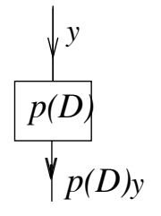

The general linear ODE of order $n$ for a function $y = y(t)$ can be written as
$$y^{(n)} + p_1(t)y^{(n-1)} + \ldots + p_n(t)y = q(t)\tag{1}$$
From now on we will consider only the case where $(1)$ has constant coefficients. This type of ODE can be written as
$$y^{(n)} + a_1(t)y^{(n-1)} + \ldots + a_n(t)y = q(t)\tag{1}$$
or, as we have seen, much more compactly using the differentiation operator $D=\frac{d}{dt}$:
$$p(D)y=q(t)$$
where
$$p(D)=D^n+a_1D^{n-1}+\ldots+a_n$$
We call $p(D)$ a polynomial differential operator with constant coefficients. We think of the formal polynomial $p(D)$ as operating on a function $y(t)$, converting it into another function; it is like a black box, in which the function $y(t)$ goes in, and $p(D)y$ comes out.  
  
The reason for introducing the polynomial operator $p(D)$ is that this allows us to use polynomial algebra to simplify, streamline and extend our calculations for solving ODE's. Throughout this session we use the notation of equation $(4)$:
$$p(D)=D^n+a_1D^{n-1}+\ldots+a_n, a_i \text{ constants}\tag{4}$$
