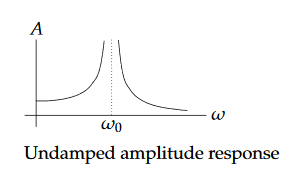
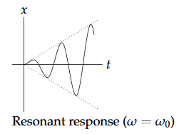

We now look at the pure resonant case for a second-order LTI (Linear Time Invariance) DE. We will use the language of spring-mass systems in order to interpret the results in physical terms, but in fact the mathematics is the same for any second-order LTI DE for which the coefficient of the first derivative is equal to zero.

The problem is thus to find a particular solution the DE
$$
x''+\omega_0^2x=\cos \omega t\tag{1}
$$
Complex replacement:
$$
z''+\omega_0^2z=e^{i\omega t}\\
x=Re(z)
$$
Characteristic polynonial:
$$
p(s)=s^2+\omega_0^2\\
p'(s)=2s\\
p(i\omega)=\omega_0^2-\omega^2\\
p'(i\omega)=2i\omega
$$
Exponential Response formula:
$$
z_p=\begin{cases}
\frac{e^{i\omega t}}{p(i\omega)}&=\frac{e^{i\omega t}}{\omega_0^2-\omega^2}&\text{if }\omega\neq\omega_0\\
\frac{te^{i\omega t}}{p'(i\omega)}&=\frac{te^{i\omega t}}{2i\omega}&\text{if } \omega=\omega_0
\end{cases}\\
x_p=\begin{cases}
\frac{\cos \omega t}{\omega_0^2-\omega^2}&\text{if }\omega\neq\omega_0\\
\frac{t\sin \omega_0 t}{2\omega_0}&\text{if } \omega=\omega_0
\end{cases}
$$

### Resonance and amplitude response of the undamped harmonic oscillator

In $x_p$ the amplitude $=A=A(\omega)=\vert\frac{1}{\omega_0^2-\omega^2}\vert$ is a function of $\omega$.  
The plot below shows $A$ as a function of $\omega$. Note, it is similar to the damped amplitude response except the peak is infinitely high. As $\omega$ gets closer to $\omega_0$ the amplitude increases.
Tplot is output amplitude vs. input frequency.  

When $\omega=\omega_0$ we have $x_p=\frac{t\sin \omega t}{2\omega_0}$. This is called *pure resonance* (like a swing). The frequency $\omega_0$ is called the *resonant* or *natural* frequency of the system.  
In the plot below notice that the response is oscillatory but not periodic. The amplitude keeps growing in time (caused by the factor of $t$ in $x_p$).   
The plot is output vs. time (for a fixed input frequency).  

### Reconciling the Resonant and Non-resonant Solutions
Let's find another particular solution to $(1)$.
$$
x_c=\frac{\cos \omega_0t}{\omega_0^2-\omega^2}
$$
is a complementary solution because it is the solution to the associated homogeneous equation.

$x_p-x_c$ still is a particular solution to $(1)$, so a new particular solution is
$$
x_p=\frac{\cos \omega t}{\omega_0^2-\omega^2}-\frac{\cos \omega_0t}{\omega_0^2-\omega^2}
$$

When $\omega$ goes to $\omega_0$,
$$
\begin{aligned}
&\lim_{\omega \to \omega_0} \frac{\cos \omega t}{\omega_0^2-\omega^2}-\frac{\cos \omega_0t}{\omega_0^2-\omega^2}\\
&=\lim_{\omega \to \omega_0} \frac{-\omega\sin \omega t}{-2\omega}\tag*{L'Hôpital's rule}\\
&=\frac{t\sin \omega_0 t}{2\omega_0}
\end{aligned}
$$
Notes, the variable is $\omega$ not $t$.
