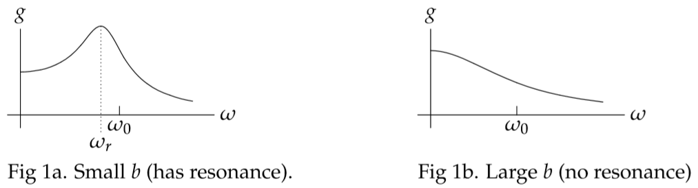
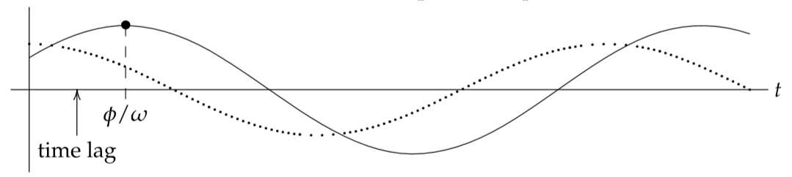

In the previous note in this session we found the periodic solution to the equation
$$mx''+bx'+kx=B\cos \omega t\tag{1}$$
The solution was $x_p=gB\cos (\omega t - \phi)$ , where $g$ is the gain
$$
g=g(\omega)=\frac{1}{\sqrt{(k-m\omega^2)^2+(b\omega)^2}}\tag{2}
$$
and $\phi$ is the phase lag
$$
\phi=\phi(\omega)=Arg(p(i\omega))=\tan^{-1}(\frac{b\omega}{k-m\omega^2})\tag{3}
$$

The gain or amplitude response is a function of $\omega$. It tells us the size of the system's response to the given input frequency. If the amplitude has a peak at $\omega_r$ we call this the **practical resonance frequency**. If the damping $b$ gets too large then, for the system in equation $(1)$, there is no peak and, hence, no practical resonance. The following figure shows two graphs of $g(\omega)$, one for small $b$ and one for large $b$.  

### Finding the Practical Resonant Frequency
We now turn our attention to finding a formula for the practical resonant frequency -if it exists-of the system in $(1)$. Practical resonance occurs at the frequency $\omega_r$ where $g(\omega)$ has a maximum. For the system $(1)$ with gain $(2)$ it is clear that the maximum gain occurs when the expression under the radical has a minimum. Accordingly we look for the minimum of
$$f(\omega)=(k-m\omega^2)^2+b^2\omega^2$$
Setting $f'(\omega)=0$ and solving gives 
$$
f'(\omega)=-4m\omega(k-m\omega^2)+2b^2\omega=0
$$
$$
\omega=0 \text{ or }m^2\omega^2=mk-b^2/2
$$
We see that if $mk-b^2/2>0$ then there is a practical resonant frequency
$$
\omega_r=\sqrt{\frac{k}{m}-\frac{b^2}{2m^2}}
$$

### Phase Lag
In the picture below the dotted line is the input and the solid line is the response.
The damping causes a lag between when the input reaches its maximum and when the output does. In radians, the angle $\phi$ is called the phase lag and in units of time $\phi/\omega$ is the time lag.  

