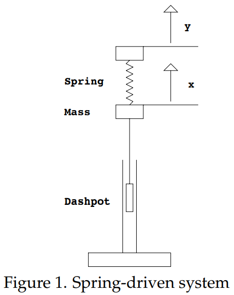

The figure below shows a spring-mass-dashpot system that is driven through the spring.  

Suppose that $y$ denotes the displacement of the plunger at the top of the spring and $x(t)$ denotes the position of the mass, arranged so that $x = y$ when the spring is unstretched and uncompressed. There are two forces acting on the mass: the spring exerts a force given by $k(y - x)$ (where $k$ is the spring constant) and the dashpot exerts a force given $by - bx'$ (against the motion of the mass, with damping coefficient $b$). Newton's law gives
$$mx''=k(y-x)-bx'$$
or, putting the system on the left and the driving term on the right,
$$mx''+bx'+kx=ky\tag{1}$$
In this example it is natural to regard $y$, rather than the right-hand side $q = ky$, as the input signal and the mass position $x$ as the system response. Suppose that $y$ is sinusoidal, that is,
$$y=B_1\cos \omega t$$
Then we expect a sinusoidal solution of the form 
$$x_p=A\cos (\omega t-\phi)$$

By definition the *gain* is the ratio of the amplitude of the system response to that of the input signal. Since $B_1$ is the amplitude of the input we have $g = A/B_1$.

In the previous note in this session, we worked out the formulas for $g$ and $\phi$, and so we can now use them with the following small change. The $k$ on the right-hand-side of equation $(1)$ needs to be included in the gain (since we don't include it as part of the input). We get
$$
g(\omega)=\frac{A}{B_1}=\frac{k}{\left\lvert p(i\omega)\right\rvert}=\frac{k}{\sqrt{(k-m\omega^2)^2+(b\omega)^2}}
$$
$$
\phi(\omega)=\tan^{-1}(\frac{b\omega}{k-m\omega^2})
$$

Note that the gain is a function of $\omega$, i.e. $g = g(\omega)$. Similarly, the *phase lag* $\phi=\phi(\omega)$ is a function of $\omega$. The entire story of the steady state system response $x_p=A\cos (\omega t-\phi)$ to sinusoidal input signals is encoded in these two functions of $\omega$, the gain and the phase lag.  
We see that choosing the input to be $y$ instead of $ky$ scales the gain by $k$ and does not affect the phase lag.  
The factor of $k$ in the gain does not affect the frequency where the gain is greatest, i.e. the practical resonant frequency. From the previous note in this session we know this is 
$$
\omega_r=\sqrt{\frac{k}{m}-\frac{b^2}{2m^2}}
$$
