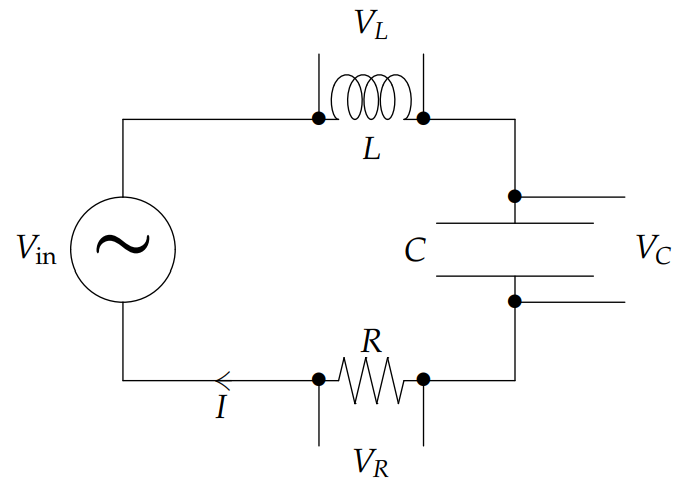

### Simple circuit physics
The picture at right shows an inductor, capacitor and resistor in series with a driving voltage source.  
  
* $I(t)$ is the current in the circuit in amps.
* $L$ is the inductance in henries.
* $R$ is the resistance in ohms.
* $C$ is the capacitance in farads.
* $V_{in}$ is the input voltage to the circuit.
* $Q(t)$ is the charge on the capacitor, so $I(t) = Q'(t)$.

From physics we get that the voltage drops across each of the circuit elements.
$$V_L=LI'=LQ'',V_R=RI=RQ',V_C=\frac{Q}{C}$$
The amazing thing is that this and Kirchhoff's voltage law (KVL) is all the physics we need to understand this circuit. The rest is linear CC DE's and complex arithmetic. (KVL says that the net voltage drop around any closed loop is 0.)

### Summary of the this Session
We start with a summary of the physics and DE's covered in this session. Explanations will be given below and in the next note.  
*Compatible Units:* The units given with the circuit diagram above are compatible and we will assume throughout that we are using them.  
*Voltage Drops:* $LI', RI, Q/C$. (We will just accept these from the physicists.)  
*DEs:* Using the KVL and the voltage drops descibed above we get all of the following physically equivalent DE's.
$$LQ''+RQ'+\frac{1}{C}Q=V_{in}\tag{1}$$
$$LI''+RI'+\frac{1}{C}I=V_{in}'\tag{2}$$
$$LV_C''+RV_C'+\frac{1}{C}V_C=\frac{1}{C}V_{in}\tag{3}$$
$$LV_R''+RV_R'+\frac{1}{C}V_R=\frac{1}{R}V_{in}'\tag{4}$$
*Complex Replacement:* If $x$ is a real number or function, we will use the following notational convention here: $\tilde{x}$ will be a *complex replacement* for $x$, in the same sense that we have use this term before, namely, $\tilde{x}$ is complex, and $x$ is the real or imaginary part of $\tilde{x}$ depending on whether the input was cosine or sine.  
*Complex Impedance:* (valid when $\tilde{V}_{in} = e^{i\omega t}$)
$$\tilde{Z}_L=iL\omega,\tilde{Z}_R=R,\tilde{Z}_C=\frac{1}{iC\omega}$$
Total impedance =$\tilde{Z}=\tilde{Z}_L+\tilde{Z}_R+\tilde{Z}_C=R+i(\omega L+1/\omega C)$  
*Complex Ohm's Law:* $\tilde{V}_{in}=\tilde{Z}\tilde{I},\tilde{V}_L=\tilde{Z}_L\tilde{I},\tilde{Z}_R=\tilde{Z}_R\tilde{I},\tilde{V}_c=\tilde{Z}_C\tilde{I}$  
*Phasors:* All the output voltages are plotted in the complex plane as a rigid set of vectors that rotate at frequency $\omega$. $V_R$ and $\tilde{I}$ point in the same direction, $\tilde{V}_L$ leads $\tilde{I}$ by $\pi/2$, $\tilde{V}_C$ lags $\tilde{I}$ by $\pi/2$. $\tilde{I}$ either leads or lags $\tilde{V}_{in}$ by $\phi = \tan^{-1}((L\omega - 1/(C\omega))/R)$.  
*Reactance and real impedance:*  
Reactance = $S=\omega L-1/\omega C \rArr \tilde{Z}=R+iS$  
Real impedance = $|\tilde{Z}|=\sqrt{R^2+S^2}=\sqrt{R^2+(\omega L-1/\omega C)^2}$  
If $V_{in}=E_0\sin \omega t$ then from $\tilde{V}_{in}=\tilde{Z}\tilde{I}$ we get $I=\frac{E_0}{|\tilde{Z}|}\sin(\omega t- \phi)$, with the phase angle $\phi=\tan^{-1}(S/R)$.  
*Practical resonance:* In equations $(2)$ and $(4)$ the practical resonance is always at the natural frequency $\omega_0=1/\sqrt{LC}$

### The Differential Equations
First, let's justify the differential equations 1-4. KVL implies the total voltage drop around the circuit has to be 0. If we follow the current $I$ clockwise around the circuit adding up the voltage drops, we get the basic equation
$$LI'+RI+\frac{1}{C}Q-V_{in}=0\tag{5}$$
here we've assume that the input provides a voltage gain. We can replace $I$ by $Q'$ in $(5)$ to get equation $(1)$. If we differentiate $(5)$ and replace $Q'$ by $I$ we get $(2)$. Now multiply $(1)$ by $1/C$ to get $(3)$ and multiply $(2)$ by $R$ to get $(4)$.

### The Electro-Mechanical Analogy
Notice that equation $(3)$ has the same form as the DE forthe spring-mass system driven through the spring. That is, if you substitute $m, b, k$ and $x$ for $L, R, 1/C, VC$ in $(3)$ and call $V_{in}$ the input then you have the equation for the spring-mass system driven through the spring. Likewise equation $(4)$ has the same form as the spring-mass system driven through the dashpot.  
Thus, ignoring their interpretations as voltage instead of postion, the outputs $V_C$ and $V_R$ behave exacly like the position $x$ of the mass driven through the spring and dashpot respectively.

### Resistance
Ohm's law is most often given for the voltage $V_R = IR$ across a resistor. Recall: Two resistances $R_1$ and $R_2$ combine to give an equivalent resistance $R$. For $R_1, R_2$ in series $R = R_1 + R_2$, and in parallel $\frac{1}{R}=\frac{1}{R_1}+\frac{1}{R_2}$.
