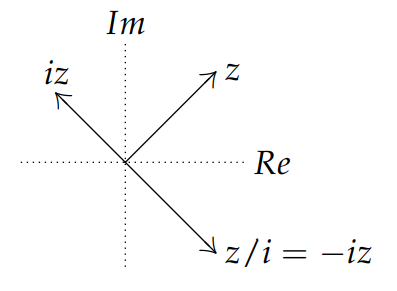
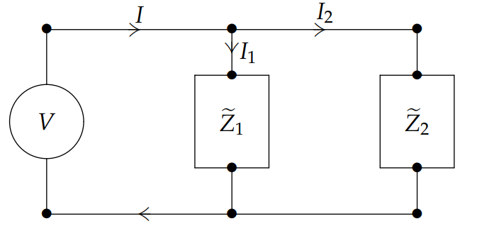
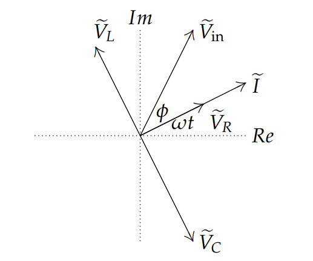

### Simple Complex Arithmetic Fact
You should be clear that in the complex plane multiplication by $i$ is the same as rotation by $\pi/2$. Likewise division by $i$ is the same as rotation by $-\pi/2$.  
The phase difference between two complex numbers $a$ and $b$ is simply the difference of their arguments, $Arg(a) - Arg(b)$. The simple arithmetic fact implies
$$z\text{ and }iz\text{ have a phase difference of }\pi/2\\
z\text{ and }z/i\text{ have a phase difference of }-\pi/2\tag{1}$$

### Complex Impedance
We repeat for reference some of the DE's given in the previous note.
$$LQ''+RQ'+\frac{1}{C}Q=V_{in}\tag{2}$$
$$LI''+RI'+\frac{1}{C}I=V_{in}'\tag{3}$$
Using complex arithmetic and the Exponential Response formula we can understand all the statements about impedance and phasors.  
First, note that if we remove the inductor and capacitor then $(2)$ is just Ohm's law, i.e. $RQ'=RI=V_{in}$.  
Now we make the crucial assumption of sinusoidal input (alternating current):
$$V_{in}(t)=V_0\sin \omega t$$
With this input we will solve equation (3).

First, complexify $(3)$: (Because of the tildes ($\tilde{I}$) we use prime instead of dot to indicate derivatives.)
$$L\tilde{I}''+R\tilde{I}'+\frac{1}{C}\tilde{I}=\tilde{V}_{in}'=i\omega V_0e^{i\omega t}, I=\text{Im}(\tilde{I})$$
The Exponential Response formula gives the periodic solution:
$$\tilde{I}=\frac{i\omega V_0}{P(i\omega)}e^{i\omega t}\tag{4}$$
A little algebra shows that the coefficient of $V_0e^{i\omega t}$ in $(4)$ is
$$\frac{i\omega}{P(i\omega)}=\frac{i\omega}{-L\omega^2+1/C+Ri\omega}=\frac{1}{iL\omega+1/iC\omega+R}$$
Accordingly we define the **complex impedance** as
$$\tilde{Z}=iL\omega+1/iC\omega+R\tag{5}$$
(Notice $\tilde{Z}$ depends on the input frequency $\omega$.)

We can now write the complex version of Ohm's law (always assuming $\tilde{V}_{in}=V_0e^{i\omega t}$):
$$\tilde{I}=\frac{1}{\tilde{Z}}\tilde{V}_{in}\text{ or }\tilde{V}_{in}=\tilde{Z}\tilde{I}\tag{6}$$
We can associate a separate impedance to each circuit element:
$$\tilde{Z}_L=i\omega L,\tilde{Z}_R=R,\tilde{Z}_C=\frac{1}{i\omega C}\tag{7}$$
Comparing $(5)$ and $(7)$ we see that for a set of elements wired in series the total complex impedance is just the sum of the individual impedances. That is, impedance behaves just like resistance in series.

What's more, using the voltage drops across each element we see they individually satisfy a complex Ohm's Law.
$$\tilde{V}_L=L\tilde{I}'=Li\omega\tilde{I}=\tilde{Z}_L\tilde{I}\\
\tilde{V}_R=R\tilde{I}\\
\tilde{V}_C=\frac{1}{C}\tilde{Q}=\frac{1}{C}\int \tilde{I}=\frac{1}{iC\omega}\tilde{I}=\tilde{Z}_C\tilde{I}$$
Note: the formulas involving ω depend crucially on the assumption that the complex input is $V_0e^{i\omega t}$.

### Impedance in Parallel
It is also true and easy to show that for circuit elements in parallel the complex impedances combine like resistors in parallel. That is, if impedances $\tilde{Z}_1$ and $\tilde{Z}_2$ are in parallel then the total impedance of the pair, call it $\tilde{Z}$, satisfies
$$\frac{1}{\tilde{Z}}=\frac{1}{\tilde{Z}_1}+\frac{1}{\tilde{Z}_2}$$
To see this we use Ohm's law for a single circuit, KVL and Kirchoff's current law (KCL). They imply
$$I=I_1+I_2, \tilde{V}=\tilde{I}_1\tilde{Z}_1, \tilde{V}=\tilde{I}_2\tilde{Z}_2\\
\rArr \tilde{I}=\frac{\tilde{V}}{\tilde{Z}_1}+\frac{\tilde{V}}{\tilde{Z}_2}=\tilde{V}(\frac{1}{\tilde{Z}_1}+\frac{1}{\tilde{Z}_2})\\
\rArr \tilde{V}=\frac{1}{\frac{1}{\tilde{Z}_1}+\frac{1}{\tilde{Z}_2}}\tilde{I}$$

### Amplitude-Phase Form and Real Impedance
First we put the expression $(5)$ for complex impedance in the form we need
$$\tilde{Z}=iL\omega+\frac{1}{iC\omega}+R=i(L\omega-\frac{1}{C\omega})+R=iS+R$$
We call $S = L\omega-\frac{1}{C\omega}$ the **reactance**; note that $S = 0$ when $\omega^2 =1/(LC)$.  
In amplitude phase form $\tilde{Z}=|\tilde{Z}|e^{i\phi}$, where $|\tilde{Z}|=\sqrt{S^2+R^2}$ and $\phi=Arg(\tilde{Z})=\tan^{-1}(S/R)$  
Notice the sign of $\phi$ depends on the sign of $S = L\omega-1/C\omega$ and also that $\phi$ is between $-\pi/2$ and $\pi/2$.  
Thus,
$$\tilde{I}=\frac{V_0}{\sqrt{S^2+R^2}}e^{i(\omega t-\phi)}=\frac{V_0}{\sqrt{(L\omega-1/C\omega)^2+R^2}}e^{i(\omega t-\phi)}\tag{8}$$
The term $\sqrt{S^2+R^2}=|\tilde{Z}|=\sqrt{(L\omega-1/C\omega)^2+R^2}$ is called the **real impedance**.  
Taking imaginary parts in $(8)$ gives
$$I|\tilde{Z}|=V_0\sin(\omega t-\phi)$$
which is like Ohm's Law, except with a phase shift.

### Phasors
(The term phasor just means $e{i\omega t}$).  
We have seen that each element of an LRC circuit obeys a complex Ohm's law:
$$\tilde{V}_L=\tilde{Z}_L\tilde{I}=Li\omega\tilde{I},\tilde{V}_R=R\tilde{I},\tilde{V}_C=\tilde{Z}_C\tilde{I}=\frac{1}{iC\omega}\tilde{I}\tag{9}$$
Each of complex voltages is some constant factor $\tilde{I}$, which is, in turn, a multiple of $e^i\omega t$. If we plot the voltages in the complex plane then as $t$ increases the entire picture will rotate at frequency $\omega$. We call each of these voltages a **phasor**.  
We want to look at the phase difference between the various voltages. By our simple arithmetic fact $(1)$, the factors $i$ and $1/i$ in $\tilde{V}_L$ and $\tilde{V}_C$ imply
1. The phasors $\tilde{V}_L$ and $\tilde{V}_C$ are respectively $\pi/2$ ahead and $\pi/2$ behind $\tilde{V}_R$  
Equation $(8)$ implies 
2. The phasor $\tilde{V}_R$ is $\phi$ behind $\tilde{V}_{in}$ (if $\phi$ is negative then $\tilde{V}_R$ is ahead of $\tilde{V}_{in}$.)

### Amplitude Response and Practical Resonance
The natural frequency of the circuit is $\omega_0 = 1/\sqrt{LC}$. This is the frequency of oscillation when the "damping" term $R$ is zero.

The *practical resonance* of the system $(3)$ is independent of the value of $R$ and always at the natural frequency $\omega_0 = 1/\sqrt{LC}$ (This is easy to see in $(8)$, since $|\tilde{I}|$ is clearly maximized when the term $(L\omega-1/C\omega)^2=0$.)  
That is, practical resonance occurs when
$$\tilde{Z}_L+\tilde{Z}_C=0 \rArr iL\omega-i/C\omega=0 \rArr \tilde{Z}=R, \tilde{I}=\frac{V_0}{R}e^{i\omega t}$$
In the phasor picture, at practical resonance $\tilde{V}_{in}$, $\tilde{I}$ and $\tilde{V}_R$ all line up, i.e.,
lag is 0 and $\tilde{V}_R = \tilde{V}_{in}$.  
This is one case where the corresponding sinusoidal graphs of the real voltages are neat enough to give a nice picture: the graph of $V_R$ is exactly in phase with $V_{in}$; $V_L$ and $V_C$ have the same magnitude and are $180\degree$ out of phase; increasing $R$ doesn't change $V_R$, but decreases the amplitude of $V_L$ and $V_C$.
