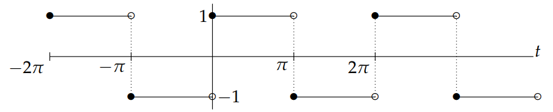
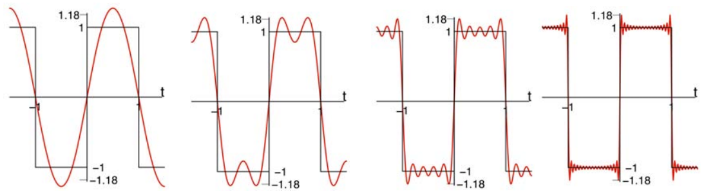

We will first state Fourier's theorem for periodic functions with period $P = 2\pi$. In words, the theorem says that a function with period $2\pi$ can be written as a sum of cosines and sines which all have period $2\pi$.

### Theorem (Fourier)
Suppose $f(t)$ has period $2\pi$ then we have
$$
\begin{aligned}
f(t)&\sim\frac{a_0}{2}+a_1\cos t+a_2\cos 2t+a_3\cos 3t + \ldots+b_1\sin t+b_2\sin 2t+b_3\sin 3t+\ldots\\
&=\frac{a_0}{2}+\sum_{n=1}^{\infty}a_n\cos nt+b_n\sin nt\tag{1}
\end{aligned}
$$
where the coefficients $a_0, a_1, \ldots$ and $b_1, b_2 \ldots$ are computed by
$$
a_0=\frac{1}{\pi}\int_{-\pi}^{\pi}f(t)dt\\
a_n=\frac{1}{\pi}\int_{-\pi}^{\pi}f(t)\cos(nt)dt\\
b_n=\frac{1}{\pi}\int_{-\pi}^{\pi}f(t)\sin(nt)dt\tag{2}
$$
Some comments are in order.  
1. As we saw in the quiz above, each of the functions $\cos(t), \cos(2t), \cos(3t), \ldots$ all have $2\pi$ as a period. The same is clearly true for $\sin(t), \sin(2t), \sin(3t), \ldots$.
2. The series on the right-hand side $(1)$ is called a **Fourier series**; and the coefficients, $a_0, a_1, \ldots b_1, b_2 \ldots$ in $(2)$ are called the **Fourier coefficients** of $f(t)$.
3. The letter a is used in $a_0/2$ because we can think of it as the coefficient of $\cos(0\cdot t) = 1$. We don't need a $b_0$ term because $\sin(0\cdot t) = 0$. The term constant term $\frac{a_0}{2}$ is written in this way to make the formula for $a_0$ look just like those of the other cosine coefficients $a_n$. (We will see why we need the factor of $\frac{1}{2}$ in a later note when we prove that these formulas really do give the coefficients.)
4. In $(1)$ we used the symbol $\sim$ instead of an equal sign because the two sides of $(1)$ might differ at those values of $t4 where $f(t)$ is discontinuous. For us, this is a minor point and we will allow ourselves to use an equal sign from now on.
5. There is some terminology coming from acoustics and music: the $n = 1$ frequency is called the **fundamental**, and the frequencies $n \geq 2$ are called the **higher harmonics** (or overtones). We will explore the connection between Fourier series and sound in a later session.

### Example
Compute the Fourier series of $f(t)$, where $f(t)$ is the square wave with period $2\pi$. which is defined over one period by
$$f(t)=\begin{cases}
-1&\text{for }-\pi\leq t < 0\\
1&\text{for }0\leq t <\pi
\end{cases}$$
The graph over several periods is shown below.  

**Solution** Computing a Fourier series means computing its Fourier coefficients.  
In applying these formulas to the given square wave function, we have to split the integrals into two pieces corresponding to where $f(t)$ is +1 and where it is -1. We find  
$$
\begin{aligned}
a_n&=\frac{1}{\pi}\int_{-\pi}^{\pi}f(t)\cos(nt)dt\\
&=\frac{1}{\pi}\int_{-\pi}^{0}(-1)\cdot \cos(nt)dt+\frac{1}{\pi}\int_{0}^{\pi}(1)\cdot \cos(nt)dt
\end{aligned}
$$
Thus, for $n\neq0$  
$$
a_n=-\frac{\sin(nt)}{n\pi}\bigg|_{-\pi}^0 + \frac{\sin(nt)}{n\pi}\bigg|_0^\pi=0
$$
and for $n=0$  
$$a_0=\frac{1}{\pi}\int_{-\pi}^{\pi}f(t)dt=0 \tag{characteristic of odd function}$$
Likewise
$$
\begin{aligned}
b_n&=\frac{1}{\pi}\int_{-\pi}^{\pi}f(t)\sin(nt)dt\\
&=\frac{1}{\pi}\int_{-\pi}^{0}(-1)\cdot \sin(nt)dt+\frac{1}{\pi}\int_{0}^{\pi}(1)\cdot \sin(nt)dt\\
&=\frac{\cos(nt)}{n\pi}\bigg|_{-\pi}^0 - \frac{\cos(nt)}{n\pi}\bigg|_0^\pi\\
&=\frac{1-\cos(-n\pi)}{n\pi}-\frac{cos(n\pi)-1}{n\pi}\\
&=\frac{2}{n\pi}(1-\cos(n\pi))\\
&=\frac{2}{n\pi}(1-(-1)^n)\\
&=\begin{cases}
\frac{4}{n\pi}&\text{for $n$ odd}\\
0&\text{for $n$ even}
\end{cases}
\end{aligned}
$$
We have used the simplification $\cos n\pi = (-1)^n$ to get a nice formula for the coefficients $b_n$.

This then gives the Fourier series for $f(t)$:
$$f(t)=\sum_{n=1}^\infty b_n\sin(nt)=\frac{4}{n\pi}(\sin t+\frac{1}{3}\sin 3t + \frac{1}{5}\sin 5t + \ldots)$$
**seeing the convergence of a Fourier series**  
However, it is not easy to see that the sum on the right-hand side is in fact converging to the square wave $f(t)$. So let's use a computer to plot the sums of the first $N$ terms of the series. for $N = 1, 3, 9, 33$. We get the following four graphs:  

Notice that since a finite sum of sine functions is continuous (in fact smooth), the partial sums cannot jump when $t$ is an integer multiple of $\pi$, the way the square way $f(t)$ does. But they are certainly "trying" to become the square wave $f(t)$! And the more terms you add in, the better the fit, with the theoretical limit as $N \rightarrow \infty$ being exactly equal to $f(t)$ (except
actually at the jumps $t = n\pi$, as we'll see).

**Note**: In this case we don't have any cosine terms, just sine. This turns out to be not an accident: it follows from the fact that $f(t)$ here is an *odd* function, i.e. $f(-t) = -f(t)$, and such functions have only sines (which are also odd functions) in their Fourier series. Similarly for even functions and cosine series: if $f(t)$ is even ($f(-t) = f(t)$) then all the $b_n$'s vanish and the Fourier series is simply $f(t)=\frac{a_0}{2}+\sum_{n=1}^{\infty}a_n\cos nt$; while if $f(t)$ is odd then all the $a_n$'s vanish and the Fourier series is $f(t)=\sum_{n=1}^{\infty}b_n\sin nt$.
