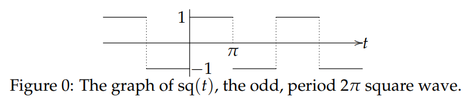
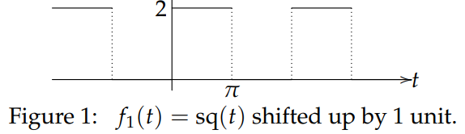
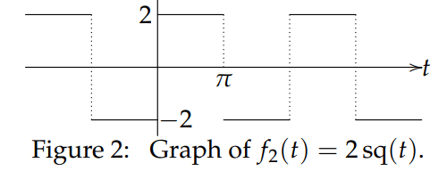
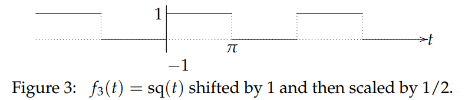
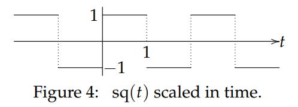
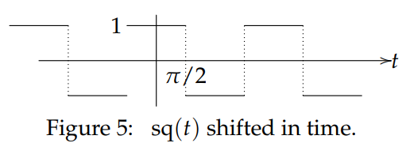

There is a very useful class of shortcuts which allows us to use the known Fourier series of a function $f(t)$ to get the series for a function related to $f(t)$ by shifts and scale changes. We illustrate this technique with a collection of examples of related functions.

We let $sq(t)$ be the standard odd, period $2\pi$ square wave.
$$
sq(t)=\begin{cases}
-1 &\text{for }-\pi\leq t<0\\
1 &\text{for }0\leq t <\pi
\end{cases}\tag{1}
$$

We already know the Fourier series for $sq(t)$. It is
$$
sq(t)=\frac{4}{\pi}(\sin t+\frac{1}{3}\sin 3t+\frac{1}{5}\sin 5t+\cdots)=\frac{4}{\pi}\sum_{n \text{ odd}}\frac{\sin nt}{t}\tag{2}
$$

### Shifting and Scaling in the Vertical Direction
**Example 1. (Shifting)** Find the Fourier series of the function $f_1(t)$ whose graph is shown.  
  
**Solution.** The graph in Figure 1 is simply the graph in Figure 0 shifted upwards one unit. That is, $f_1(t) = 1 + sq(t).$ Therefore
$$f_1(t)=1+\frac{4}{\pi}\sum_{n \text{ odd}}\frac{\sin nt}{t}$$

**Example 2. (Scaling)** Let $f_2(t) = 2 sq(t).$ Sketch its graph and find its Fourier series.  
**Solution.**  
  
The Fourier series of $f_2(t)$ comes from that of $sq(t)$ by multiplying by 2.
$$f_2(t)=\frac{8}{\pi}\sum_{n \text{ odd}}\frac{\sin nt}{t}$$

**Example 3.** We can combine shifting and scaling along the vertical axis. Let $f_3(t)$ be the function shown in Figure 3. Write it in terms of $sq(t)$ and find its Fourier series.  
  
**Solution.**
$$f_3(t)=\frac{1}{2}(1+sq(t))=\frac{1}{2}+\frac{2}{\pi}\sum_{n \text{ odd}}\frac{\sin nt}{t}$$

### Scaling and Shifting in $t$
**Example 4. (Scaling in time)** Find the Fourier series of the function $f_4(t)$ whose graph is shown.  
  
InFigure 4 the point marked 1 on the $t$-axis corresponds with the point marked $\pi$ in Figure 0. This shows that $f_4(t) = sq(\pi t)$ and therefore we replace $t$ by $\pi t$ in the Fourier series of $sq(t)$.
$$f_4(t)=\frac{4}{\pi}\sum_{n \text{ odd}}\frac{\sin n\pi t}{t}$$

**Example 5. (Shifting in time)** Let $f_5(t) = sq(t + \pi /2)$. Graph this function and find its Fourier series.  
**Solution.** We have $f_5(t)$ is $sq(t)$ shifted to the left by $\pi/2$. Therefore
$$f_5(t)=\frac{4}{\pi}(\sin (t+\pi/2)+\frac{1}{3}\sin (3t+3\pi/2)+\cdots)=\frac{4}{\pi}(\cos t-\frac{\cos 3t}{3}+\cdots$$
  
Notice that $f_5(t)$ is even, and so must have only cosine terms in its series, which is in fact confirmed by the simplified form above.
