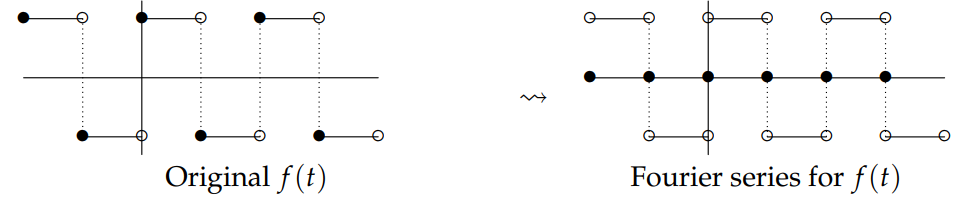
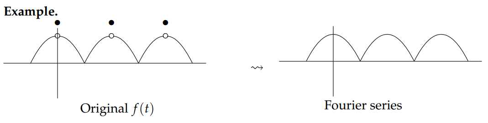

The period $2L$ function $f(t)$ is called **piecewise smooth** if there are a only finite number of points $0 \leq t_1 < t_2 < \ldots < t_n ≤ 2L$ where $f(t)$ is not
differentiable, and if at each of these points the left and right-hand limits $\lim\limits_{t \to t_i^+} f'(t)$ and $\lim\limits_{t \to t_i^-} f'(t)$ exist (although they might not be equal).

Recall that when we first introduced Fourier series we wrote
$$
\begin{aligned}
f(t)&\sim\frac{a_0}{2}+a_1\cos t+a_2\cos 2t+a_3\cos 3t + \ldots+b_1\sin t+b_2\sin 2t+b_3\sin 3t+\ldots\\
&=\frac{a_0}{2}+\sum_{n=1}^{\infty}a_n\cos nt+b_n\sin nt\tag{1}
\end{aligned}
$$
where we used '∼' instead of an equal sign. The following theorem shows that our subsequent use of an equal sign, while not technically correct, is close enough to be warranted.

**Theorem:** If $f(t)$ is piecewise smooth and periodic then the Fourier series for $f$
1. converges to $f(t)$ at values of $t$ where $f$ is continuous
2. converges to the average of $f(t^-)$ and $f(t+)$ where it has a jump discontinuity.

**Example.** Square wave. No matter what the endpoint behavior of $f(t)$ the Fourier series converges to:  

**Example.** Continuous sawtooth: Fourier series converges to $f(t)$.  

