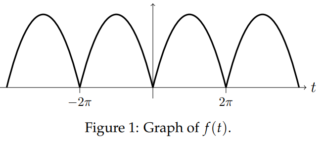

There is a famous formula found by Euler:
$$
\sum_{n=1}^\infty \frac{1}{n^2}=\frac{\pi^2}{6}\tag{1}
$$
We'll show how you can use a Fourier series to get this result.

Consider the period $2\pi$ function given by $f(t)=t(\pi-t/2)$ on $[0,2\pi]$.  

First, we compute the Fourier series of $f(t)$. Since $f$ is even, the sine terms are all 0. For the cosine terms it is slightly easier to integrate over a full period from 0 to $2\pi$ rather than doubling the integral over the halfperiod.  
For $n = 0$ we have
$$
\begin{aligned}
a_0&=\frac{1}{\pi}\int_0^{2\pi}t(\pi-t/2)dt\\
&=\frac{1}{\pi}(\frac{\pi t^2}{2}-\frac{t^3}{6})\bigg|_0^{2\pi}\\
&=\frac{1}{\pi}(\frac{4\pi^3}{2}-\frac{8\pi^3}{6})\\
&=\frac{2}{3}\pi^2
\end{aligned}
$$
and for $n\neq 0$ we have
$$
\begin{aligned}
a_n&=\frac{1}{\pi}\int_0^{2\pi}t(\pi-t/2)\cos (nt)dt\\
&=\frac{1}{\pi}([t(\pi-t/2)\frac{\sin(nt)}{n}]\bigg|_0^{2\pi}-\int_0^{2\pi}(\pi-t)\frac{\sin(nt)}{n}dt)\\
&=\frac{1}{\pi}\cdot -([(\pi-t)\cdot -\frac{\cos(nt)}{n^2}]\bigg|_0^{2\pi}-\int_0^{2\pi}\frac{\cos(nt)}{n^2}dt)\\
&=\frac{1}{\pi}((\pi-2\pi)-(\pi-0))\frac{1}{n^2}+\frac{1}{\pi}\frac{\sin(nt)}{n^3}\bigg|_0^{2\pi}\\
&=-\frac{2}{n^2}
\end{aligned}
$$
Thus the Fourier series is $f(t)=\frac{\pi^2}{3}-2\sum_{n=1}^\infty\frac{\cos(nt)}{n^2}$  
Since the function $f(t)$ is continuous, the series converges to $f(t)$ for all $t$.  
Plugging in $t = 0$, we then get
$$f(0)=t(\pi-t/2)=0=\frac{\pi^2}{3}-2\sum_{n=1}^\infty\frac{1}{n^2}$$
A little bit of algebra then gives Euler's result $(1)$.
