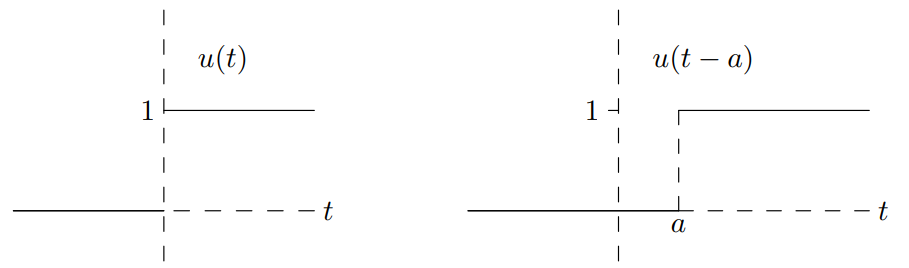
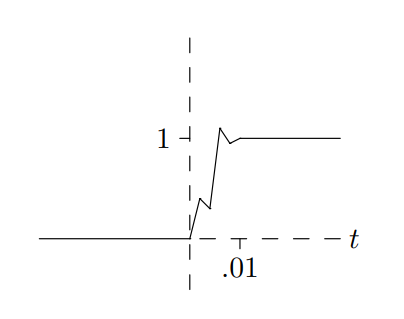
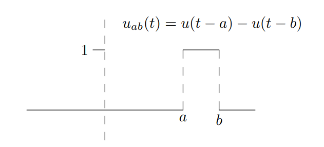
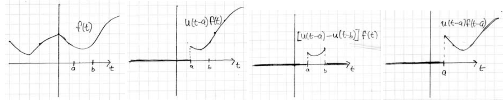

### Heaviside Unit Step Function
The **unit step function** is defined by
$$
u(t)=
\begin{cases}
0&\text{for }t<0\\
1&\text{for }t>0
\end{cases}
$$
The reason for the name *unit step* can be seen in the graph.  

The first graph shows the function $u(t)$. The second graph shows $u(t - a)$, which is simply $u(t)$ shifted to the right.
$$
u(t-1)=
\begin{cases}
0&\text{for }t<a\\
1&\text{for }t>a
\end{cases}
$$
A few details need to be highlighted.
1. $u(t)$ is also called the **Heaviside function**.
2. $u(t)$ is not defined when $t = 0$. Looking at the graph we see that $u(t)$ has a **jump discontinuity** at $t = 0$.
3. The graph shows that $u(0^-) = 0$ and $u(0^+) = 1$. Here, $u(0^-)$ means the limit of $u(t)$ as $t$ approaches 0 from the left –called the left-hand limit. Likewise, $u(0^+)$ means the limit of $u(t)$ as $t$ approaches 0 from the right.
4. In the graphs we used dashed lines at the jump discontinuity. These lines are not part of the graph and we could have left them out. It is also common to use solid lines. Strictly speaking this is incorrect, but it gives nicer looking figures (for more on this see the next section).

### Models
We can use $u(t)$ to model an on/off process. Suppose a light turns on; first it is dark, then it is light. The basic model is the unit step function.  
Of course a light doesn't reach its steady state instantaneously; it takes a small amount of time. If we use a finer time scale, you can see what happens. It might move up smoothly; it might overshoot; it might move up in fits and starts as different elements come on line. If we zoomed in near $t = 0$ the graph might actually look like  
  
At the longer time scale, we don't care about these details. Modeling the process by $u(t)$ lets us ignore them.

### Box Functions
When we modeled the light with $u(t)$ we assumed the light went on and stayed on forever. Eventually the light will be turned off or burn out. To be general, let's assume the light goes on at time $a$ and off at time $b$. We can model this with the function
$$
u_{ab}(t)=
\begin{cases}
0&\text{for }t<a\\
1&\text{for }a<t<b\\
0&\text{for }b<t
\end{cases}
$$
The graph of this is  
  
The graph shows why this is often called a **box function**. If you plot $u(t - a)$ and $u(t - b)$ on the same axes you will find that
$$u_{ab}(t)=u(t-a)-u(t-b)$$
We will usually dispense with the notation $u_{ab}(t)$ and the formuala $u(t-a)-u(t-b)$ for the box function.

### Switches
By multiplying by a function $f(t)$ we can use step and box functions as switches to turn $f(t)$ on or off.  
  
The graphs show step and box functions acting as switches.

* The first plot shows $f(t)$.
* The second shows $u(t - a)$ being used to switch $f(t)$ on at $t = a$. That is, $u(t - a)f(t)$ is 0 for $t < a$ and agrees with $f(t)$ for $t > a$.
* The third shows $u(t - a) - u(t - b)$ being used to turn $f(t)$ on in the window $a < t < b$ and off outside it.
* The fourth graph shows $u(t - a)f(t - a)$. That is, first $f(t)$ is translated to the right $a$ units and the result is switched on at time $a$.

### $u$-format and Cases Format
We now have two ways to express functions that change formulas for different intervals of $t$.

**Example.** Suppose $f(t)$ is 0 for $t < 0$, $t$ for $0 < t < 1$, $t^2$ for $1 < t < 2$ and $2t$ for $t > 2$. Express $f(t)$ in both $u$ and cases formats.  
**Solution.** Cases format expresses $f(t)$ by specifying the formula for each case:
$$
f(t)=
\begin{cases}
0&\text{for }t<0\\
t&\text{for }0<t<1\\
t^2&\text{for }1<t<2\\
2t&\text{for }2<t\\
\end{cases}
$$
$u$-format uses step and box functions to turn on and off expressions:
$$f(t) = (u(t) - u(t - 1))\cdot t + (u(t - 1) - u(t - 2)) \cdot t^2  + u(t - 2) \cdot 2t
$$
Notice how each case tells us which step or box functions to use as switches and how each $u$ function tells us where the cases change.

**Example.** Write $f(t) = u(t)\cdot 4t + u(t - 2)\cdot t^2 + u(t - 4)\cdot t^3/4$ in cases format.  
**Solution.**
$$
f(t)=
\begin{cases}
0&\text{for }t<0\\
4t&\text{for }0<t<2\\
4t+t^2&\text{for }2<t<4\\
4t+t^2+t^3/4&\text{for }4<t\\
\end{cases}
$$
Notice how there are no *off* switches in the expression for $f(t)$, so in cases format the number of terms in each successive case grows as the $u$-switches turn on.
