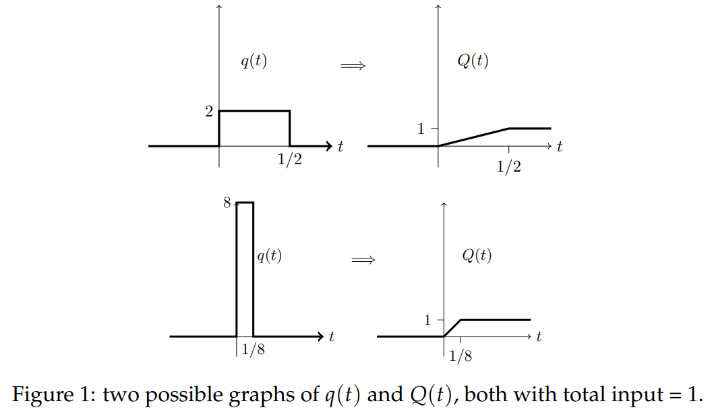
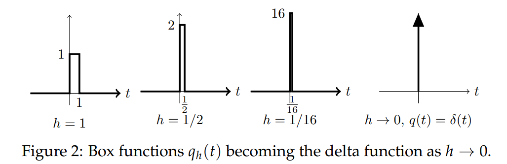
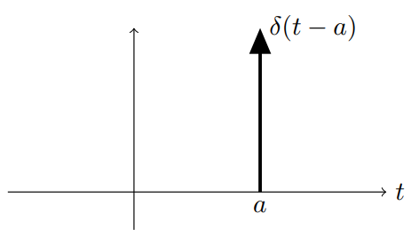
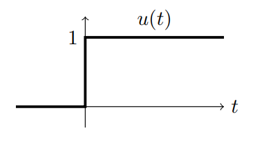
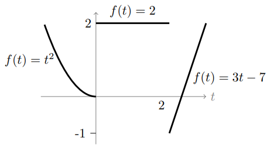
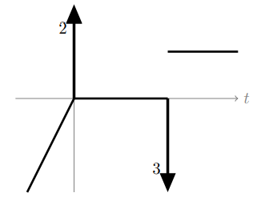

### Introduction
In our discussion of the unit step function $u(t)$ we saw that it was an idealized model of a quantity that goes from 0 to 1 very quickly. In the idealization we assumed it jumped directly from 0 to 1 in no time.

In this note we will have an idealized model of a large input that acts over a short time. We will call this model the *delta function* or *Dirac delta function* or *unit impulse*.

After constructing the delta function we will look at its properties. The first is that it is not really a function. This won't bother us, we will simply call it a *generalized function*. The reason it won't bother us is that the delta function is useful and easy to work with. Inside integrals or as input to differential equations we will see that it is much simpler than almost any other function.

### Delta Function as Idealized Input
Suppose that radioactive material is dumped in a container. The equation governing the amount of material in the tank is
$$x'+kx=q(t)$$
where, $x(t)$ is the amount of radioactive material (in kg), $k$ is the decay rate of the material (in 1/year), and $q(t)$ is the rate at which material is being added to the dump (in kg/year).  
The input $q(t)$ is in units of mass/time, say kg/year. So, the total amount dumped into the container from time 0 to time $t$ is
$$Q(t)=\int_0^tq(u)du$$
Equivalently
$$Q'(t)=q(t)$$
To keep things simple we will assume that $q(t)$ is only nonzero for a short amount of time and that the total amount of radioactive material dumped over that period is 1 kg. Here are the graphs of two possibilities for $q(t)$ and $Q(t)$.  
  
It is easy to see that each of the boxes on the left side of Figure 1 has total area equal to 1. Thus, the graphs for $Q(t)$ rise linearly to 1 and then stay equal to 1 thereafter. In other words, the total amount dumped in each case is 1.  
Now let $q_h(t)$ be a box of width $h$ and height $1/h$. As $h \rarr 0$, the width of the box becomes 0, the graph looks more and more like a spike, yet it still has area 1 (see Figure 2).  
  
We define the **delta function** to be the formal limit
$$\delta(t)=\lim_{h \to 0} q_h(t)$$
Graphically $\delta(t)$ is represented as a spike or harpoon at $t = 0$. It is an infinitely tall spike of infinitesimal width enclosing a total area of 1 (see figure 2, rightmost graph).  
As an input function $\delta(t)$ represents the ideal case where 1 unit of material is dumped in all at once at time $t = 0$.
### Properties of $\delta(t)$
1. From the previous section we have
$$\delta(t)=\begin{cases}
0&\text{for }t\neq 0\\
1&\text{for }t =0
\end{cases}$$
The graph is represented as a spike at $t = 0$. (See figure 2)

2. Because $\delta(t)$ is the limit of graphs of area 1, the area under its graph is 1. More precisely:
$$\int_c^d \delta(t)dt=\begin{cases}
1&\text{if }c<0<d\\
0&\text{otherwise}
\end{cases}$$
3. For any continuous function $f(t)$ we have
$$f(t)\delta(t)=f(0)\delta(t)$$
$$\int_c^d f(t)\delta(t)dt=\begin{cases}
f(0)&\text{if }c<0<d\\
0&\text{otherwise}
\end{cases}$$
The first statement follows because $\delta(t)$ is 0 everywhere except at $t = 0$. The second follows from the first and property $(2)$.

4. We can place the delta function over any value of $t$: $\delta(t - a)$ is 0 everywhere but at $t = a$. Its total area remains 1. Its graph is now a spike shifted to be over $t = a$; and we have  

$$f(t)\delta(t-a)=f(a)\delta(t-a)$$
$$\int_c^d f(t)\delta(t-a)dt=\begin{cases}
f(a)&\text{if }c<a<d\\
0&\text{otherwise}
\end{cases}$$

5. $\delta(t) = u'(t)$, where $u(t)$ is the unit step function. Because $u(t)$ has a jump at 0, $\delta(t)$ is not a derivative in the usual sense, but is called a *generalized derivative*. This is explained below.
6. We defined $\delta(t)$ as a limit of a sequence of box functions, all with unit area and which, in the limit, become a infinite spike over $t = 0$. Box functions are simple, but not special. Any sequence of functions with these properties has $\delta(t)$ as its limit.
7. In practical terms, you should think of $\delta(t)$ as any function of unit area, concentrated very near $t = 0$.
8. $\delta(t)$ is not really a function. We call it a **generalized function**.
9. In arriving at these properties we have skipped over some important technical details in the analysis. Generally property (3) is taken to be the formal definition of $\delta(t)$, from which the other properties follow.

### Examples of integration
Properties $(3)$ and $(2)$ show that $\delta(t)$ is very easy to integrate, as the following examples show:  
**Example 1**. $\int_{-5}^5 7e^{t^2}\cos(t)\delta(t)dt=7$. All we had to do was evaluate the integrand at $t=0$.  
**Example 2**. $\int_{-5}^5 7e^{t^2}\cos(t)\delta(t-2)dt=7e^4\cos(2)$. All we had to do was evaluate the integrand at $t=2$.  
**Example 3**. $\int_{-5}^1 7e^{t^2}\cos(t)\delta(t-2)dt=0$. Since $t = 2$ is not in the interval -5 of integration the integrand is 0 on the entire interval.

The value $t = 0^-$ represents the 'left-side' of 0 and $t=0^+$ is the 'right-side'. So, 0 is in the interval $[0^-,\infty)$ and not in $[0^+,\infty)$. Thus
$$\int_{0^-}^\infty \delta(t)dt=1$$
$$\int_{0^+}^\infty \delta(t)dt=0$$
In fact, since all the area under the graph is concentrated at 0, we can even write
$$\int_{0^-}^{0^+} \delta(t)dt=1$$

### Generalized Derivatives
Our goal in this section is to explain property $(5)$. A look at the graph of the unit step function $u(t)$ shows that it has slope 0 everywhere except at $t = 0$ and that its slope is ∞ at $t = 0$.  
  
That is, its derivative is
$$u'(t)=\begin{cases}
0&\text{if }t\neq 0\\
\infty&\text{if }t =0
\end{cases}$$
Since $u(t)$ has a jump of 1 at $t = 0$ this derivative matches properties $(1)$ and $(2)$ of $\delta(t)$ and we conclude that $u'(t) = \delta(t)$.  
Now this derivative does not exist in the calculus sense. The function $u(t)$ is not even defined at 0. So we call this derivative a **generalized derivative**.

We can also explain property $(5)$ by looking at the anti-derivative of $\delta(t)$. Let
$$f(t)=\int_{-\infty}^t \delta(\tau)d\tau$$
The fundamental theorem of calculus leads us to say that $f'(t) = \delta(t)$. (Again, this is only in a generalized sense since technically the fundamental theorem of calculus requires the integrand to be continuous.) Property $(3)$ makes it easy to compute
$$f(t)=\begin{cases}
0&\text{if }t<0\\
1&\text{if }t>0
\end{cases}$$
That is, $f(t) = u(t)$, so $u(t)$ is the antiderivative of $\delta(t)$.
**Example 4.** Suppose $f(t)$ has the following graph.  
  
The formula for each piece of the graph is indicated. For the smooth parts of the graph the derivative is just the usual one. Each jump discontinuity adds a delta function scaled by the size of the jump to $f'(t)$.
$$f'(t)=2\delta(t)-3\delta(t-2)+\begin{cases}
2t&\text{if }t<0\\
0&\text{if }0<t<2\\
3&\text{if }2<t
\end{cases}$$
In the graph for $f'(t)$ we represent the delta functions as spikes with the magnitude written next to the spike. The sign is indicated by the direction of the spike. The rest of the $f'(t)$ is plotted normally.  
  
We say $f'(t)$ is a generalized function. In 18.03 a **generalized function** will mean a sum of a regular function and a linear combination of delta functions. (In the wider world of mathematics there are other generalized functions.)  
If we want to refer to the different parts of a generalized function we will call the delta function pieces the **singular part** and the remainder will
be called the **regular part**. If the singular part contains a multiple of $\delta(t-a)$ we will say the function *contains* $\delta(t-a)$.

**Example.** Consider $f(t) = u(t) + \delta(t) + e^{-t} + 3\delta(t-2)$. The regular part of $f$ is $u(t) + e^{-t}$. The singular part is $\delta(t) + 3\delta(t - 2)$. The function contains $\delta(t)$ and $3\delta(t - 2)$. It does not contain $\delta(t - 1)$.

**Important:** In this unit, whenever a discontinuous function is differentiated we will mean the generalized derivative.
