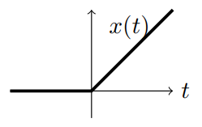
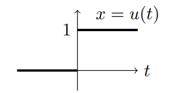
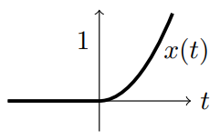

### Introduction
Before we try to solve higher order equations with discontinuous or impulsive input we need to think carefully about what happens to the solution at the point of discontinuity.

Recall that we have the left and right limits of a function as $t \rarr 0$:
$$x(0^-)=\lim_{t\uparrow 0}x(t)$$
$$x(0^-)=\lim_{t\downarrow 0}x(t)$$
(Note that we can define these limits as $t$ goes to any value $a$.) For a continuous function these two limits are the same, and they are both equal to $x(0)$.  
For the unit step function we have 
$$u(0^-)=0, u(0^+)=1, u(0)\text{ is undefined}$$
For the unit impulse function $\delta(t)$ we have
$$\delta(0^-)=0, \delta(0^+)=0, \delta(0)=\infty$$
In this unit our differential equations will always have initial conditions at $t = 0$. The above examples show that when there is a discontinuity we might need to distinguish between $0^-$ and $0^+$. Assuming $x$ is the output, we will do this by calling $x(0^-), x'(0^-), \ldots$ the **pre-initial conditions** and $x(0^+), x'(0^+), \ldots$ the **post-initial condition**.

**Important:** Hereafter when we just say *initial conditions* we will mean the *pre-initial conditions*. In cases where $x(t)$ is smooth the pre and post-initial conditions are the same and their is no need to distinguish between them.

### Simple Examples
**Example 1**. Consider the initial value problem
$$x'(t)=u(t), x(0^-)=0$$
This is a simple calculus problem and has solution 
$$
x(t)=\begin{cases}
0&\text{for } t<0\\
t&\text{for } t>0
\end{cases}
$$
  
It is easy to see that $x(0^+) = 0$, so the post-initial condition is the same as the pre-initial condition. This should not surprise us. Although the *rate* of input jumps from 0 to 1, it is still only inputting an infinitesimal amount at a time. So, the response $x(t)$ should be continuous. But, note that $x'(0^-) = 0 \neq x(0^+) = 1$.

**Example 2.** Consider the initial value problem 
$$x'(t)=\delta(t), x(0^-)=0$$
We know how to integrate δ(t) to get $x(t) = u(t)$.  
  
Here the pre-initial condition $x(0^-) = 0$ does not match the post-initial condition $x(0^+) = 1$. The impulse causes a jump in the value of $x$.

**Example 3.** Consider a second order IVP
$$x''(t)=u(t), x(0^-)=0, x'(0^-)=0$$
Integrating twice we get
$$
x(t)=\begin{cases}
0&\text{for } t<0\\
t^2/2&\text{for } t>0
\end{cases}
$$
  
Again, it's easy to check that $x(0^-) = x(0^+)$ and $x'(0^-) = x'(0^+)$. That is, the pre and post initial conditions are the same. (But, $x''(0^-) = 0 \neq x(0^+) = 1$.)

**Example 4.** Consider the initial value problem 
$$x''(t)=\delta(t), x(0^-)=0, x'(0^-)=0$$
Integrating once gives $x'(t)=u(t)$. Integrating a second time gives
$$
x(t)=\begin{cases}
0&\text{for } t<0\\
t&\text{for } t>0
\end{cases}
$$
  
Checking the pre and post initial conditions gives
$$x(0^-)=0=x(0^+)$$
$$x'(0^-)=0\neq x(0^+)=1$$
In other words, $x(t)$ itself is continuous, but for the second order equation the input $\delta(t)$ caused a jump in the first derivative.  
If we continued these examples we'd find that for an $n^{th}$-order equation an input of $\delta(t)$ causes a jump in the derivative of order $n - 1$.

### Rest Initial Conditions
The case where $x(t) = 0$ for $t < 0$ is called **rest initial conditions**. If we have a DE of order $n$ this translates into pre-initial conditions
$$x(0^-)=0,x'(0^-)=0,\ldots,x^{n-1}(0^-)=0$$

### Conclusion
A unit step input $u(t)$ causes a smooth response with matching pre and post-initial conditions. For a unit impulse input $\delta(t)$ the pre and post initial conditions match except for the derivative one less than the order of the equation.
