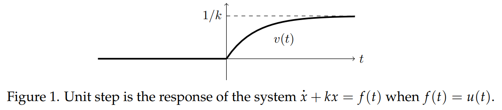

### Unit Step Response
Consider the initial value problem
$$x'+kx=ru(t), x(0^-)=0, k,r \text{ constants}$$
This would model, for example, the amount of uranium in a nuclear reactor where we add uranium at the constant rate of $r$ kg/year starting at time $t = 0$ and where $k$ is the decay rate of the uranium.

As in the previous note, adding an infinitesimal amount ($r dt$) at a time leads to a continuous response. We have $x(t) = 0$ for $t < 0$; and for $t > 0$ we must solve
$$x'+kx=r, x(0)=0$$
The general solution is $x(t)=(r/k)+ce^{-kt}$. To find $c$, we use $x(0) = 0$:
$$0=x(0)=\frac{r}{k}+c \rArr c=-\frac{r}{k}$$
Thus, in both cases and $u$-format
$$x(t)=\begin{cases}
0&\text{for }t<0\\
\frac{r}{k}(1-e^{-kt})&\text{for }t>0
\end{cases}=\frac{r}{k}(1-e^{-kt})u(t)\tag{1}$$
With $r = 1$, this is the **unit step response**, sometimes written $v(t)$. To be more precise, we could write $v(t)=u(t)(1/k)(1-e^{-kt})$.

The claim that we get a continuous response is true, but may feel a bit unjustified. Let's redo the above example very carefully without making this assumption. Naturally, we will get the same answer.

The equation is
$$x'+kx=\begin{cases}
0&\text{for }t<0\\
r&\text{for }t>0\\
\end{cases},x(0^-)=0\tag{2}$$
Solving the two pieces we get
$$x(t)=\begin{cases}
c_1e^{-kt}&\text{for }t<0\\
\frac{r}{k}+c_2e^{-kt}&\text{for }t>0\\
\end{cases}$$
This gives $x(0^-) = c_1$ and $x(0^+) = r/k + c_2$. If these two are different there is a jump at $t = 0$ of magnitude
$$x(0^+)-x(0^-)=r/k + c_2-c_1$$
The initial condition$x(0^-) =0$ implies $c_1 = 0$, so our solution looks like
$$x(t)=\begin{cases}
0&\text{for }t<0\\
\frac{r}{k}+c_2e^{-kt}&\text{for }t>0\\
\end{cases}$$
To find $c_2$ we substitute this into our differential equation $(2)$. (We must use the generalized derivative if there is a jump at $t = 0$.) After substitution the left side of $(2)$ becomes
$$
\begin{aligned}
x'+kx&=(r/k+c_2)\delta(t)+\begin{cases}
0&\text{for }t<0\\
-kc_2e^{-kt}+r+kc_2e^{-kt}&\text{for }t>0\\
\end{cases}\\
&=(r/k+c_2)\delta(t)+\begin{cases}
0&\text{for }t<0\\
r&\text{for }t>0\\
\end{cases}
\end{aligned}
$$
Comparing this with the right side of $(2)$ we see that $r/k + c_2 = 0$, or c$_2 = -r/k$. This gives exactly the same solution $(1)$ we had before.

Figure 1 shows the graph of the unit step response ($r = 1$). Notice that it starts at 0 and goes asymptotically up to $1/k$.  

### The Meaning of the Phrase 'Unit Step Response'
In this note looked at the system with equation
$$x'+kx=f(t)$$
and we considered $f(t)$ to be the input. As we have noted previously, it sometimes makes more sense to consider something else to be the input. For example, in Newton's law of cooling
$$T'+kT=kT_e$$
it makes physical sense to call $T_e$, the temperature of the environment, the input. In this case the unit step response of the system means the response to the input $T_e(t) = u(t)$, i.e. the solution to
$$T'+kT=ku(t)$$
