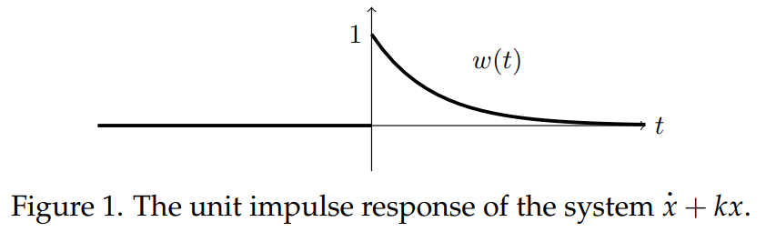
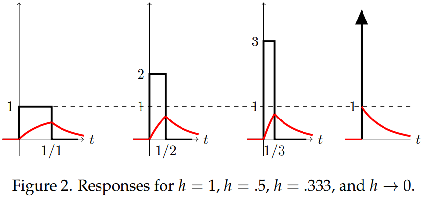

### Unit Impulse Response
Consider the initial value problem
$$x'+kx=\delta(t), x(0^-)=0, k,r \text{ constants}$$
This would model, for example, the amount of uranium in a nuclear reactor where at time $t = 0$ we add 1 kilogram of uranium all at once and $k$ is the decay rate of the uranium.

Because of the rest initial conditions we have $x(t) = 0$ for $t < 0$. The effect of the input is to cause the amount $x(t)$ to jump from 0 to 1 at $t = 0$. That is, $x(0^+) = 1$. For $t > 0$ the input $\delta(t) = 0$ and, therefore, for $t > 0$ we should solve
$$x'+kx=0,x(0)=1$$
The general solution is $x(t)=ce^{-kt}$. To find $c$, we use $x(0)=1$, which gives $c = 1$. Thus, in both cases and $u$-format
$$x(t)=\begin{cases}
0&\text{for }t<0\\
e^{-kt}&\text{for }t>0
\end{cases}=u(t)e^{-kt}\tag{1}$$
This is called the **unit impulse response**, which we denote $w(t)$. In some sense it is the simplest nontrivial solution; you just give the system a unit kick at $t = 0$, stand back, and watch the result. For $t > 0$ it is just the homogeneous solution with initial condition $x(0) = 1$.

### Graph of the Unit Impulse Response $w(t)$
Figure 1 shows the graph of the unit impulse response. Notice that at $t = 0$ it jumps to $x = 1$ and then decays exponentially to 0.

### $\delta(t)$ as a limit of box functions
Originally we found $\delta(t)$ as a limit of box functions of area 1. In this section we will compute the *unit impulse response* as the limit of the responses to these box functions. The main two points in doing this are: first, to gain more comfort and facility with this circle of ideas and second, to convince you that the delta function is much nicer to work with than box functions. We invite you to compare the amount of work required for solving the unit impulse with the amount of work needed in the unit step case.

A quick review: Define the box function as 
$$u_h(t)=\begin{cases}
0&\text{for }t<0\\
1/h&\text{for }0<t<h\\
0&\text{for }h<t
\end{cases}$$
It has total area 1 for all $h > 0$ and the graph of $u_h(t)$ becomes a spike as $h \rarr 0$, i.e.
$$\lim_{h \to 0}u_h(t)=\delta(t)$$
For the equation
$$x'+kx=u_h(t), x(0^-)=0$$
the three pieces of the solution are easily found to be
$$u_h(t)=\begin{cases}
c_1e^{-kt}&\text{for }t<0\\
\frac{1}{hk}+c_2e^{-kt}&\text{for }0<t<h\\
c_3e^{-kt}&\text{for }h<t
\end{cases}$$
Using the initial condition $x(0^-) = 0$ and matching the value of $x$ at the endpoints of each piece we find $c_1=0,c_2=-1/hk,c_3=(e^{hk}-1)/hk$. This gives the solution
$$u_h(t)=\begin{cases}
0&\text{for }t<0\\
\frac{1}{hk}(1-e^{-kt})&\text{for }0<t<h\\
\frac{1}{hk}(e^{hk}-1)e^{-kt}&\text{for }h<t
\end{cases}$$
Letting $h \rarr 0$ this becomes (since $\lim_{h \to 0}\frac{e^{hk}-1}{hk}=1$[L'Hospital's rule])
$$x(t)=\begin{cases}
0&\text{for }t<0\\
e^{-kt}&\text{for }t>0
\end{cases}$$
This limit is exactly the unit impulse response $w(t)$ we found in a previous note.

Figure 2 shows this graphically by plotting the input and output for several values of $h$.  
  
The input is plotted in black and the output in red. Notice how the output rises faster and gets closer to 1 as $h \rarr 0$. Finally, in the limit of small $h$, it jumps directly to 1.

### The Meaning of the Phrase 'Unit Impulse Response'
Exactly as in the case of the unit step response, the unit impulse response means the response of the system when the *input* is a unit impulse. In this note we looked at the the system
$$x'+kx=f(t)$$
and we considered $f(t)$ to be the input. Suppose, instead, we have the system
$$T'+kT=kT_e$$
where we consider $T_e$ to be the input. Then the unit impulse response is the response of the system to *input* $T_e(t) = \delta(t)$, i.e. the solution to
$$T'+kT=k\delta(t)$$
