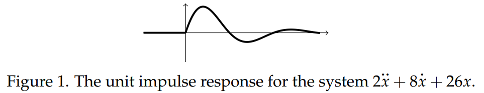

### Effect of a Unit Impulse on a Second order System
We consider a second order system
$$mx''+bx'+kx=f(t)\tag{1}$$
Our first task is to derive the following. If the input $f(t)$ is an impulse $c\delta(t - a)$, then the system's response to $f(t)$ has the following properties.
1. The momentum $mx'(t)$ jumps by $c$ units at $t = a$. That is,
$$mx'(a^+)-mx'(a^-)=c$$
2. The position $x(t)$ is unchanged at $t = a$. That is,
$$x(a^+)=x(a^-)$$
Recall the argument that we used before: If $x(t)$ had a jump at $a$ then $x'(t)$ would contain a multiple of $\delta(t - a)$. So, $mx''(t)$ would contain a multiple of the doublet $\delta(t - a)$. This is impossible since the input $\delta(t - a)$ does not contain a doublet. This shows point $(2)$ above.  
To show point $(1)$, we note that if $mx'(t)$ has a jump of $c$ units at $t - a$ then $mx''(t)$ contains the term $c\delta(t - a)$. This is needed to make the left-hand side of equation $(1)$ match the right hand side when $f(t)=c\delta(t - a)$.

Another way to show points $(1)$ and $(2)$ is a physical argument. A force acting on the mass over time changes its momentum. In fact, the best way to state Newton's second law is that
$$\frac{dp}{dt}=f(t)$$
where $p(t)$ is the momentum of a system and $f(t)$ is an external force acting on the system. If a force $f(t)$ acts over the time interval $[t_1, t_2]$ the total change of momentum due to the force is
$$\int_{t_1}^{t_2}f(t)dt$$
Physicists call this the impulse of the force $f(t)$ over the interval $[t_1, t_2]$. If a very large force is applied over a very short time interval and has total impulse of 1 the result will be a sudden unit jump in the momentum of the system.  
For a second order system the unit impulse function $\delta$ can be thought of as an idealization of this force. It is a force with total impulse 1 applied all at once.  
A third argument that we will skip would be to solve equation $(1)$ with a box function for input and take the limit as the box gets narrower and taller always with area 1.

### Unit Impulse Response
We consider once again the damped harmonic oscillator equation
$$mx''+bx'+kx=f(t)$$
The **unit impulse response** is the solution to this equation with input $f(t) = \delta(t)$ and rest initial conditions: $x(t) = 0$ for $t < 0$. That is, it is the solution to the initial value problem (IVP)
$$mx''+bx'+kx=\delta(t), x(0^-)=0, x'(0^-)=0$$
This could be a damped spring-mass system with mass $m$, damping constant $b$ and spring constant $k$. The mass is at rest at equilibrium until time $t = 0$ when it is hit by a sudden very brief very intense force, rather like getting hit on the head by a hammer. The effect is to increase the momentum instantaneously, without changing the position of the mass.  
Let $w(t)$ denote the solution we seek. The rest initial conditions tell us that $w(t) = 0$ for $t < 0$. We know from section 1 that the effect of the input is to cause a unit jump in the momentum at $t = 0$ and no change in position. We also know that, for $t > 0$, the input $\delta(t) = 0$. Putting this together, for $t > 0$ the $w(t)$ satisfies the equation
$$mw''+bw'+kw=0\\mw'(0^+)=\text{momentum}=0\rArr w'(0^+)=1/m\\ w(0^+)=0$$
This is a homogeneous constant coefficient linear differential equation which we have lots of practice in solving.  
**Example 1.** Find the unit impulse response for the system
$$2x''+8x'+26x=f(t)\tag{2}$$
**Solution.** We will use the standard notation $w(t)$ for the unit impulse response. We are looking for the response from rest to $f(t) = \delta(t)$. We know $w(t) = 0$ for $t < 0$. At $t = 0$ the input causes a unit jump in momentum, i.e., $2w'(0^+) = 1$. So, for $t > 0$ we have to solve
$$2w''+8w'+26w=0, w'(0^+)=1/2, w(0^+)=0$$
The roots of the characteristic polynomial are $-2 \pm 3i$. Which implies
$$w(t)=c_1e^{-2t}\cos 3t+c_2e^{-2t}\sin 3t, t>0$$
The initial conditions give
$$
0=w(0^+)=c_1,\\
1/2=w'(0^+)=-2c_1+3c_2\rArr c_2=1/6
$$
Thus, the unit impulse response (in both cases and $u$-format) is
$$
w(t)=\begin{cases}
0&\text{for }t<0\\
\frac{1}{6}e^{-2t}\sin 3t&\text{for }t>0
\end{cases}=\frac{1}{6}e^{-2t}\sin(3t)u(t)\tag{3}
$$
Figure 1 the graph of the unit impulse response. Notice that at $t = 0$ the graph has a corner. This corresponds to the slope $w'$ jumping from 0 to 1/2. For $t > 0$ the graph decays to 0 while oscillating.  

### Checking Example 1 by Substitution
With any differential equation you can verify a solution by plugging it into the equation. We will do that with example 1 to gain some more insight into why we get the solution.  
First, we take the derivatives of the solution in equation $(3)$ for $t \neq 0$
$$
w'(t)=\begin{cases}
0&\text{for }t<0\\
\frac{1}{6}e^{-2t}(-2\sin 3t +3\cos 3t)&\text{for }t>0
\end{cases}=\frac{1}{6}e^{-2t}(-2\sin 3t +3\cos 3t)u(t)
$$
$$
w''(t)=\begin{cases}
0&\text{for }t<0\\
\frac{1}{6}e^{-2t}(-5\sin 3t -12\cos 3t)&\text{for }t>0
\end{cases}=\frac{1}{6}e^{-2t}(-5\sin 3t -12\cos 3t)u(t)
$$
Next we look at the jumps at $t = 0$
$$w(0^-)=0, w(0^+)=0$$
$$w'(0^-)=0, w'(0^+)=1/2$$
Now we can compute the full generalized derivatives (we just give them in $u$-format)
$$
\begin{aligned}
w'(t)&=&&\frac{1}{6}e^{-2t}(-2\sin 3t +3\cos 3t)u(t)\\
w''(t)&=&\frac{1}{2}\delta(t)+&\frac{1}{6}e^{-2t}(-5\sin 3t -12\cos 3t)u(t)
\end{aligned}
$$
Finally we substitute $w$ for $x$ in equation $(2)$
$$
\begin{aligned}
2w''(t)&=\delta(t)+&\frac{-5}{3}e^{-2t}\sin 3t &-4e^{-2t}\cos 3t\\
8w'(t)&=&\frac{-8}{3}e^{-2t}\sin 3t &+4e^{-2t}\cos 3t\\
26w(t)&=&\frac{13}{3}e^{-2t}\sin 3t\\
2w''(t)+8w'(t)+26w(t)&=\delta(t)
\end{aligned}
$$

### The Meaning of the Phrase 'Unit Impulse Response'
As we've noted several times already, the response to a given input depends on what we consider to be the input. For example, if our system is
$$mx''+bx'+kx=by'$$
and we consider $y$ to be the input, then the unit impulse response is the solution to
$$mx''+bx'+kx=b\delta'(t) \text{   with rest IC.}$$
(Here, $\delta'$ is what we've called a *doublet*.) For $t > 0$ this is equivalent to
$$mx''+bx'+kx=0, \text{   with post IC   }x(0^+)=\frac{b}{m}, x'(0^+)=\frac{b^2}{m^2}$$