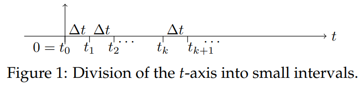
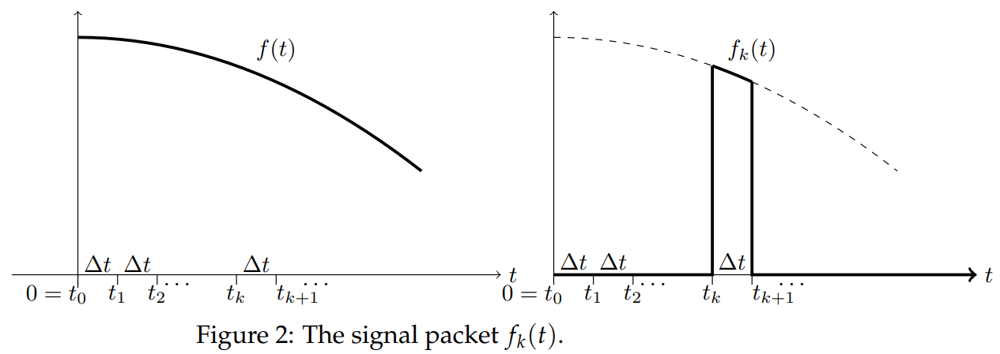

Green's Formula: For the equation
$$P(D)y=f(t),y(t)=0,y'(t)=0 \text{ for } t<0\tag{1}$$
the solution for $t > 0$ is given by
$$y(t)=(f*w)(t)=\int_{0^-}^{t+} f(\tau)w(t-\tau)d\tau\tag{2}$$
where $w(t)$ is the weight function (unit impulse response) for the system.

**Proof:** The proof of Green's formula is surpisingly direct. We will use the linear time invariance of the system combined with superposition and the definition of the integral as a limit of Riemann sums.  
To avoid worrying about $0^-$ and $t^+$ we will assume that $f(t)$ is continuous. With appropriate care, the proof will work for an $f(t)$ that has jump discontinuities or contains delta functions.  
As we saw in the session on Linear Operators in the last unit, linear
time invariance means that
$$y(t) \text{ solves } P(D)y=f(t) \rArr y(t-a) \text{ solves } P(D)y=f(t-a)\tag{3}$$
Or, in the language of input-response, if $y(t)$ is the response to input $f(t)$ then $y(t - a)$ is the response to input $f(t - a)$.  
First we will partition time into intervals of width $\Delta t$. So, $t_0 = 0, t_1 = \Delta t, t_2 = 2\Delta t$, etc.  
  
Next we decompose the input signal $f(t)$ into packets over each interval. The $k$th signal packet, $f_k(t)$ coincides with $f(t)$ between $t_k$ and $t_{k+1}$ and is 0 elsewhere
$$f(t_k)=\begin{cases}
f(t)& \text{for }t_k\leq t \leq t_{k+1}\\
0& \text{elsewhere}
\end{cases}$$
  
It is clear that for $t > 0$ we have $f(t)$ is the sum of the packets
$$f(t)=f_0(t)+f_1(t)+f_2(t)+\ldots+f_k(t)+\ldots$$
A single packet $f_k(t)$ is concentrated entirely in a small neighborhood
of $t_k$ so it is approximately an impulse with the same size as the area under $f_k(t)$. The area under $f_k(t) \approx f(t_k)\Delta t$. Hence,
$$f_k(t)\approx (f_k(t)\Delta t)\delta(t-t_k)$$
The weight function $w(t)$ is response to $\delta(t)$. So, by linear time invariance the response to $f_k(t)$ is
$$y_k(t)\approx (f_k(t)\Delta t)w(t-t_k)$$
We want to find the response at a fixed time. Since $t$ is already in use, we will let $T$ be our fixed time and find $y(T)$.
Since $f$ is the sum of $f_k$, superposition gives $y$ is the sum of $y_k$. That is, at time $T$
$$\begin{aligned}
y_(T)&\approx y_0(T)+y_1(T)+\ldots\\
&=(f(t_0)w(T-t_0)+f(t_1)w(T-t_1)+\ldots)\Delta t\tag{4}
\end{aligned}$$
We can ignore all the terms where $t_k > T$. (Because then $w(T - t_k) = 0$, since $T - t_k < 0$.) If $n$ is the last index where $t_k < T$ we have
$$y_(T)\approx (f(t_0)w(T-t_0)+f(t_1)w(T-t_1)+\ldots+f(t_n)w(T-t_n))\Delta t$$
This is a Riemann sum and as $\Delta t \rarr 0$ it goes to an integral
$$y(T)=\int_0^T f(t)w(T-t)dt$$
Except for the change in notation this is Green's formula $(2)$.

**Note on Causality:** Causality is the principle that the future does not affect the past. Green's theorem shows that the system $(1)$ is causal. That is, $y(t)$ only depends on the input up to time $t$. Real physical systems are causal.  
There are non-causal systems. For example, an audio compressor that
gathers information after time $t$ before deciding how to compress the signal at time $t$ is non-causal. Another example is the system with input $f(t)$ and output $y(t)$ where $y$ is the solution to $y' = f(t + 1)$.
