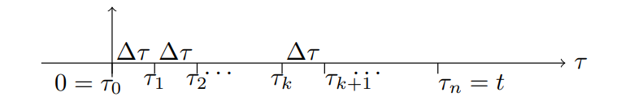

We will give several examples of Green's formula. The first we will 'build from scratch' so you get a sense of how this formula arises naturally. The last example shows how Green's formula works for a system driven at its resonant frequency.

**Example 1. The build up of a pollutant in a lake**  
Every good formula deserves a particularly illuminating example, and perhaps the following will serve for the convolution integral.  
**Problem:** We have a lake, and a pollutant is being dumped into it, at a certain variable rate $f(t)$. This pollutant degrades exponentially over time. If the lake begins at time zero with no pollutant, how much is in the lake at time $t > 0$?  
**Solution.** Let $x(t)$ be the amount of pollutant in the lake at time $t$ and a be the decay constant. For exponential decay we know that if a quantity $p$ of pollutant is dropped in the lake at time $\tau_k$ then at a later time $t$ it will have been reduced to the amount
$$pe^{-a(t-\tau_k)}\tag{1}$$
Here $t-\tau_k$ is the time elapsed between when the pollutant is added and when we check how much of it is left.  
In our system pollutant is not being added all at once. Rather, it is dripping continuously into the lake. We break the interval $[0, t]$ into $n$ small pieces of width $\Delta \tau$ as shown.  
  
Let $p_k$ be the amount of pollutant added in the interval $[\tau_k, \tau_{k+1}]$. Since $\Delta \tau$ is small we get the approximation
$$p_k\approx f(\tau_k)\Delta \tau$$
(Remember $f(\tau)$ is a rate; to get a quantity you must multiple by time.)  
According to equation $(1)$ the amount of this left at time $t$ is approximately
$$p_ke^{-a(t-\tau_k)}\approx f(\tau_k)\Delta \tau e^{-a(t-\tau_k)}$$
This is approximately the contribution to $x(t)$ from the interval $[\tau_k, \tau_{k+1}]$. To determine the $x(t)$ we simply sum up the contributions of all the intervals.
$$\begin{aligned}
x(t)&=p_0e^{-a(t-\tau_0)}+p_1e^{-a(t-\tau_1)}+\ldots+p_ne^{-a(t-\tau_n)}\\
&=(f(\tau_0)e^{-a(t-\tau_0)}+f(\tau_1)e^{-a(t-\tau_1)}+\ldots+f(\tau_n)e^{-a(t-\tau_n)})\Delta \tau
\end{aligned}$$
This is a Riemann sum. Taking the limit as $\Delta \tau \rarr 0$ we get the convolution integral
$$x(t)=\int_0^t f(\tau)e^{-a(t-\tau)}d\tau\tag{2}$$
**Example 2.** In example 1 we constructed our formula by slicing an interval into pieces. You should know how to do this. But, we prove theorems and formulas to avoid always going back to first principles. In this example we will solve the problem in example 1 using the differential for exponential
decay and finding its weight function. (Of course, this DE was found by slicing an interval into pieces...)  
The DE with rest IC is
$$x'+ax=f(t), x(0^-)=0$$
Its weight function $w(t)$ is 0 for $t < 0$, and for $t > 0$ it is the solution to the IVP
$$w'+aw=0, w(0)=1$$
We get $w(t) = e^{-at} for $t > 0$.  
Using Green's formula we again get the convolution integral $(2)$.  
**Example 3. Resonance**  
Use Green's formula to solve the DE with rest inital conditions
$$2x''+8x=\cos(2t), x(0^-)=0, x'(0^-)=0$$
For $t > 0$, the weight function is the solution to
$$2w''+8w=0, w(0)=0, w'(0)=1/2$$
The solution is $w(t)=\frac{1}{4}\sin(2t)$. For $t>0$ Green's formula gives
$$x(t)=\int_0^t \cos(2\tau) \frac{1}{4}\sin(2(t-\tau))d\tau$$
This is an easy integral, we sketch the algebra to compute it. It uses the trigonometric identity: $\sin(A)\cos(B)=\frac{\sin(A+B)+\sin(A-B)}{2}$
$$\begin{aligned}
x(t)&=\int_0^t \cos(2\tau) \frac{1}{4}\sin(2(t-\tau))d\tau\\
&=\frac{1}{4}\int_0^t \sin(2t-2\tau) \cos(2\tau)d\tau\\
&=\frac{1}{8}\int_0^t \sin(2t)+\sin(2t-4\tau)d\tau\\
&=\frac{1}{8}(\tau\sin(2t)+\frac{\cos(2t-4\tau)}{4})\bigg|_0^t\\
&=\frac{1}{8}(t\sin(2t)+\frac{\cos(-2t)-\cos(2t)}{4})\\
&=\frac{t\sin(2t)}{8}
\end{aligned}$$
This is the answer we expected from our earlier work with the exponential response formula.
