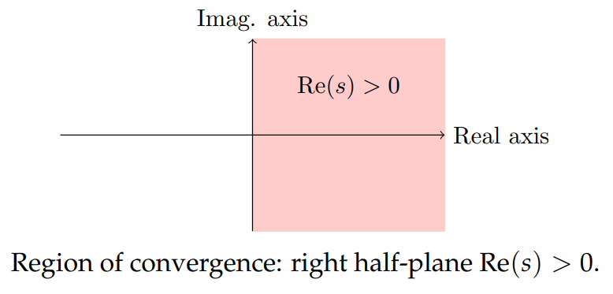

### Complex $s$ and region of convergence
We will allow $s$ to be complex, using as needed the properties of the complex exponential we learned in unit 1.  
**Example 1.** In the previous note we saw that $\mathcal{L}(1) = 1/s$, valid for all $s > 0$. Let's recompute $\mathcal{L}(1)(s)$ for complex $s$. Let $s = \alpha+i\beta$
$$\begin{aligned}
\mathcal{L}(1)(s)&=\int_0^\infty e^{-st}dt\\
&=\lim_{T \to \infty}\frac{e^{-st}}{-s}\bigg|_0^T\\
&=\lim_{T \to \infty}\frac{e^{-\alpha t}(\cos(\beta t)+i\sin(\beta t))}{-s}\bigg|_0^T
\end{aligned}$$
This converges if $\alpha > 0$ and diverges if $\alpha < 0$. Since $\alpha = \text{Re}(s)$ we have
$$\mathcal{L}(1)=1/s, \text{ for Re($s$)} > 0$$
The region Re$(s) > 0$ is called the **region of convergence** of the transform. It is a right half-plane.  
  
**Frequency:** The Laplace transform variable $s$ can be thought of as complex frequency. It will take us a while to understand this, but we can begin here. Euler's formula says $e^{i\omega t} = \cos(\omega t) + i\sin(\omega t)$ and we call $\omega$ the angular frequency. By analogy for any complex number exponent we call $s$ the **complex frequency** in $e^{st}. If $s = a + i\omega$ then $s$ is the complex frequency and its imaginary part $\omega$ is an actual frequency of a sinusoidal oscillation.

### Piecewise continuous functions and functions of exponential order
If the integral fails to converge for any s then the function does not have a Laplace transform.  
**Example.** It is easy to see that $f(t) = e^{t^2}$
has no Laplace transform.  
The problem is the $e^{t^2}$ grows too fast as $t$ gets large. Fortunately, all of the functions we are interested in do have Laplace transforms valid for Re$(s) > a$ for some value $a$.  
**Functions of Exponential Order**  
The class of functions that do have Laplace transforms are those of *exponential order*. Fortunately for us, all the functions we use in 18.03 are of this type.  
A function is said to be of **exponential order** if there are numbers $a$ and $M$ such that $|f(t)| < Me^{at}$. In this case, we say that $f$ has exponential order $a$.  
**Examples.** $1, \cos(\omega t), \sin(\omega t), t^n$ all have exponential order 0. $e^{at}$ has exponential order $a$.

A function $f(t)$ is **piecewise continuous** if it is continuous everywhere except at a finite number of points in any finite interval and if at thesepoints it has a jump discontinuity (i.e. a jump of finite height).  
**Example.** The square wave is piecewise continuous.  
**Theorem:** If $f(t)$ is piecewise continuous and of exponential order $a$ then the Laplace transform $\mathcal{L}f(s)$ converges for all $s$ with Re$(s) > a$.  
**Proof:** Suppose Re$(s) > a$ and $|f(t)| < Me^{at}$. Then we can write $s = (a + \alpha) + i\beta$, where $\alpha > 0$. Then, since $|e^{-i\beta t}| = 1$,
$$|f(t)e^{-st}|=|f(t)e^{-(a+\alpha)t}e^{-i\beta t}|=|f(t)e^{-(a+\alpha)t}|<Me^{-\alpha t}$$
Since $\int_0^\infty Me^{-\alpha t}dt$ converges for $\alpha > 0$, the Laplace transform integral also converges.

**Domain of $F(s)$:** For $f(t)$ we have $F(s) = 1/s$ with region of convergence Re$(s) > 0$. But, the function $1/s$ is well defined for all $s \neq 0$. The process of extending the domain of $F(s)$ from the region of convergence is called *analytic continuation*. In this class analytic continuation will always consist of extending $F(s)$ to the complex plane minus the zeros of the denominator.
