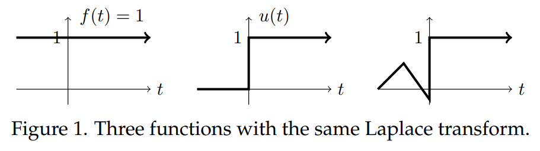
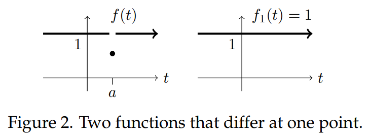

### Domain of $\mathcal{L}^{-1}(F)$
We have been a bit vague on one key technical point which we aim to clear up in this note. We start with an example.  
**Example.** Let $u(t)$ be the unit step function. Since $u(t) = 1$ for $t > 0$ we don't need the $0^-$ in the Laplace limits of integration.
$$\mathcal{L}(u)=\int_{0^-}^\infty u(t)e^{-st}dt=\int_0^\infty e^{-st}dt=1/s$$
This is exactly the same as $\mathcal{L}(1)$. So, when we look for $f(t) = \mathcal{L}^{-1}(1/s)$ is it $f(t) = 1$ or $f(t) = u(t)$?  
The answer is, it doesn't matter. Since we are only concerned with the interval $(0^-, \infty)$, you can choose either one. To be precise, for a function $F(s)$ we allow any function $f(t)$ with the following properties to be called its Laplace inverse $\mathcal{L}^{-1}(F)$:
1. $f(t)$ is a (possibly) generalized function.
2. $f(t)$ is defined on $(0, \infty)$, except possibly at a discrete set of points where there are jump discontinuities or $f(t)$ is singular, e.g. has delta functions.
3. $f(t)$ may also have a singular part at $t = 0$.
4. $\mathcal{L}(f)=F$.
5. In particular, the Laplace inverse is not defined at $t = 0$ and has nothing to say about $f(0^-), f'(0^-), f''(0^-), \ldots$. Indeed, it has nothing to say about $f(t)$ for all $t < 0$. When finding the inverse Laplace transform these values are either irrelevant or must be determined by other means.

The functions in Figure 1 below all all have Laplace transform $1/s$. Notice, they are all different for $t < 0$ and the last two are not defined at 0. Since they agree on $t > 0$ (and have no delta function at $t = 0$) they have the same Laplace transform.  

### Removable Discontinuities
We're still we're not done with our discussion of the possible differences between two functions with the same Laplace transform. Consider the two functions whose graphs are shown in Figure 2.  
  
They differ only at the point $t = a$. It is easy to see that they have the same Laplace transform: $\mathcal{L}(f) = \mathcal{L}(f_1) = 1/s$. (This is because the integral is an area and the areas under two curves that differ like these are the same.)  
According to our definition either $f(t)$ and $f_1(t)$ can be chosen as $\mathcal{L}^{-1}(1/s)$. But, here the continuous function $f_1(t)$ is usually the better choice. For example, if we are finding a physical quantity that varies over time then the continuous function is usually the better model. The discontinuity in $f(t)$ looks physically spurious.  
Discontinuities like the one in $f(t)$ are called **removable discontinuities**. That is, by changing the value of $f(a)$ the function can be made continuous. (Technical definition below).

#### Course Convention
In this course we will follow the physically and mathematically reasonable convention that our signals do not have removable discontinuities. They can, however, have jump discontinuities and contain delta functions, which are idealizations of real physical signals.

#### Technical Definition of Removable Discontinuity
Suppose a function is discontinuous at $t = a$. If it can be made continuous by changing just the value of at a then we call $t = a$ a **removable discontinuity**. Graphically: if the curve is a continuous curve with a gap where one point was moved then the point is a removable discontinuity. In symbols: If $f(a^-) = f(a^+) = b$ then we can make a new function, continuous at $a$ by redefining the value at $t = a$:
$$f_1(t)=\begin{cases}
f(t) &\text{ for } t\neq a\\
b &\text{ for } t=a
\end{cases}$$
Again, we say the discontinuity at $t = a$ is **removable**.