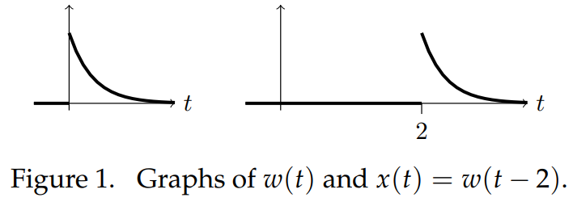

### Introductory Example
Consider the system $x' + 3x = f(t)$. In the previous note we found its unit impulse response:
$$w(t)=\begin{cases}
0&\text{ for } t<0\\
e^{-3t}&\text{ for } t>0
\end{cases}=u(t)e^{-3t}$$
This is the response from rest IC to the input $f(t) = \delta(t)$. What if we shifted the impulse to another time, say, $f(t) = \delta(t - 5)$? Linear time invariance tells us the response will also be shifted. That is, the solution to
$$x'+3x=\delta(t-2), \text{ with rest IC}\tag{1}$$
is
$$x(t)=w(t-2)=\begin{cases}
0&\text{ for } t<2\\
e^{-3(t-2)}&\text{ for } t>2
\end{cases}=u(t-2)e^{-3(t-2)}$$
In words, this is a system of exponential decay. The decay starts as soon as there is an input into the system. Graphs are shown in Figure 1 below.  
  
We know that $\mathcal{L}(\delta(t-a))=e^{-as}$. So, we can find $X = \mathcal{L}(x)$ by taking the Laplace transform of $(1)$.
$$(s+3)X(s)=e^{-2s} \rArr X(s)=\frac{e^{-2s}}{s+3}=e^{-2s}W(s)$$
where $W=\mathcal{L}(w)$. This is an example of the $t$-translation rule.

### $t$-translation Rule
We give the rule in two forms.
$$\mathcal{L}(u(t-a)f(t-a))=e^{-as}F(s)\tag{2}$$
$$\mathcal{L}(u(t-a)f(t))=e^{-as}\mathcal{L}(f(t+a))\tag{3}$$
For completeness we include the formulas for
$$\mathcal{L}(u(t-a))=e^{-as}/s\tag{4}$$
$$\mathcal{L}(\delta(t-a))=e^{-as}\tag{5}$$
Remarks:
1. Formula $(3)$ is ungainly. The notation will become clearer in the examples below.
2. Formula $(2)$ is most often used for computing the inverse Laplace transform, i.e., as
$$u(t-a)f(t-a)=\mathcal{L}^{-1}(e^{-as}F(s))$$
3. These formulas parallel the $s$-shift rule. In that rule, multiplying by an exponential on the time ($t$) side led to a shift on the frequency ($s$) side. Here, a shift on the time side leads to multiplication by an exponential on the frequency side.

**Proof:** The proof of $(2)$ is a very simple change of variables on the Laplace integral.
$$\begin{aligned}
\mathcal{L}(u(t-a)f(t-a))&=\int_0^\infty u(t-a)f(t-a)e^{-st}dt\\
&=\int_a^\infty f(t-a)e^{-st}dt &\text{($u(t - a) = 0$ for $t < a$)}\\
&=\int_0^\infty f(\tau)e^{-s(\tau+a)}d\tau &\text{(change of variables: $\tau = t - a$)}\\
&=e^{-as}\int_0^\infty f(\tau)e^{-s\tau}d\tau\\
&=e^{-as}F(s)
\end{aligned}$$
Formula $(3)$ follows easily from $(2)$. The easiest way to proceed is by introducing a new function. Let $g(t) = f(t + a)$, so
$$f(t)=g(t-a) \text{ and } G(s)=\mathcal{L}(g)=\mathcal{L}(f(t+a))$$
We get
$$\mathcal{L}(u(t-a)f(t))=\mathcal{L}(u(t-a)g(t-a))=e^{-as}G(s)=e^{-as}\mathcal{L}(f(t+a))$$
The second equality follows by applying $(2)$ to $g(t)$.

**Example.** Find $\mathcal{L}^{-1}(\frac{ke^{-as}}{s^2+k^2})$  
**Solution.**
$$\begin{aligned}
&&&f(t)=\mathcal{L}^{-1}(\frac{k}{s^2+k^2})=\sin(kt)\\
\rArr &&&\mathcal{L}^{-1}(\frac{ke^{-as}}{s^2+k^2})=u(t-a)f(t-a)=u(t-a)\sin(k(t-a))
\end{aligned}$$
**Example.**
$$\mathcal{L}(u(t-3)t)=e^{-3s}\mathcal{L}(t+3)=e^{-3s}(\frac{1}{s^2}+\frac{3}{s}$$
**Example.**
$$\mathcal{L}(u(t-3)\cdot 1)=e^{-3s}\mathcal{L}(1)=e^{-3s}/s$$
**Example.** Find $\mathcal{L}(f)$ for $f(t)=\begin{cases}
0&\text{ for } t<2\\
t^2&\text{ for } t>2
\end{cases}$  
**Solution.**
$$f(t)=u(t-2)t^2 \rArr F(s)=e^{-2s}\mathcal{L}((t+2)^2)=e^{-2s}(\frac{2}{s^3}+\frac{4}{s^2}+\frac{4}{s})$$
**Example.** Find $\mathcal{L}(f)$ for $f(t)=\begin{cases}
\cos(t)&\text{ for } 0 < t < 2\pi\\
0&\text{ for } t>2\pi
\end{cases}$  
**Solution.**
$$\begin{aligned}
&&&f(t)=\cos(t)(u(t)-u(t-2\pi))=u(t)\cos(t)-u(t-2\pi)\cos(t)\\
\rArr &&&F(s)=\frac{s}{s^2+1}-e^{-2\pi s}\mathcal{L}(\cos(t+2\pi))=(1-e^{-2\pi s})\frac{s}{s^2+1}
\end{aligned}$$
