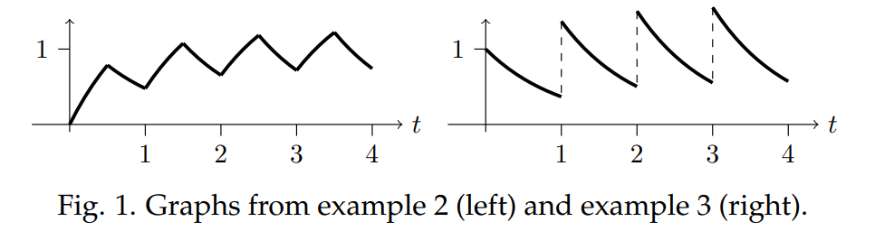

The fish population in a lake is not reproducing fast enough and the population is decaying exponentially with decay rate $k$. A program is started to stock the lake with fish. Three different scenarios are discussed below.

**Example 1.** A program is started to stock the lake with fish at a constant rate of $r$ units of fish/year. Unfortunately, after 1/2 year the funding is cut and the program ends. Model this situation and solve the resulting DE for the fish population as a function of time.  
**Solution.** Let $x(t)$ be the fish population and let $A = x(0^-)$ be the initial population. Exponential decay means the population is modeled by
$$x'+kx=f(t), x(0^-)=A\tag{1}$$
where $f(t)$ is the rate fish are being added to the lake. In this case
$$f(t)=\begin{cases}
r&\text{ for } 0<t<1/2\\
0&\text{ for } 1/2<t
\end{cases}$$
First, write $f$ in '$u$-format': $f(t) = r(1 - u(t - 1/2))$.  
Next, take the Laplace transform and solve for $X(s)$.
$$\begin{aligned}
&&&F(s)=\mathcal{L}(f)(s)=\frac{r}{s}-\frac{r}{s}e^{-s/2}\\
\rArr &&&sX-X(0^-)+kX=F(s)\\
\rArr &&&(s+k)X-A=\frac{r}{s}(1-e^{-s/2})\\
\rArr &&&X(s)=\frac{A}{s+k}+\frac{r}{s(s+k)}(1-e^{-s/2})
\end{aligned}
$$
To find $x(t)$ we temporarily ignore the factor of $e^{-s/2}$ and take Laplace inverse of what's left. (using partial fractions).
$$\mathcal{L}^{-1}(\frac{A}{s+k})=Ae^{-kt}, \mathcal{L}^{-1}(\frac{r}{s(s+k)})=\frac{r}{k}(1-e^{-kt})$$
The $t$-translation formula says
$$\mathcal{L}^{-1}(\frac{re^{-s/2}}{s(s+k)})=u(t-1/2)\frac{r}{k}(1-e^{-k(t-1/2)})$$
Putting it all together we get (in $u$ and cases format).
$$\begin{aligned}
x(t)&=Ae^{-kt}+\frac{r}{k}(1-e^{-kt})-u(t-1/2)\frac{r}{k}(1-e^{-k(t-1/2)})\\
&=\begin{cases}
Ae^{-kt}+\frac{r}{k}(1-e^{-kt}) &\text{ for } 0<t<1/2\\
Ae^{-kt}+\frac{r}{k}(e^{-kt}-e^{-k(t-1/2)}) &\text{ for } 1/2<t
\end{cases}
\end{aligned}$$

**Example 2.** (Periodic on/off) The program is refunded and the have enough money to stock at a constant rate of $r$ for the first half of each year. Find $x(t)$ in this case.  
**Solution.** All that's changed from example 1 is the input function $f(t)$. We write it in cases-format and translate that to $u$-format so we can take the Laplace transform.
$$\begin{aligned}
f(t)&=\begin{cases}
r&\text{ for } 0<t<1/2\\
0&\text{ for } 1/2<t<1\\
r&\text{ for } 1<t<3/2\\
0&\text{ for } 3/2<t<2\\
&\cdots
\end{cases}\\
&=r(1-u(t-\frac{1}{2})+u(t-1)-u(t-\frac{3}{2})+\cdots)
\end{aligned}$$
The computations from here are essentially the same as in the previous example.
$$\begin{aligned}
&&&\mathcal{L}(f)=\frac{r}{s}(1-e^{-1/2}+e^{-1}-e^{-3/2}+\cdots)\\
\rArr &&&X=\frac{A}{s+k}+\frac{r}{s(s+k)}(1-e^{-1/2}+e^{-1}-\cdots)\\
\rArr &&&x(t)=Ae^{-kt}+\frac{r}{k}[(1-e^{-kt})-u(t-1/2)(1-e^{-k(t-1/2)})+\cdots]\\
\rArr &&&x(t)=\begin{cases}
Ae^{-kt}+\frac{r}{k}-\frac{r}{k}e^{-kt}&\text{ for } 0<t<1/2\\
Ae^{-kt}-\frac{r}{k}(e^{-kt}-e^{-k(t-1/2)})&\text{ for } 1/2<t<1\\
\cdots\\
Ae^{-kt}+\frac{r}{k}-\frac{r}{k}(e^{-kt}-e^{-k(t-1/2)}+\ldots+e^{-k(t-n)})&\text{ for } n<t<n+1/2\\
Ae^{-kt}-\frac{r}{k}(e^{-kt}-e^{-k(t-1/2)}+\ldots-e^{-k(t-n-1/2)})&\text{ for } n+1/2<t<n+1\\
\cdots
\end{cases}
\end{aligned}$$
Factoring out $e^{-kt}$ gives:
$$x(t)=\begin{cases}
Ae^{-kt}+\frac{r}{k}-\frac{r}{k}e^{-kt}(1-e^{k/2}+e^k-e^{3k/2}+\ldots+e^{kn})&\text{ for } n<t<n+1/2\\
Ae^{-kt}-\frac{r}{k}e^{-kt}(1-e^{k/2}+e^k-\ldots-e^{k(n+1/2)})&\text{ for } n+1/2<t<n+1
\end{cases}$$
Note that the constant term $r/k$ is only present during periods of stocking.

**Example 3.** (Impulse train) The answer to the previous example is a little hard to read. We know from experience that impulsive input usually leads to simpler output. In this scenario suppose that once a year $r/2$ units of fish are dumped all at once into the lake. Find $x(t)$ in this case.  
**Solution.** Once again, all that's changed from example 1 is the input function $f(t)$. The IVP is still given by equation $(1)$.
$$f(t)=\frac{r}{2}(\delta(t)+\delta(t-1)+\delta(t-2)+\delta(t-3)+\cdots$$
This is called an *impulse train*. Its Laplace transform is easy to find.
$$F(s)=\frac{r}{2}(1+e^{-s}+e^{-2s}+e^{-3s}+\cdots)$$
One nice thing about delta functions is that they don't introduce any new terms into the partial fractions part of the problem.
$$\begin{aligned}
sX(s)-X(0^-)+kX(s)&=\frac{r}{2}(1+e^{-s}+e^{-2s}+e^{-3s}+\cdots)\\
\rArr X(s)&=\frac{A}{s+k}+\frac{r}{2(s+k)}(1+e^{-s}+e^{-2s}+e^{-3s}+\cdots)
\end{aligned}$$
Laplace inverse is easy:
$$\mathcal{L}^{-1}(\frac{1}{s+k})=e^{-kt} \rArr \mathcal{L}^{-1}(\frac{e^{-ns}}{s+k})=u(t-n)e^{-k(t-n)}$$
Thus,
$$x(t)=Ae^{-kt}+\frac{r}{2}e^{-kt}+\frac{r}{2}u(t-1)e^{-k(t-1)}+\frac{r}{2}u(t-2)e^{-k(t-2)}++\frac{r}{2}u(t-3)e^{-k(t-3)}+\cdots$$
Here are graphs of the solutions to examples 2 and 3 (with $A = 0, k = 1, r = 2$). Notice how they settle down to periodic behavior.  

