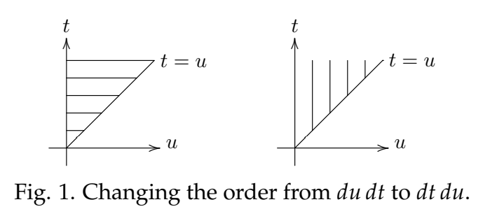

### Green's Formula in Time and Frequency
When we studied convolution we learned Green's formula. This says, the IVP
$$p(D)x=f(t), \text{ with rest IC}\tag{1}$$
has solution
$$x(t)=(w*f)(t), \text{ where $w(t)$ is the weight function.}\tag{2}$$
(Remember, the weight function is the same as the unit impulse response.)  
The Laplace transform changes these equations to ones in the frequency variable $s$.
$$p(s)X(s)=F(s)\tag{3}$$
$$X(s)=\frac{1}{p(s)}F(s)=W(s)F(s)\tag{4}$$
where $W(s)$ is the transfer function.  
Equation $(2)$ is *Green's formula in time* and $(4)$ is *Green's formula in frequency*. In words, viewed from the $t$ side, the solution to $(1)$ is the convolution of the weight function and the input. Viewed from the $s$ side, the solution is the product of the transfer function and the input.

### Convolution
Comparing equations $(2)$ and $(4)$ we see that
$$\mathcal{L}(w*f)=W(s)\cdot F(s)\tag{5}$$
It appears that Laplace transforms convolution into multiplication. Technically, equation $(5)$ only applies when one of the functions is the weight function, but the formula holds in general.  
**Theorem:** For any two functions $f(t)$ and $g(t)$ with Laplace transforms $F(s)$ and $G(s)$ we have
$$\mathcal{L}(f*g)=F(s)\cdot G(s)\tag{6}$$
**Remarks:**
1. This theorem gives us another way to prove convolution is commutative. It is just the commutivity of regular multiplication on the $s$-side.
$$\mathcal{L}(f*g)=F\cdot G=G\cdot F=\mathcal{L}(g*f)$$
2. In fact, the theorem helps solidify our claim that convolution is a type of multiplication, because viewed from the frequency side it *is* multiplication.  
**Proof:** The proof is a nice exercise in switching the order of integration. We won't use $0^-$ and $t^+$ in the integrals, since they would just clutter the exposition. It is an amusing exercise to put them in and see that they transform correctly as we manipulate the integrals.  
We start by writing $\mathcal{L}(f*g)$ as the convolution integral followed by the Laplace integral.  
$$\begin{aligned}
\mathcal{L}(f*g)&=\int_0^\infty(f*g)(t)e^{-st}dt\\
&=\int_0^\infty \int_0^t f(t-u)g(u)e^{-st}dudt\\
&\text{Next, we change the order of integration (see the figure below).}\\
&=\int_0^\infty \int_u^\infty f(t-u)g(u)e^{-st}dtdu\\
&\text{Finally, change variables in the inner integral: substitute $v = t - u, dv =
dt$, ($u$ a constant)}\\
&=\int_0^\infty \int_0^\infty f(v)g(u)e^{-s(v+u)}dvdu\\
&=\int_0^\infty f(v)e^{-sv}dv \int_0^\infty g(u)e^{-su}du\\
&=F(s)G(s)
\end{aligned}$$

### Integration Rule
If differentiation on the time side leads to multiplication by $s$ on the frequency side then we should expect integration in time to lead to division by $s$. If $f(t)$ is a function with Laplace transform $F(s)$ then the integration rule states:
$$\mathcal{L}(\int_{0^-}^{t^+}f(\tau)d\tau)=\frac{F(s)}{s}$$
**Proof:** One way to prove this is using the $t$-derivative rule. Let/s be clever and use convolution instead. The integral is exactly $f(t)*1$. Thus,
$$\mathcal{L}(\int_{0^-}^{t^+}f(\tau)d\tau)=\mathcal{L}(f*1)=F(s)\cdot \mathcal{L}(1)=\frac{F(s)}{s}$$
This is what we needed to show.
