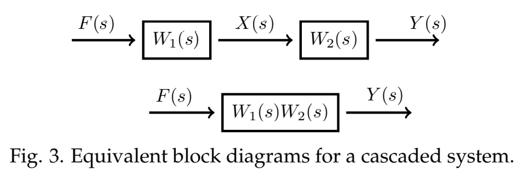

### Introduction
We discussed some simple block diagrams when we introduced the notions of system, input, and output back in unit 1. Here, we will include the transfer function in the diagram and show how to use them to compute the transfer function of more complicated systems.  
As we do this, it will be useful to keep in mind the desciption of the transfer function as output/input.

### Simple Examples
**Example 1.** Suppose we have the system $mx'' + bx' + kx = f(t)$, with input $f(t)$ and output $x(t)$. The Laplace transform converts this all to functions and equations in the frequency variable $s$. The transfer function for this system is $W(s) = 1/(ms^2 + bs + k)$. We can write the relation between input and output as
$$\text{input } F(s) \rightsquigarrow \text{output } X(s) = W(s)F(s)$$
As a block diagram we can represent the system by  
  
Sometimes we write the formula for the transfer function in the box representing the system. For the above example this would look like  

**Example 2.** (Cascading systems) Consider the *cascaded* system
$$p_1(D)x = f , p_2(D)y = x, \text{ rest IC.}$$
The input to the cascade is $f$ and the output is $y$. The first equation takes the input $f$ and outputs $x$. This is the input to the second equation, which ouputs $y$.  
This is easy to solve on the frequency side. Let $W_1(s) = 1/p_1(s)$ and $W_2(s) = 1/p_2(s)$ be the transfer functions for the two differential equations. Considering the two equations separately we have
$$X(s) = W_1(s) \cdot F(s) \text{ and } Y(s) = W_2(s) \cdot X(s)$$
It follows immediately that $Y(s) = W_2(s)\cdot W_1(s)\cdot F(s)$. Therefore the transfer function for the cascade is
$$\text{output/input} = Y(s)/F(s) = W_2(s) \cdot W_1(s)$$
In other words, for cascaded systems the transfer functions multiply.  
Representing this as block diagrams we have two equivalent diagrams  

**Example 3.** (Parallel systems) Suppose that we have a system consisting of two systems in parallel as shown in the block diagram.  
  
Find the transfer function for the entire system.  
**Solution.** The plus sign in the circle indicates the two signals coming into the junction should be added. The split near the start indicates the input $F(s)$ go into each system.  
The way to figure out the transfer function is to name the outputs of each individual system.  
  
For each system we know output $=$ transfer function $\times$ input.  
Thus, $X_1 = W_1 \cdot F, X_2 = W_2 \cdot F, Y = X_1 + X_2$. So, we easily compute
$$Y = X_1 + X_2 = W_1 \cdot F + W_2 \cdot F = (W_1 + W_2) \cdot F$$
Therefore the transfer function is $W_1 + W_2$.

### Feedback Loops
Many systems use feedback loops. That is, the output of the system is monitored and used to modify the input. It is very hard to control a system without a feedback loop.  
Suppose we start with a system with transfer function $W(s)$.  
  
and modify it to have the feedback loop shown  
  
The original system is known as the *open loop system* and the corresponding system with feedback is known as the *closed loop system*.  
We've labeled the outputs from each system element. The symbol $\times g$ means the input is scaled by $g$, that is apply a gain of $g$ to the input. The symbol $\sum$ means the two inputs are combined; the plus and minus signs indicate to add or subtract the corresponding input.  
The method of finding the transfer function is the same as in the previous examples. A bit of algebra gives
$$V=F-gY, Y=W\cdot V \rArr Y=W(F-gY) \rArr Y=\frac{W}{1+gW}\cdot F$$
As usual, the transfer function is output/input $= Y/F = W/(1 + gW)$. This formula is one case of what is often called *Black's formula*.

**Example 4.** Suppose we have an open loop system, say a circuit, with transfer function $W(s) = s/(as^2 + bs + c)$. If we add a feedback loop with gain $g$ then using Black's formula the closed loop transfer function is
$$\frac{s/(as^2 + bs + c)}{1+gs/(as^2 + bs + c)}=\frac{s}{as^2 + (b+g)s + c}$$
