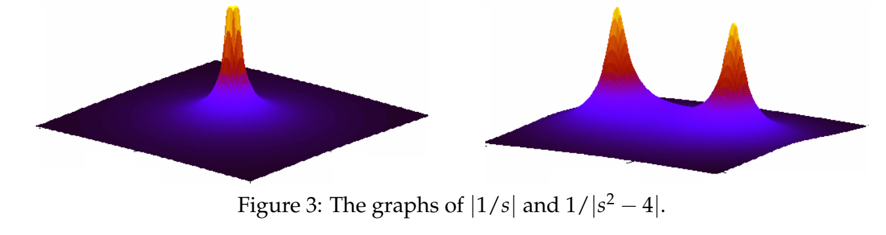

### Rational Functions
A **rational function** is a ratio of polynomials $q(s)/p(s)$.  
**Examples.** The following are all rational functions. $(s^2 + 1)/(s^3 + 3s + 1),1/(ms^2 + bs + k), s^2 + 1 + (s^2 + 1)/1$.  
If the numerator $q(s)$ and the denominator $p(s)$ have no roots in common, then the rational function $q(s)/p(s)$ is in **reduced form**.
**Example.** The three functions in the example above are all in reduced form.  
**Example.** $(s - 2)/(s^2 - 4)$ is not in reduced form, because $s = 2$ is a root of both numerator and denominator. We can rewrite this in reduced form as
$$\frac{s-2}{s^2-4}=\frac{s-2}{(s+2)(s-2)}=\frac{1}{s+2}$$

### Poles
For a rational function in reduced form the **poles** are the values of $s$ where the denominator is equal to zero; or, in other words, the points where the rational function is not defined. We allow the poles to be complex numbers here.  
**Examples.**  
a) The function $1/(s^2 + 8s + 7)$ has poles at $s = -1$ and $s = -7$.  
b) The function $(s - 2)/(s^2 - 4) = 1/(s + 2)$ has only one pole, $s = -2$.  
c) The function $1/(s^2 + 4)$ has poles at $s = \plusmn 2i$.  
d) The function $s^2 + 1$ has no poles.  
e) The function $1/(s^2 + 8s + 7)(s^2 + 4)$ has poles at $-1, -7, \plusmn 2i$. (Notice that this function is the product of the functions in (a) and (c) and that its poles are the union of poles from (a) and (c).)  
**Remark.** For ODE's with system function of the form $1/p(s)$, the poles are just the roots of $p(s)$. These are the familiar characteristic roots, which are important as we have seen.

### Graphs Near Poles
We start by considering the function $F_1(s) = 1/s$. This is well defined for every complex $s$ except $s = 0$. To visualize $F_1(s)$ we might try to graph it. However it will be simpler, and yet still show everything we need, if we graph $|F_1(s)|$ instead.  
To start really simply, let's just graph $|F_1(s)| = \frac{1}{|s|}$ for $s$ real (rather than complex).  
  
Now let's do the same thing for $F_2(s) = 1/(s^2 - 4)$. The roots of the denominator are $s = \plusmn 2$, so the graph of $F_2(s) = \frac{1}{|s^2-4|}$ has vertical asymp­totes at $s = \plusmn 2$.  
  
As noted, the vertical asymptotes occur at values of $s$ where the denominator of our function is 0. These are what we defined as the poles.
* $F_1(s)=\frac{1}{s}$ has a single pole at s = 0.
* $F_2(s)=\frac{1}{s^2-4}$ has two poles, one each at $s = \plusmn 2$.

Looking at Figures 1 and 2 you might be reminded of a tent. The poles of the tent are exactly the vertical asympotes which sit at the poles of the function.  
Let's now try to graph $|F_1(s)|$ and $|F_2(s)|$ when we allow $s$ to be complex. If $s = a + ib$ then $F_1(s)$ depends on two variables $a$ and $b$, so the graph requires three dimensions: two for $a$ and $b$, and one more (the vertical axis) for the value of $|F_1(s)|$. The graphs are shown in Figure 3 below. They are 3D versions of the graphs above in Figures 1 and 2. At each pole there is a conical shape rising to infinity, and far from the poles the function fall off to 0.  
  
Roughly speaking, the poles tell you the shape of the graph of a function $|F(s)|$: it is *large near the poles*. In the typical pole diagams seen in practice, the $|F(s)|$ is also small far away from the poles.

### Poles and Exponential Growth Rate
If $a > 0$, the exponential function $f_1(t) = e^{at}$ grows rapidly to infinity as $t \rarr \infty$. Likewise the function $f_2(t) = e^{at} \sin bt$ is oscillatory with the amplitude of the oscillations growing exponentially to infinity as $t \rarr \infty$. In both cases we call $a$ the *exponential growth rate* of the function.  
The formal definition is the following
**Definition:** The **exponential growth rate** of a function $f(t)$ is the smallest value a such that
$$\lim_{t \to \infty} \frac{f(t)}{e^{at}}=0 \text{ for all }b > a\tag{1}$$
In words, this says $f(t)$ grows slower than any exponential with growth rate larger than $a$.  
**Examples.**
1. $e^{2t}$ has exponential growth rate 2.
2. $e^{-2t}$ has exponential growth rate -2. A negative growth rate means that the function is decaying exponentially to zero as $t \rarr \infty$.
3. $f(t) = 1$ has exponential growth rate 0.
4. $\cos t$ has exponential growth rate 0. This follows because $\lim_{t \to \infty} \frac{\cos t}{e^{at}}=0$ for all positive $b$.
5. $f(t) = t$ has exponential growth rate 0. This may be surprising because $f(t)$ grows to infinity. But it grows linearly, which is slower than any positive exponential growth rate.
6. $f(t) = e^{t^2}$ does not have an exponential growth rate since it grows faster than any exponential.

**Poles and Exponential Growth Rate**  
We have the following theorem connecting poles and exponential growth rate.  
**Theorem:** The exponential growth rate of the function $f(t)$ is the largest real part of all the poles of its Laplace transform $F(s)$.  
**Examples.** We'll check the theorem in a few cases.
1. $f(t) = e^{3t}$ clearly has exponential growth rate equal to 3. Its Laplace transform is $1/(s - 3)$ which has a single pole at $s = 3$, and this agrees with the exponential growth rate of $f(t)$.
2. Let $f(t) t$, then $F(s)= 1/s^2$. $F(s)$ has one pole at $s = 0$. This matches the exponential growth rate zero found in (5) from the previous set of examples.
3. Consider the function $f(t)=3e^{2t}+5e^t+7e^{-8t}$. The Laplace transform is $F(s) = 3/(s - 2) + 5/(s - 1) + 7/(s + 8)$, which has poles at $s = 2, 1, -8$. The largest of these is 2. (Don't be fooled by the absolute value of -8, since 2 > -8, the largest pole is 2.) Thus, the exponential growth rate is 2. We can also see this directly from the formula for the function. It is clear that the $3e^{2t}$ term determines the growth rate since it is the dominant term as $t \rarr \infty$.
4. Consider the function $f(t)=e^{-t} \cos 2t+3e^{-2t}$. The Laplace transform is $F(s) = \frac{s}{(s+1)^2+4}+\frac{s}{s+2}$. This has poles $s = -1\plusmn 2i, -2$. The largest real part among these is -1, so the exponential growth rate is -1.

Note that in item (4) in this set of examples the growth rate is negative because $f(t)$ actually *decays* to 0 as $t \to \infty$. We have the following  
**Rule:**
1. If $f(t)$ has a negative exponential growth rate then $f(t) \to 0$ as $t \to \infty$.
2. If $f(t)$ has a positive exponential growth rate then $f(t) \to \infty$ as $t \to \infty$.

### An Example of What the Poles Don't Tell Us
Consider an arbitrary function $f(t)$ with Laplace transform $F(s)$ and $a > 0$. Shift $f(t)$ to produce $g(t) = u(t - a)f(t - a)$, which has Laplace transform $G(s) = e^{-as}F(s)$. Since $^e{-as}$ does not have any poles, $G(s)$ and $F(s)$ have exactly the same poles. That is, the poles can't detect this type of shift in time.
