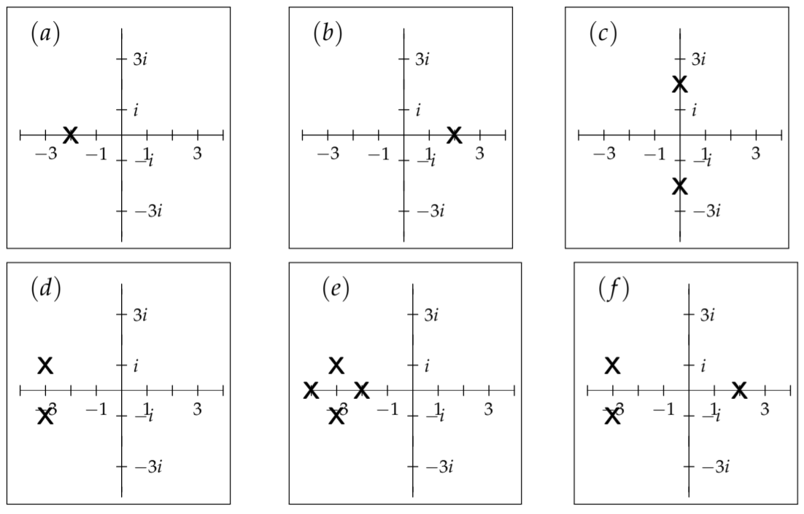
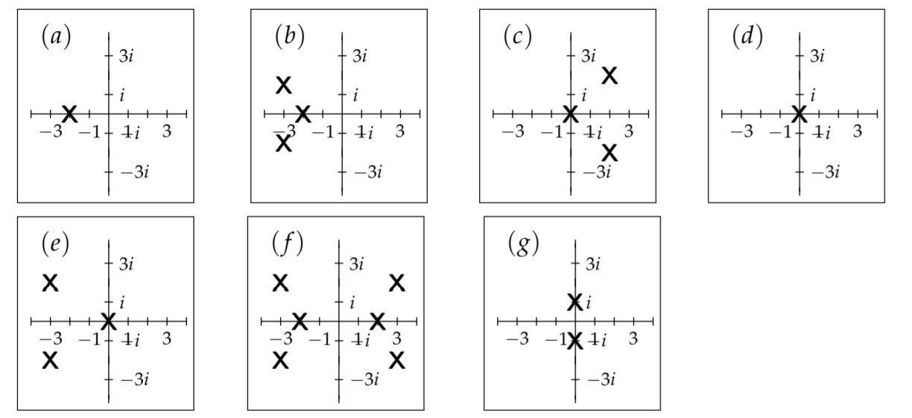
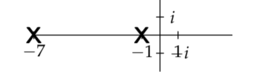
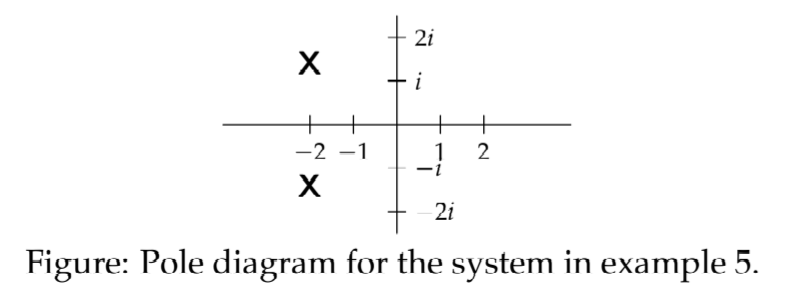

### Definition of the Pole Diagram
The pole diagram of a function $F(s)$ is simply the complex $s$-plane with an $$ marking the location of each pole of $F(s)$.  
**Example 1.** Draw the pole diagrams for each of the following functions.  
a) $F_1(s)=\frac{1}{s+2}$  
b) $F_2(s)=\frac{1}{s-2}$  
c) $F_3(s)=\frac{1}{s^2+4}$  
d) $F_4(s)=\frac{s}{s^2+6s+10}$  
e) $F_5(s)=\frac{1}{((s+3)^2+1)(s+2)(s+4)}$  
f) $F_6(s)=\frac{1}{((s+3)^2+1)(s-2)}$  
**Solution.**  
  
For (d) we found the poles by first completing the square: $s^2 + 6s + 10 = (s + 3)^2 + 1$, so the poles are at $s = -3 \plusmn i$.

**Example 2.** Use the pole diagram to determine the exponential growth rate of the inverse Laplace transform of each of the functions in example 1.  
**Solution.**  
a) The largest pole is at -2, so the exponential growth rate is -2.  
b) The largest pole is at 2, so the exponential growth rate is 2.  
c) The poles are $\plusmn2i$, so the largest real part of a pole is 0. The exponential growth rate is 0.  
d) The largest real part of a pole is -3. The exponential growth rate is -3.  
e) The largest real part of a pole is -2. The exponential growth rate is -2.  
f) The largest real part of a pole is 2. The exponential growth rate is 2.

**Example 3.** Each of the pole diagrams below is for a function $F(s)$ which is the Laplace transform of a function $f(t)$. Say whether  
(i) $f(t) \to 0$ as $t \to \infty$  
(ii) $f(t) \to \infty$ as $t \to \infty$  
(iii) You don't know the behavior of $f(t)$ as $t \to 0$  
  
**Solution.** a) Exponential growth rate is -2, so $f(t) \to 0$.  
b) Exponential growth rate is -2, so $f(t) \to 0$.  
c) Exponential growth rate is 2, so $f(t) \to \infty$.  
d) Exponential growth rate is 0, so we can't tell how $f(t)$ behaves.  Two examples of this: (i) if $F(s) = 1/s$ then $f(t) = 1$, which stays bounded; (ii) if $F(s) = 1/s^2$ then $f(t) = t$, which does go to infinity, but more slowly than any positive exponential.  
e) Exponential growth rate is 0, so don't know the behavior of $f(t)$.  
f) Exponential growth rate is 3, so $f(t) \to \infty$.  
g) Exponential growth rate is 0, so don't know the behavior of $f(t)$. (e.g. both $\cos t$ and $t\cos t$ have poles at $\plusmn i$.

### The Pole Diagram for an LTI System
**Definition:** The pole diagram for an LTI system is defined to be the pole diagram of its transfer function.  
**Example 4.** Give the pole diagram for the system
$$x''+8x'+7x=f(t)$$
where we take $f(t)$ to be the input and $x(t)$ the output.  
**Solution.** The transfer function for this system is
$$W(s)=\frac{1}{s^2+7s+1}=\frac{1}{(s+1)(s+7)}$$
Therefore, the poles are $s = -1, -7$ and the pole diagram is  

**Example 5.** Give the pole diagram for the system
$$x''+4x'+6x=y'$$
where we consider $y(t)$ to be the input and $x(t)$ to be the output.  
**Solution.** Assuming rest IC's, Laplace transforming this equation gives us $(s^2 + 4s + 6)X = sY$. This implies $X(s)=\frac{s}{s^+4s+6}Y(s)$ and the transfer function is $W(s)=\frac{s}{s^2+4s+6}$. This has poles at $s=-2\plusmn \sqrt{2}i$.  

