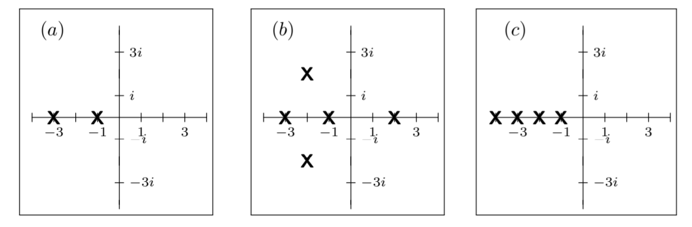
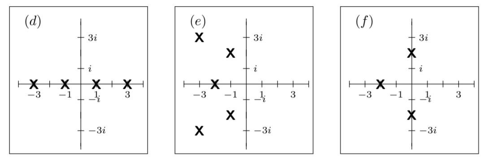

Recall that the LTI system
$$p(D)x=f\tag{1}$$
has an associated homogeneous equation
$$p(D)x=0\tag{2}$$
In unit 2 we saw the following stability criteria.
1. The system is stable if every solution to $(2)$ goes to 0 as $t \to \infty$. In words, the unforced system always returns to equilibrium.
2. Equivalently, the system is stable if all the roots of the characteristic equation have negative real part.

Now, since the transfer function for the system in $(1)$ is the poles $1/p(s)$ of the system are just the characteristic roots. Comparing this with the stability criterion 2, gives us another way of expressing the stability criteria.

3. The system is stable if all its poles have negative real part.
4. Equivalently, the system is stable if all its poles lie strictly in the left half of the complex plane Re$(s) < 0$.

Criterion 4 tells us how to see at a glance if the system is stable, as illustrated in the following example. 
**Example.** Each of the following six graphs is the pole diagram of an LTI system. Say which of the systems are stable.  
  
  
**Solution.** (a), (c) and (e) have all their poles in the left half-plane, so they are stable. The others do not, so they are not stable.
