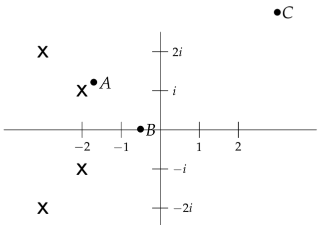

We started the session by considering the poles of functions $F(s)$, and saw that, by definition, the graph of $|F(s)|$ went off to infinity at the poles. Since it tells us where $|F(s)|$ is infinite, the pole diagram provides a crude graph of $|F(s)|$: roughly speaking, $|F(s)|$ will be large for values of $s$ near the poles. In this note we show how this basic fact provides a useful graphical tool for spotting resonant or near-resonant frequencies for LTI systems.  
**Example 1.** Figure 1 shows the pole diagram of a function $F(s)$. At which of the points A, B, C on the diagram would you guess $|F(s)|$ is largest?  
  
**Solution.** Point A is close to a pole and B and C are both far from poles so we would guess point $|F(s)|$ is largest at point A.  
**Example 2.** The pole diagram of a function $F(s)$ is shown in Figure 2. At what point $s$ on the positive imaginary axis would you guess that $|F(s)|$ is largest?  
  
**Solution.** We would guess that $s$ should be close to $3i$, which is near a pole. There is not enough information in the pole diagram to determine the exact location of the maximum, but it is most likely to be near the pole.

### Amplitude Response and the System Function
Consider the system
$$p(D)x=f(t)\tag{1}$$
where we take $f(t)$ to be the input and $x(t)$ to be the output. The transfer function of this system is
$$W(s)=\frac{1}{p(s)}\tag{2}$$
When $f(t) = B \cos(\omega t)$ the Exponential Response Formula from unit 2 gives the following periodic solution to $(1)$
$$x_p(t)=\frac{B\cos (\omega t-\phi)}{|p(i\omega)|}, \text{ where } \phi=Arg(p(i\omega))\tag{3}$$
If the system is stable, then all solutions are asymptotic to the periodic solution in $(3)$. In this case, we saw in the session on Frequency Response in unit 2 that the amplitude response of the system as a function of $\omega$ is
$$g(\omega)=\frac{1}{|p(i\omega)|}\tag{4}$$
Comparing $(2)$ and $(4)$, we see that for a stable system the amplitude response is related to the transfer function by
$$g(\omega)=|W(i\omega)|\tag{5}$$
**Note:** The relation $(5)$ holds for all stable LTI systems.  
Using equation $(5)$ and the language of amplitude response we will now re-do example 2 to illustrate how to use the pole diagram to estimate the practical resonant frequencies of a stable system.  
**Example 3.** Figure 3 shows the pole diagram of a stable LTI system. At approximately what frequency will the system have the biggest response?  
  
**Solution.** Let the transfer function be $W(s)$. Equation $(5)$ says the amplitude response $g(\omega) = |W(i\omega)|$. Since $i\omega$ is on the positive imaginary axis, the amplitude response $g(\omega)$ will be largest at the point $i\omega$ on the imaginary axis where $|W(i\omega)|$ is largest. This is exactly the point found in example 2. Thus, we choose $i\omega \approx 3i$, i.e. the practical resonant frequency is approximately $\omega = 3$.  
**Note:** Rephrasing this in graphical terms: we can graph the magnitude of the system function $W(s)$ as a surface over the $s$-plane. The amplitude response of the system $|g(\omega)| = |W(i\omega)|$ is given by the part of the system function graph that lies above the imaginary axis.
