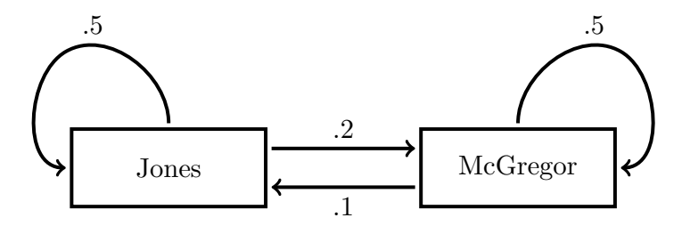

### Models: Two Examples
**Example 1.** Farmer Jones and farmer McGregor each have a field full of rabbits; farmer Jones' field contains $x(t)$ rabbits, and farmer McGregor's $y(t)$ ones; $t$, time, is measured in months. These rabbits breed fast: they show a net growth rate of 0.5 rabbits per rabbit per month. The rabbits can also hop over the hedge between the fields; the grass is greener in Farmer McGregor's field, so Jones' rabbits jump over a the rate of 0.2 per month, whereas McGregor's jump at the rate of 0.1 per month.  
We can illustrate this with the following flow diagram:  
  
Putting everything together, the equations governing $x$ and $y$ are:
$$x'=0.5x-0.2x+0.1y=0.3x+0.1y$$
$$y'=0.5y-0.1y+0.2x=0.2x+0.4y$$
This is an example of a first order $2 \times 2$ linear system.

**Example 2.** Consider the equations:
$$\begin{aligned}
R'&=&\frac{1}{4}R+&&J\\
J'&=&-\frac{17}{16}R+&&\frac{3}{4}J
\end{aligned}$$
This is another first order $2 \times 2$ linear system. It is the result of an analysis by the MIT Humanities Department of the plot a famous Shakespeare play: $R$ denotes Romeo's love for Juliet, and $J$ Juliet's love for Romeo. What does this model mean? Let us try to work backwards.  
The change in Romeo's feelings towards Juliet is mostly determined by how she feels about him: $J$ is the most important term in the expression for $R'$. His own feelings have a small reinforcing effect corresponding to the factor of 1/4 in front of the $R$.  
On the other hand, Juliet is more complex. She has a healthy selfawareness. If she loves Romeo, that very fact causes her to love him more: this is where the $(3/4)J$ term comes from. On the other hand, if he seems to love her, she gets frightened and starts to love him less hence the $-(17/16)R$ term.  
We shall revisit this example in sections text companion matrix and applet companion matrix, and analyze mathematically the solutions to this tragic model.

### Solving a Linear System by Elimination
**Definition.** A two-by-two first order linear system of ODE's with constant coefficients is a collection of equations:
$$x'=ax+by$$
$$y'=cx+dy$$
where $a, b, c$ and $d$ are constants.  
We'll shorten this to *first order linear system* or even *linear system*.  
**Remark.** Say you have dependent variables $x_1, \dots, x_n$; one can define $n \times n$ first order linear systems (with constant coefficients) in exactly the same way:
$$x_1'=a_{11}x_1+\cdots+a_{1n}x_n\\
\cdots\\
x_n'=a_{n1}x_1+\cdots+a_{nn}x_n$$
where the $a_{ij}$ are constants.  
In the next few sessions, we shall develop many tools for understanding $2 \times 2$ linear systems, both analytically and qualitatively. All these techniques generalize, in a fairly straightforward fashion, to $n \times n$ systems. However, this goes beyond the scope of this course. The interested reader could for instance consult the textbook by Edwards and Penney.  
The naive way to solve a linear system of ODE's with constant coefficients is by eliminating variables, so as to change it into a single higher order equation, in one dependent variable. One then solves this equation using the techniques for constant-coefficient ODE's learned in unit 2. This is best illustrated with a worked example.  
**Example.** Let us consider the system of equations from example 1.
$$x'=0.3x+0.1y\tag{1}$$
$$y'=0.2x+0.4y\tag{2}$$
**Step 1.** Transform the equations to get a second order ODE for $x$.  
Use $(1)$ to express $y$ in terms of $x$:
$$y=10x'-3x\tag{3}$$
Plug this into $(2)$. (From equation $(3)$ we get $y' = 10x'' - 3x'$). This gives
$$10x''-3x'=0.2x+4x'-1.2x \rArr 10x''-7x+x=0\tag{4}$$
**Step 2.** Solve the ODE for $x$.  
The characteristic equation for $(4)$ is:
$$10s^2-7s+s=0$$
which has roots $r_1 = 0.5$ and $r_2 = 0.2$. Thus we get two basic solutions,
$$x_1=e^{0.5t} \text{ and } x_2=e^{0.2t}$$
**Step 3.** Solution for $y$.  
Each basic solution for $x$ gives a corresponding solution for $y$, using equa­tion $(3)$
$$y_1=2e^{0.5t} \text{ and } y_2=-e^{0.2t}$$
**Step 4.** Using superposition we get the general solution
$$x(t)=c_1e^{0.5t}+c_2e^{0.2t}$$
$$y(t)=2c_1e^{0.5t}-c_2e^{0.2t}$$
**Remarks.**
1. It is important to understand that the constants $c_1$ and $c_2$ are the same for $x$ and $y$; this follows from equation $(3)$.
2. For certain $c_i$, there will be negatively-valued solutions; these are clearly not biologically significant: the model only holds for $x,y \geq 0$.
3. We chose to eliminate $y$ to have a second order equation in terms of $x$; we could just as well have chosen to eliminate $x$ to get an equation in $y$. It might sometimes be computationally easier to go one way than the other; look out for this.
4. We started by solving systems by elimination because it reduces to our previous methods. This will not be our preferred technique. In fact, in both theoretical and especially numerical work it is usually preferable to go the opposite way and convert a higher order ODE into a system of first order equations and then use matrix methods.
