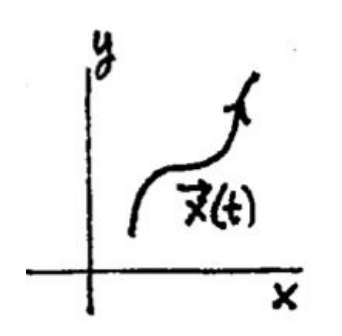

The sort of system for which we will be trying to sketch solutions can be written in the form
$$\begin{aligned}
x'=ax+by\\
y'=cx+dy
\end{aligned} \lrArr \boldsymbol{x'}=A\boldsymbol{x}, \text{ where } A=\begin{pmatrix}
a&b\\c&d
\end{pmatrix}\tag{1}$$
where $a, b, c, d$ are constants.  
A **solution** of this system has the form (we write it two ways)
$$\begin{aligned}
\boldsymbol{x}(t)=\begin{pmatrix}
x(t)\\y(t)
\end{pmatrix}
\end{aligned}, \begin{aligned}
x=x(t)\\y=y(t)
\end{aligned}\tag{2}$$
It is a vector function of $t$ whose components satisfy the system $(1)$ when they are substituted in for $x$ and $y$. In general, you learned in 18.02 and physics that such a vector function describes a motion in the $xy$-plane; the equations in $(2)$ tell how the point $(x, y)$ moves in the $xy$-plane as the time $t$ varies. The moving point traces out a curve called the **trajectory** of the solution $(2)4. The $xy$-plane itself is called the **phase plane** for the system $(1)$. We show a sketch of a trajectory at right. Notice the arrow is used to indicate the direction of increasing time.  
  
We use the term **phase portrait** to mean the graphs of enough trajectories to give a good sense of all the solutions to the system $(1)$.

### Critical Points
**Definition.** A critical point is a point where the derivatives are 0. Therefore a point $(x_0, y_0)$ is a critical point of the system $(1)$ if
$$\begin{pmatrix}
x'\\y'
\end{pmatrix}=A\begin{pmatrix}
x_0\\y_0
\end{pmatrix}=\begin{pmatrix}
0\\0
\end{pmatrix}$$
The equations of the system $(1)$ show this is equivalent to
$$x = x_0, y = y_0 \text{ is a (constant) solution to (1).}$$
Critical points are the key to our qualitative view of systems. We classify the linear systems by their behavior near critical points.  
For the linear system constant coefficient system $(1)$ there is always a critical point at $(0, 0)$. If the matrix $A$ is invertible then this is the only critical point.

### Sketching Principle
When sketching integral curves for direction fields we saw that integral curves did not cross. For the system $(1)$ we have a similar principle.

**Sketching Principle.** Two trajectories of $(1)$ cannot intersect.
