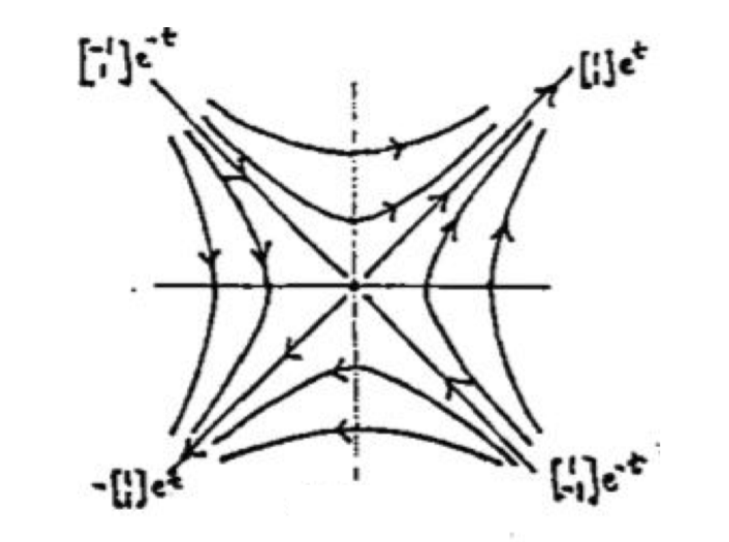
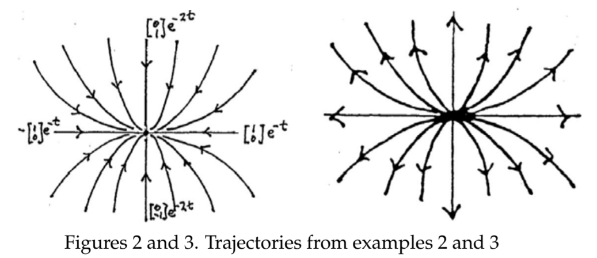
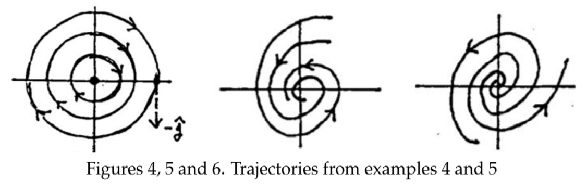

In this note we will only consider linear systems of the form $\boldsymbol{x'} = A\boldsymbol{x}$. Such a system always has a critical point at the origin.  
We start by sketching a few of the simple examples, so as to get an idea of the various possibilities for their trajectories. We will also introduce the terminology used to describe the resulting geometric pictures.  
**Example 1.** Let's consider the linear system on the left below. Its characteristic equation is $\lambda^2 - 1 = 0$, so the eigenvalues are $\plusmn 1$. It is easy to see its general solution is the one on the right below:
$$\begin{cases}
x'=y\\y'=x
\end{cases};\boldsymbol{x}=c_1\begin{pmatrix}
1\\1
\end{pmatrix}e^t+c_2\begin{pmatrix}
1\\-1
\end{pmatrix}e^{-t}\tag{1}$$
The only critical point of the system is $(0, 0)$.  
Looking at the general solution in $(1)$, we see that by giving one of the $c$'s the value 0 and the other one the value 1 or -1, we get four easy solutions:
$$\begin{pmatrix}
1\\1
\end{pmatrix}e^t,-\begin{pmatrix}
1\\1
\end{pmatrix}e^t,\begin{pmatrix}
1\\-1
\end{pmatrix}e^{-t},-\begin{pmatrix}
1\\-1
\end{pmatrix}e^{-t}$$
These four solutions give four trajectories which are easy to plot. Consider the first, for example. When $t = 0$, the point is at $(1, 1)4. As $t$ increases, the point moves outward along the line $y = x$. As $t$ decreases through negative values, the point moves inwards along the line, toward $(0, 0)$. Since $t$ is always understood to be increasing on the trajectory, the whole trajectory consists of the ray $y = x$ in the first quadrant, excluding the origin (which is not reached in finite negative time), with an outward direction of motion.  
A similar analysis can be made for the other three solutions; see figure 1 below.  
  
As you can see, each of the four solutions has as its trajectory one of the four rays. The indicated direction of motion is outward or inward according to whether the exponential factor increases or decreases as $t$ increases. There is even a fifth trajectory: the origin itself, which is a stationary point, i.e., a solution all by itself. So the intersecting diagonal lines represent five trajectories, no two of which intersect.  
For the other trajectories we can do a little algebra: We have
$$\begin{aligned}
x=c_1e^t+c_2e^{-t}\\
y=c_1e^t-c_2e^{-t}
\end{aligned}$$
This easily gives $x^2 - y^2 = 4c_1c_2 = a$ constant, which is the equation of a hyperbola oriented with the axes - we sketch in some of the hyperbolas. We know which direction to point the arrows indicating the direction of motion as $t$ increases since they must be compatible with the motion along the rays - for by continuity, nearby trajectories must have arrowheads pointing in similar directions. The only possibility therefore is the one shown in figure 1.  
A linear system whose trajectories show the general features of those in fig. 1 is said to be an **unstable saddle**. It is called *unstable* because the trajectories go off to infinity as $t$ increases (there are three exceptions: what are they? They are in line $y=-x$). It is called a *saddle* because of its general resemblance to the level curves of a saddle-shaped surface in 3-space.  
**Example 2.** This time we consider the linear system below -since it is decoupled, its general solution (on the right) can be obtained easily by inspection:
$$\begin{cases}
x'=-x\\
y'=-2y
\end{cases}, \boldsymbol{x}=c_1\begin{pmatrix}
1\\0
\end{pmatrix}e^{-t}+c_2\begin{pmatrix}
0\\1
\end{pmatrix}e^{-2t}\tag{2}$$
It is immediate that $x=c_1e^{-t}$ and $y=c_2e^{-2t}$ implies
$$y=cx^2$$
That is, the trajectories are a family of parabolas.  
Following the same plan as in Example 1, we single out the four solutions
$$\begin{pmatrix}
1\\0
\end{pmatrix}e^{-t},-\begin{pmatrix}
1\\0
\end{pmatrix}e^{-t},\begin{pmatrix}
0\\1
\end{pmatrix}e^{-2t},-\begin{pmatrix}
0\\1
\end{pmatrix}e^{-2t}$$
Their trajectories are the four rays along the coordinate axes, the motion being always inward as $t$ increases. Put compatible arrowheads on the parabolas and you get figure 2.  
A linear system whose trajectories have the general shape of those in fig. 2 is called an **asymptotically stable node** or a **sink node**. The word *node* is used when the trajectories have a roughly parabolic shape (or exceptionally, they are rays); *asymptotically stable* or *sink* means that all the trajectories approach the critical point as $t$ increases.  
  
**Example 3.** This is the same as Example 2, except that the signs are reversed:
$$\begin{cases}
x'=x\\
y'=2y
\end{cases},\boldsymbol{x}=c_1\begin{pmatrix}
1\\0
\end{pmatrix}e^t+c_2\begin{pmatrix}
0\\1
\end{pmatrix}e^{2t}\tag{3}$$
The first order differential equation remains the same, so we get the same parabolas. The only difference in the work is that the exponentials now have positive exponents. The picture remains exactly the same except that now the trajectories are all traversed in the opposite direction - away from the origin - as $t$ increases. The resulting picture is fig. 3, which we call an **unstable node** or **source node**.  
**Example 4.** A different type of simple system (eigenvalues $\plusmn i$) and its solution is
$$\begin{cases}
x'=y\\
y'=-x
\end{cases},\boldsymbol{x}=c_1\begin{pmatrix}
\sin t\\\cos t
\end{pmatrix}+c_2\begin{pmatrix}
\cos t\\-\sin t
\end{pmatrix}\tag{4}$$
For this example let's see a different way of finding the trajectories. Dividing $y'/x'$ converts to a separable first order ODE.
$$\frac{dy/dt}{dx/dt}=\frac{dy}{dx}=-\frac{x}{y},x^2+y^2=c$$
The trajectories are the family of circles centered at the origin. To determine the direction of motion, look at the solution in $(4)$ for which $c_1 = 0, c_2 = 1$. Notice that it is the reflection in the $y$-axis of the usual (counterclockwise) parametrization of the circle; hence the motion is clockwise around the circle. An even simpler procedure is to determine a single vector in the velocity field - that's enough to determine all of the directions. For example, the velocity vector at $(1, 0)$ is $< 0, -1 >= -\boldsymbol{j}$, again showing the motion is clockwise. (The vector is drawn in on fig. 4, which illustrates the trajectories.)  
This type of linear system is called a **stable center**. The word *stable* signifies that any trajectory stays within a bounded region of the phase plane as $t$ increases or decreases indefinitely. (We cannot use "asymptotically stable," since the trajectories do not approach the critical point $(0, 0)$ as $t$ increases.) The word center describes the geometric configuration: it would be used also if the curves were ellipses having the origin as center.  
  
**Example 5.** As a last example, a system having a complex eigenvalue $\lambda = -1 + i$ is, with its general solution,
$$\begin{cases}
x'=-x+y\\
y'=-x-y
\end{cases},\boldsymbol{x}=c_1e^{-t}\begin{pmatrix}
\sin t\\\cos t
\end{pmatrix}c_2e^{-t}\begin{pmatrix}
\cos t\\-\sin t
\end{pmatrix}\tag{5}$$
The two fundamental solutions (using $c_1 = 0$ and $c_1 = 1$, and vice-versa) are typical. They are like the solutions in example 4, but multiplied by $e^-t$. Their trajectories are therefore traced out by the tip of an origin vector that rotates clockwise at a constant rate, while its magnitude shrinks exponentially to 0. In other words, the trajectories spiral in toward the origin as $t$ increases. We call this pattern an **asymptotically stable spiral** or a *sink spiral*; see fig. 6. (An older terminology uses *focus* instead of spiral.)  
To determine the direction of motion, it is simplest to do what we did in the previous example: determine from the ODE system a single vector of the velocity field. For instance, the system $(5)$ has at $(1, 0)$ the velocity vector $-i - j$, which shows that the motion is clockwise.  
For the system $\begin{cases}x'=x+y\\y'=-x+y\end{cases}$,  an eigenvalue is $\lambda = 1 + i$, and in $(5)$ $e^t$ replaces $e^{-t}$. The magnitude of the rotating vector increases as $t$ increases, giving as pattern an **unstable spiral**, or *source spiral*, as in fig. 6.
