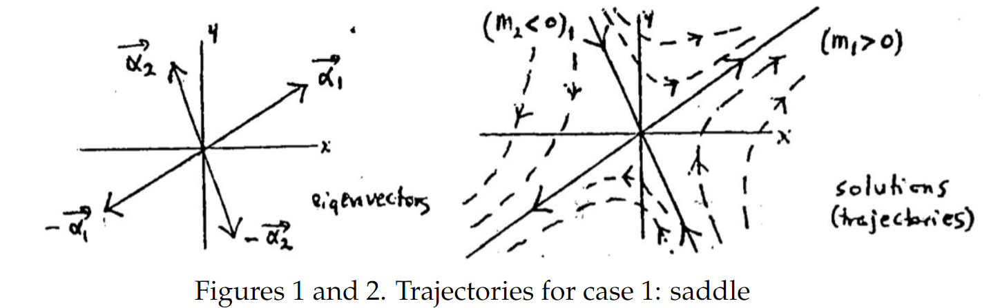
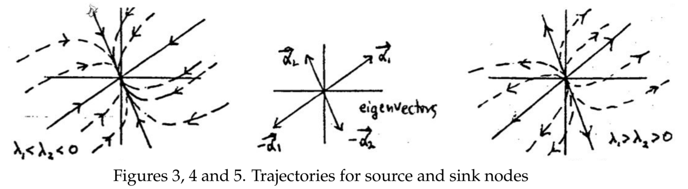
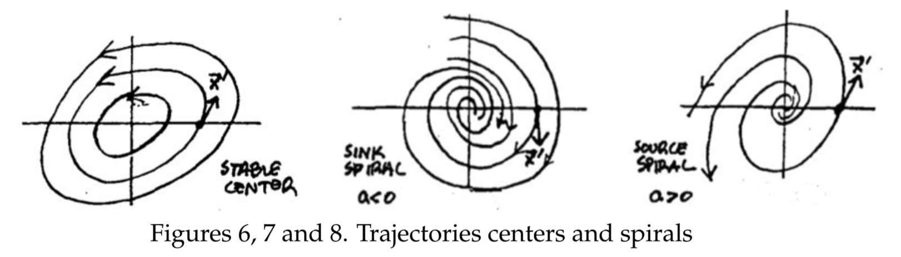
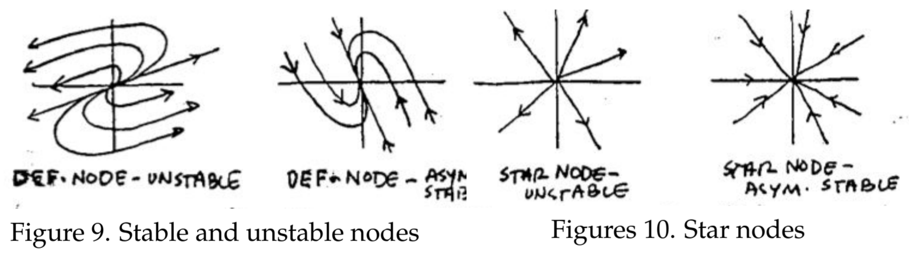

In the preceding section we sketched trajectories for some particular linear systems. They were chosen to illustrate the different possible geometric pictures. Based on that experience, we can now describe how to sketch the general system.
$$\boldsymbol{x'}=A\boldsymbol{x}, A= 2\times 2 \text{ constant matrix.}$$
The geometric picture is largely determined by the eigenvalues and eigenvectors of $A$, so there are several cases.  
For the first group of cases, we suppose the eigenvalues $\lambda_1$ and $\lambda_2$ are *real* and *distinct*.  
**Case 1.** The $\lambda_i$ have opposite signs: $\lambda_1 > 0, \lambda_2 < 0$; **unstable saddle.**  
Suppose the corresponding eigenvectors are $\vec{\alpha}_1$ and $\vec{\alpha}_2$, respectively. Then four solutions to the system are
$$\boldsymbol{x}=\plusmn \vec{\alpha}_1e^{\lambda_1 t}, \boldsymbol{x}=\plusmn \vec{\alpha}_2e^{\lambda_2 t}\tag{1}$$
How do the trajectories of these four solutions look?  
In figure 1 below, the four vectors $\plusmn \vec{\alpha}_1$ and $\plusmn \vec{\alpha}_2$ are drawn as origin vectors. In figure 2, the corresponding four trajectories are shown as solid lines, with the direction of motion as tincreases shown by arrows on the lines. The reasoning behind this is the following.  
Look first at $\boldsymbol{x}=\vec{\alpha}_1e^{\lambda_1 t}$. We think of $e^{\lambda_1 t}$ as a scalar factor changing the length of $\boldsymbol{x}$; that is as $t$ increases from $-\infty$ to $\infty$, this scalar factor increases from 0 to $\infty$, since $\lambda_1 >0$. The tip of this lengthening vector represents the trajectory of the solution $\boldsymbol{x}=\vec{\alpha}_1e^{\lambda_1 t}$, which is therefore a ray going out from the origin in the direction of the vector $\vec{\alpha}_1$.  
Similarly, the trajectory of $\boldsymbol{x}=-\vec{\alpha}_1e^{\lambda_1 t}$ is a ray going out from the origin in the opposite direction: that of the vector $-\vec{\alpha}_1$.  
The trajectories of the other two solutions $\boldsymbol{x}=\plusmn \vec{\alpha}_2e^{\lambda_2 t}$ will be similar, except that since $\lambda_2<0$, the scalar factor $e^{\lambda_2 t}$ decreases as $t$ increases. Thus the solution vector will be shrinking as tincreases. The trajectory traced out by its tip will be a ray having the direction of $\vec{\alpha}_2$ or $-\vec{\alpha}_2$, but traversed toward the origin as $t$ increases, getting arbitrarily close but never reaching it in finite time.  
To complete the picture, we sketch some nearby trajectories. These will be smooth curves generally following the directions of the four rays de­scribed above. In example 1 in the previous note they were hyperbolas. In general they are not, but they look something like hyperbolas, and they do have the rays as asymptotes. They are the trajectories of the solutions
$$\boldsymbol{x}=c_1\vec{\alpha}_1e^{\lambda_1 t}+c_2\vec{\alpha}_2e^{\lambda_2 t}\tag{2}$$
for different values of the constants $c_1$ and $c_2$.  
  
**Case2.** $\lambda_1$ and $\lambda_2$ are distinct and negative: say $\lambda_1 <\lambda_2 <0$; **asymptoti­cally stable** (*sink*) **node**  
Formally, the solutions $(1)$ are written the same way and we draw their trajectories just as before. The only difference is that now all four trajec­tories are represented by rays coming in towards the origin as $t$ increases, since both of the $\lambda_i$ are negative. The four trajectories are represented as solid lines in figure 3.  
The trajectories of the other solutions $(2)$ will be smooth curves which generally follow the four rays. In the corresponding example 2 from the previous note, they were parabolas; here too they will be parabola-like, but this does not tell us how to draw them, so a little more thought is needed. The parabolic curves will certainly come in to the origin as $t$ increases, but tangent to which of the rays? Briefly, the answer is this:  
**Node-sketching principle.** *Near the origin, the trajectories follow the ray attached to the $\lambda_i$ nearer to zero; far from the origin, they follow (i.e. are roughly parallel to) the ray attached to the $\lambda_i$ further from zero.*  
You need not memorize the above. Instead learn the reasoning on which it is based, since this type of argument will be used over and over in science and engineering work having nothing to do with differential equations.  
Since we are assuming $\lambda_1 < \lambda_22 < 0$, it is $\lambda_2$ which is closer to 0. We want to know the behavior of the solutions near the origin and far from the origin. Since all solutions are approaching the origin,  
*near the origin* corresponds to large positive $t$ (we write $t \gg 1$); and  
*far from the origin* corresponds to large negative $t$ (written $t \ll -1$).  
As before, the general solution has the form
$$\boldsymbol{x}=c_1\vec{\alpha}_1e^{\lambda_1 t}+c_2\vec{\alpha}_2e^{\lambda_2 t}, \lambda_1<\lambda_2<0 \tag{3}$$
If $t \gg 1$, then $\boldsymbol{x}$ is near the origin, since both terms in $(3)$ are small. However, the first term is negligible compared with the second: for since
$\lambda_1-\lambda_2<0$, we have
$$\frac{e^{\lambda_1 t}}{e^{\lambda_2 t}}=e^{(\lambda_1-\lambda_2)t}\approx 0, t \gg 1\tag{4}$$
Thus if $\lambda_1<\lambda_2<0$ and $t \gg 1$, we can neglect the first term of $(3)$, getting
$$\boldsymbol{x} \sim c_2\vec{\alpha}_2e^{\lambda_2 t} \text{ for } t \gg 1 (\boldsymbol{x} \text{ near the origin})$$
which shows that $\boldsymbol{x}(t)$ follows the ray corresponding to the the eigenvalue $\lambda_2$ closer to zero.
Similarly, if $t \ll -1$, then $\boldsymbol{x}$ is far from the origin since both terms in $(3)$ are large. This time the ratio in $(4)$ is large, so that it is the first term in $(3)$ that dominates the expression, which tells us that
$$\boldsymbol{x} \sim c_1\vec{\alpha}_1e^{\lambda_1 t} \text{ for } t \ll -1 (\boldsymbol{x} \text{ far from the origin})$$
This explains the reasoning behind the node-sketching principle in this case.  
Some of the trajectories of the solutions $(3)$ are sketched in dashed lines in figure 3, using the node-sketching principle, and assuming $\lambda_1<\lambda_2<0$  
  
**Case 3.** $\lambda_1$ and $\lambda_2$ are distinct and positive: say $\lambda_1 > \lambda_2 > 0$ **unstable** (*source*) **node**  
The analysis is like the one we gave above. The direction of motion on the four rays coming from the origin is outwards, since the $\lambda_i>0$. The node-sketching principle is still valid and the reasoning for it is like the reasoning in case 2. The resulting sketch looks like the one in fig. 5.  
**Case 4.** Eigenvalues are pure imaginary: $\lambda = \plusmn bi, b > 0$ **stable center**  
Here the solutions to the linear system have the form
$$\boldsymbol{x}=\boldsymbol{c}_1\cos bt+\boldsymbol{c}_2\sin bt, \boldsymbol{c}_1,\boldsymbol{c}_2 \text{ constant vectors.}\tag{5}$$
(There is no exponential factor since the real part of $\lambda$ is zero.) Since every solution $(5)$ is periodic, with period $2\pi/b$, the moving point representing it retraces its path at intervals of $2\pi/b$. The trajectories therefore are closed curves; ellipses, in fact; see fig. 6.  
Sketching the ellipse is a little troublesome, since the vectors $\boldsymbol{c}_i$ do not have any simple relation to the major and minor axes of the ellipse. For this course, it will be enough if you determine whether the motion is clockwise or counterclockwise. As in example 4 in the previous note, this can be done by using the system $\boldsymbol{x'} = A\boldsymbol{x}$ to calculate a single velocity vector $\boldsymbol{x'}$ of the velocity field. From this the sense of motion can be determined by inspection.  
The word *stable* means that each trajectory stays for all time within some circle centered at the critical point. *Asymptotically stable* is a stronger requirement: each trajectory must approach the critical point (here, the origin) as $t \to \infty$.  
**Case 5.** The eigenvalues are complex, but not purely imaginary. There are two cases:
$$\begin{aligned}
&a\plusmn bi,&a<0,b>0; &&&\text{asymptotically stable (sink) spiral}\\
&a\plusmn bi,&a>0,b>0; &&&\text{unstable (source) spiral}
\end{aligned}$$
Here the solutions to the linear system have the form
$$\boldsymbol{x}=e^{at}(\boldsymbol{c}_1\cos bt+\boldsymbol{c}_2\sin bt), \boldsymbol{c}_1,\boldsymbol{c}_2 \text{ constant vectors.}\tag{6}$$
They look like the solutions $(5)$, except for a scalar factor $e^{at}$ which either  
decreases towards 0 as $t \to \infty (a < 0)$, or  
increases towards $\infty$ as $t \to \infty (a > 0)$.  
Thus the point $\boldsymbol{x}$ travels in a trajectory which is like an ellipse, except that the distance from the origin is steadily shrinking or expanding. The result is a trajectory which does one of the following:  
*spirals steadily towards the origin, (asymptotically stable spiral)* $a < 0$  
*spirals steadily away from the origin. (unstable spiral)* $a > 0$  
The exact shape of the spiral is not obvious and perhaps best left to computers. You should determine the direction of motion by calculating from the linear system $\boldsymbol{x'}=A\boldsymbol{x}$ a single velocity vector $\boldsymbol{x'}$ near the origin. Typical spirals are pictured (figs. 7, 8).  
  
Other cases.  
Repeated real eigenvalue $\lambda \neq 0$, defective: (incomplete: one independent eigenvector):  
**defective node;** *unstable* if $\lambda > 0$; *asymptotically stable* if $\lambda < 0$ (fig. 9).  
Repeated real eigenvalue $\lambda \neq 0$, complete (two independent eigenvectors):  
**star node;** *unstable* if $\lambda > 0$; *asymptotically stable* if $\lambda < 0$. (fig. 10).  
One eigenvalue $\lambda = 0$.  
A set of parallel lines.  

