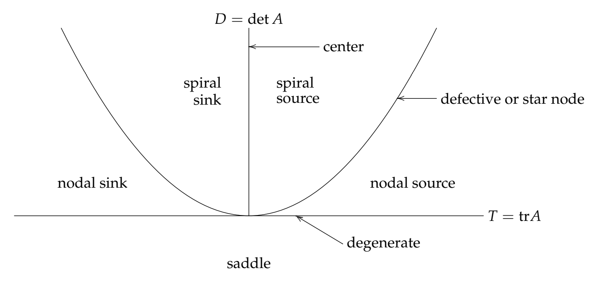

Recall that the *characteristic polynomial* of a square matrix $A$ is defined to be
$$p(\lambda) = \det(A - \lambdaI)$$
For a $2\times2$ matrix $A$, $A=\begin{bmatrix}a&b\\c&d\end{bmatrix}$, we have $p(\lambda)=\begin{vmatrix}a-\lambda&b\\c&d-\lambda\end{vmatrix}=\lambda^2-(a+d)\lambda+(ad-bc)$. If we now recall the definitions of **trace** and **determinant** for a $2\times2$ matrix $A$ from the linear algebra and matrix review given at the end of the previous session on Matrix Methods, namely $\text{tr}A = a+d$ and $\det A = ad - bc$, we see that we can write $p(\lambda) = λ^2 - \text{tr}A\lambda + \det A$.  
Now if we use the abbreviations $T = \text{tr}A$ and $D = \det A$, we can write the characteristic polynomial as $p(\lambda) = \lambda^2 - T\lambda + D$. The eigenvalues are the roots of $p(\lambda)$, so the quadratic formula immediately gives us that the eigenvalues will be real if and only if the discriminant $T^2 - 4D > 0$ and complex if and only if $T^2 - 4D < 0$. The separating curve $D = T^2/4$ is shown on the trace-determinant graph below.  
Then looking at the full quadratic formula for $p(\lambda)=0,\lambda=\frac{T\plusmn\sqrt{T^2-4D}}{2}$, we can determine the conditions for the signs in the case of real eigenvalues and also the signs of the real part for the complex case. We leave this as an exercise (not difficult and highly recommended) for the reader. The results are as follows:
1. If $D < 0$, the eigenvalues are real and of opposite sign, and the phase portrait is a saddle (which is always unstable).
2. If $0 < D < T^2/4$, the eigenvalues are real, distinct, and of the same sign, and the phase portrait is a node, stable if $T < 0$, unstable if $T > 0$.
3. If $0 < T^2/4 < D$, the eigenvalues are neither real nor purely imaginary, and the phase portrait is a spiral, stable if $T < 0$, unstable if $T > 0$.

Sketching this information in on the T-D graph gives the trace-determinant diagram below.  
The boundary cases, where the either inequalities become equality and/or where $T = 0$ or $D = 0$, are called the "borderline cases." We will discuss these further in a later session.

