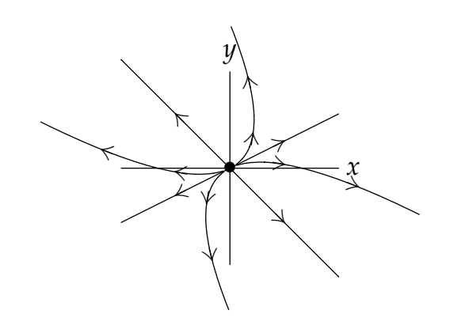

There are a number of public-domain computer programs which produce phase portraits for $2 \times 2$ autonomous systems. One has the option of displaying the trajectories with or without the "little" arrows of the vector direction field. We first give an example where the direction field is included, and then a portrait gallery with only the tractories themselves. In the pictures which illustrate these cases, only a few trajectories are shown, but these are sufficent to shown the qualitative behavior of the system.  
A much richer understanding of this gallery can be achieved using the Mathlets Linear Phase Portraits: Cursor Entry and Linear Phase Portraits: Matrix Entry.

**Example.** (direction field included).
$$\begin{pmatrix}
x\\y
\end{pmatrix}'=\begin{pmatrix}
y\\-x
\end{pmatrix}$$
General solution: $x = c_1 \cos t + c_2 \sin t, y = -c_1 \sin t + c_2 \cos t$  
As we saw before, the trajectories are circles. We know the direction is clockwise by looking at a single tangent vector.  

### The portrait gallery
1. A has real eigenvalues with two independent eigenvectors. Let $\lambda_1, \lambda_2$ be the eigenvalues and $\boldsymbol{v}_1$ and $\boldsymbol{v}_2$ the corresponding eigenvectors. $\rArr$ general solution to (*) is $\boldsymbol{x}=c_1e^{\lambda_1t}\boldsymbol{v}_1+c_2e^{\lambda_2t}\boldsymbol{v}_2$

i) $\lambda_1 > \lambda_2 > 0$.  
**Unstable nodal source**.  
As $t \to \infty$ the term $e^{\lambda_1t}\boldsymbol{v}_1$ dominates and $\boldsymbol{x} \to \infty$.  
As $t \to -\infty$ the term $e^{\lambda_2t}\boldsymbol{v}_2$ dominates and $\boldsymbol{x} \to 0$.  

ii) $\lambda_1 < \lambda_2 < 0$.  
**Stable nodal sink (asymptotically stable)**.  
(Simply reverse the arrows on case (i).)  
As $t \to \infty$ the term $e^{\lambda_2t}\boldsymbol{v}_2$ dominates and $\boldsymbol{x} \to 0$.  
As $t \to -\infty$ the term $e^{\lambda_1t}\boldsymbol{v}_1$ dominates and $\boldsymbol{x} \to \infty$.  

iii) $\lambda_1 > 0 > \lambda_2$.  
**Saddle, unstable.**  
As $t \to \infty$ the term $e^{\lambda_1t}\boldsymbol{v}_1$ dominates and $\boldsymbol{x} \to \infty$.  
As $t \to -\infty$ the term $e^{\lambda_2t}\boldsymbol{v}_2$ dominates and $\boldsymbol{x} \to \infty$.  
  

iv) $\lambda_1 = 0 > \lambda_2$.  
**Line of critical points.**  
The critical points are not isolated - they lie on the line through 0 with direction $\boldsymbol{v}1$.  
$\boldsymbol{x}=c_1\boldsymbol{v}_1+c_2e^{\lambda_2t}\boldsymbol{v}_2$  
As $t \to \infty$ $\boldsymbol{x} \to c_1\boldsymbol{v}_1$ along a line parallel to $\boldsymbol{v}_2$.  

v) $\lambda_1 = 0 < \lambda_2$.  
**Line of critical points.**  
(Simply reverse the arrows in case (iv).)  
The critical points are not isolated - they lie on the line through 0 with direction $\boldsymbol{v}1$.  
$\boldsymbol{x}=c_1\boldsymbol{v}_1+c_2e^{\lambda_2t}\boldsymbol{v}_2$  
As $t \to \infty$ $\boldsymbol{x} \to \infty$ along a line parallel to $\boldsymbol{v}_2$.  

vi) $\lambda_1 = \lambda_2 > 0$.  
**Star nodal source (unstable).**  
Let $\lambda = \lambda_1 = \lambda_2$. Two independent eigenvectors $\rArr$ $A$ is a scalar matrix $\rArr$ $\boldsymbol{x} = e^{\lambda t}\overrightarrow{c}$.  
That is all trajectories are straight rays.  
As $t \to \infty$ $\boldsymbol{x} \to \infty$ along a line from 0.  
As $t \to -\infty$ $\boldsymbol{x} \to 0$  

vii) $\lambda_1 = \lambda_2 < 0$.  
**Star nodal sink (asymptotically stable).**  
(Simply reverse the arrows in case (vi).)  

viii) $\lambda_1 = \lambda_2 = 0$.  
**Non-isolated critical points.**  
Every point is a critical point, every trajectory is a point.

2. Real defective case (repeated eigenvalue, only one eigenvector). Let $λ$ be the eigenvalue and $\boldsymbol{v}_1$ the corresponding eigenvector. Let $\boldsymbol{v}_2$ be a generalized eigenvector associated with $\boldsymbol{v}_1$. $\rArr$ general solution to (*) is $\boldsymbol{x}=e^{\lambda t}(c_1\boldsymbol{v}_1+c_2(t\boldsymbol{v}_1+\boldsymbol{v}_2))$.

i) $\lambda > 0$.  
**Defective source node (unstable).**  
As $t \to \infty$ the term $t\boldsymbol{v}_1$ dominates and $\boldsymbol{x} \to \infty$.  
As $t \to -\infty$ the term $t\boldsymbol{v}_1$ dominates and $\boldsymbol{x} \to 0$.  

ii) $\lambda < 0$.  
**Defective sink node**  
(asymptotically stable).  
(Simply reverse the arrows in case (i).)  

iii) $\lambda = 0$.  
**Line of critical points.**  
$\boldsymbol{x}=c_1\boldsymbol{v}_1+c_2(t\boldsymbol{v}_1+\boldsymbol{v}_2)$  
Trajectories are parallel to $\boldsymbol{v}_1$  

3. Complext roots (pair of complex conjugate eigenvalues and vectors). Let an eigenvalue be $\lambda = \alpha + \beta i$, with eigenvector $\boldsymbol{v} + i\boldsymbol{w}$. $\rArr$ $x = e^{\alpha t}(c_1(\cos \beta t \boldsymbol{v} - \sin \beta t \boldsymbol{w}) + c_2(\sin \beta t \boldsymbol{v} + \cos \beta t \boldsymbol{w}))$. The sines and cosines in the solution will cause the trajectory to spiral around the critical point.

i) Re$(\lambda) > 0$ (i.e. $\alpha > 0$).  
**Spiral source (unstable).**  
Trajectories can spiral clockwise or counterclockwise.  
As $t \to \infty$, $\boldsymbol{x} \to \infty$  
As $t \to -\infty$, $\boldsymbol{x} \to 0$  

ii) Re$(\lambda) < 0$ (i.e. $\alpha < 0$).  
**Spiral sink (asymptotically stable).**  
(Reverse arrows from case (i).)
Trajectories can spiral clockwise or counterclockwise.  
As $t \to \infty$, $\boldsymbol{x} \to 0$  
As $t \to -\infty$, $\boldsymbol{x} \to \infty$  

iii) Re$(\lambda) = 0$ (i.e. $\alpha = 0$).  
**Stable center.**  
Trajectories can turn clockwise or counterclockwise.  
As $t \to \plusmn \infty$, $\boldsymbol{x}$ follows an ellipse.  

For the complex case you can find the direction of rotation by checking the tangent vector at one point.  
**Example.** $A=\begin{pmatrix}2&3\\-3&2\end{pmatrix}$ has eigenvalues $2 \plusmn 3i$. $\rArr$ the critical point is a spiral source.  
The tangent vector at the point $\boldsymbol{x}_0=\begin{pmatrix}1\\0\end{pmatrix}$ is $A\boldsymbol{x}_0=\begin{pmatrix}2\\-3\end{pmatrix}$ $\rArr$ spiral is clockwise.
