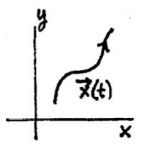
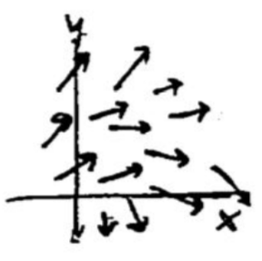

### General First Order Autonomous Systems
The sort of system for which we will be trying to sketch solutions can be written in the form
$$\begin{aligned}
x'=f(x,y)\\
y'=g(x,y)
\end{aligned}\tag{1}$$
This is called an **autonomous** system. The word autonomous means selfregulating. These systems are self-regulating in the sense that their rate of change (i.e. derivatives) depends only on the state of the system (values of $x$ and $y$) and not on the time $t$. You can easily spot an autonomous system because the independent variable (which we understand to be $t$) does not appear explicitly on the right, though of course it lurks in the derivatives on the left.  
The system $(1)$ is a *first-order autonomous system*; it is in *standard form* - the derivatives on the left, the functions on the right.  
Just as for linear constant coefficient systems autonomous systems have trajectories in the phase plane. We will repeat the definitions of these objects in this more general setting.  
A **solution** of this system has the form (we write it two ways)
$$\boldsymbol{x}(t)=\begin{pmatrix}
x(t)\\y(t)
\end{pmatrix},\begin{aligned}
x=x(t)\\y=y(t)
\end{aligned}\tag{2}$$
It is a vector function of $t$, whose components satisfy the system $(1)$ when they are substituted in for $x$ and $y$. In general, you learned in 18.02 and physics that such a vector function describes a motion in the $xy$-plane; the equations in $(2)$ tell how the point $(x, y)$ moves in the $xy$-plane as the time $t$ varies. The moving point traces out a curve called the **trajectory** of the solution $(2)$ The $xy$-plane itself is called the **phase plane** for the system $(1)$. We show a sketch of a trajectory at right. Notice the arrow is used to indicate the direction of in increasing time.  
  
We use the term **phase portrait** to mean the graphs of enough trajectories to give a good sense of all the solutions to the system $(1)$.  
We have seen how we can picture the solutions $(2)$ to the system. But how can we picture the system $(1)$ itself? We can think of the derivative of a solution
$$\boldsymbol{x'}(t)=\begin{pmatrix}
x'(t)\\y'(t)
\end{pmatrix}\tag{3}$$
as representing the **velocity vector** of the point $(x, y)$ as it moves according to $(2)$. From this viewpoint, we can interpret geometrically the system $(1)$ as prescribing for each point $(x_0, y_0)$ in the $xy$-plane a velocity vector having its tail at $(x_0, y_0)$:
$$\boldsymbol{x'}=\begin{pmatrix}
f(x_0,y_0)\\g(x_0,y_0)
\end{pmatrix}=f(x_0,y_0)\boldsymbol{i}+g(x_0,y_0)\boldsymbol{j}\tag{4}$$
The system $(1)$ is thus represented geometrically as a vector field, the **velocity field**. A solution $(2)$ of the system is a point moving in the $xy$-plane so that at each point of its trajectory, it has the velocity prescribed by the field. The trajectory itself will be a curve which at each point has the direction of the velocity vector at that point.  

### Critical Points
**Definition.** A point $(x_0, y_0)$ is a **critical point** of the system $(1)$ if
$$f(x_0,y_0)=0\text{ and }g(x_0,y_0)=0$$
In considering how to sketch trajectories of the system $(1)$, the first thing to consider are the *critical points* (they are sometimes called *stationary points*).  
If we adopt the geometric viewpoint, thinking of the system as represented by a velocity vector field, then a critical point is one where the velocity vector is zero. That is $(x_0,y_0)$ is a critical point is equativalent to
$$x = x_0, y = y_0 \text{ is a (constant) solution to }(1)$$
Such a point is a trajectory all by itself, since by not moving it satisfies the equations $(1)$ of the system (and hence the alternative designation *stationary point*).  
The critical points represent the simplest possible solutions to $(1)$, so you begin by finding them; this is done by solving the pair of simultaneous
equations
$$\begin{aligned}
f(x,y)=0\\g(x,y)=0
\end{aligned}$$
Next, you can try the strategy indicated in the following note of passing to the associated first-order ODE and trying to solve that and sketch the solutions; or you can try to locate some sketchable solutions to $(1)$ and draw them in, as we did for linear constant coefficient systems in the session on Phase Potraits.

### Sketching Principle
When sketching integral curves for direction fields we saw that integral curves did not cross. For the system $(1)$ we have a similar principle.  
**Sketching Principle.** Assuming the the functions $f(x, y)$ and $g(x, y)$ are smooth, (i.e. have continuous partial derivatives) then two trajectories of $(1)$ cannot intersect.
