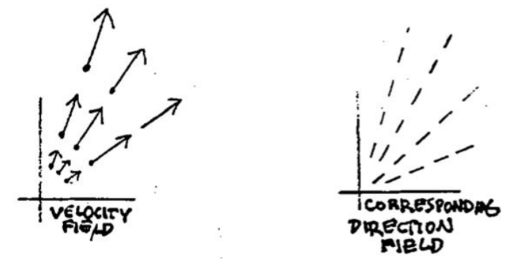

We are still considering the first order autonomous system
$$\begin{aligned}
x'=f(x,y)\\y'=g(x,y)
\end{aligned}\tag{1}$$
We can eliminate $t$ from the system by dividing one equation by the other. Since by the chain rule
$$\frac{y'}{x'}=\frac{dy/dt}{dx/dt}=\frac{dy}{dx}$$
we get after the division a single first-order ODE in $x$ and $y$:
$$\begin{aligned}
x'=f(x,y)\\y'=g(x,y)
\end{aligned}\rarr\frac{dy}{dx}=\frac{g(x,y)}{f(x,y)}\tag{2}$$
If the first order equation on the right is solvable, this is an important way of getting information about the solutions to the system on the left. Indeed, in the older literature, little distinction was made between the system and the single equation - "solving" meant to solve either one.  
There is however a difference between them: the system involves time, whereas the single ODE does not. Consider how their respective solutions are related:
$$\begin{aligned}
x=x(t)\\y=y(t)
\end{aligned}\rarr F(x,y)=0\tag{3}$$
where the equation on the right is the result of eliminating $t$ from the pair of equations on the left. Geometrically, $F(x, y) = 0$ is the equation for the trajectory of the solution $\boldsymbol{x}(t)$ on the left. The trajectory in other words is the path traced out by the moving point $x(t), y(t)$ ; it doesn't contain any record of how fast the point was moving; it is only the track (or trace, as one sometimes says) of its motion.  
In the same way, we have the difference between the *velocity field*, which represents the left side of $(2)$, and the *direction field*, which represents the right side. The velocity vectors have magnitude and sense, whereas the line segments that make up the direction field only have slope. The passage from the left side of $(2)$ to the right side is represented geometrically by changing each of the velocity vectors to a line segment of standard length. Even the arrowhead is dropped, since it represents the direction of increasing time, and time has been eliminated; only the slope of the vector is retained.  

