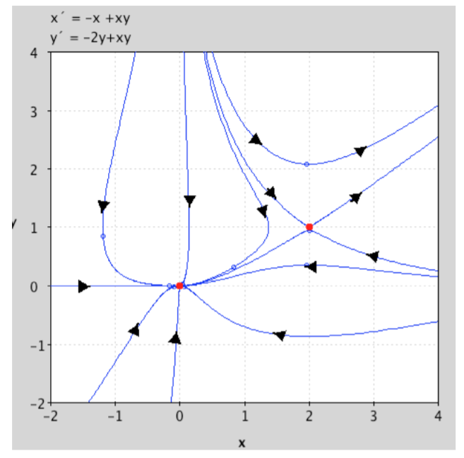
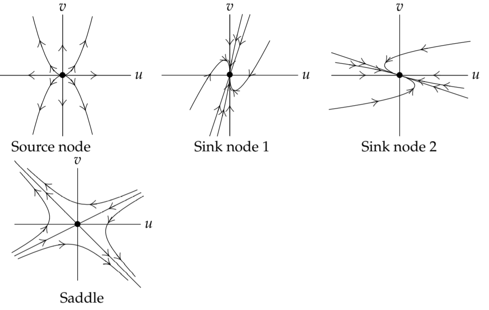
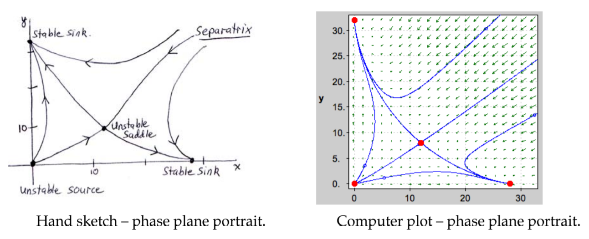

In session on Phase Portraits, we described how to sketch the trajectories of a linear system
$$\begin{aligned}
\begin{aligned}
x'=ax+by\\y'=cx+dy
\end{aligned}&&a,b,c,d \text{ constants}
\end{aligned}$$
We now return to the general (i.e., non-linear) $2 \times 2$ autonomous system discussed at the beginning of this chapter, in sections 1 and 2:
$$\begin{aligned}
x'=f(x,y)\\y'=g(x,y)
\end{aligned}\tag{1}$$
it is represented geometrically as a vector field, and its trajectories - the solution curves - are the curves which at each point have the direction prescribed by the vector field. Our goal is to see how one can get information about the trajectories of $(1)$, without determining them analytically or using a computer to plot them numerically.  
**Linearizing at the origin.** To illustrate the general idea, let's suppose that $(0, 0)$ is a critical point of the system $(1)$, i.e.,
$$f(0,0)=0,g(0,0)\tag{2}$$
Then if $f$ and $g$ are sufficiently differentiable, we can approximate them near $(0, 0)$ (the approximation will have no constant term by $(2)$):
$$\begin{aligned}
f(x, y) = a_1x + b_1y + \text{ higher order terms in $x$ and $y$}\\
g(x, y) = a_2x + b_2y + \text{ higher order terms in $x$ and $y$}
\end{aligned}$$
If $(x, y)$ is close to $(0, 0)$, then $x$ and $y$ will be small and we can neglect the higher order terms. Then the non-linear system $(2)$ is approximated near $(0, 0)$ by a linear system, the **linearization** of $(2)$ at $(0,0)$:
$$\begin{aligned}
x' = a_1x + b_1y\\
y' = a_2x + b_2y
\end{aligned}\tag{3}$$
and near $(0,0)$, the solutions of $(1)$ - about which we know nothing - will be like the solutions to $(4)$, about which we know a great deal from our work in the previous sessions.  
**Example 1.** Linearize the system $\begin{cases}x'=y\cos x\\y'=x(1+y)^2\end{cases}$ at the critical point $(0,0)$.  
**Solution.** We have $\begin{cases}x'\approx y(1-\frac{1}{2}x^2)\\y'=x(1+2y+y^2)\end{cases}$ so the linearization is $\begin{cases}x'=y\\y'=x\end{cases}$.  
**Linearising at a general point** More generally, suppose now the critical point of $(1)$ is $(x_0, y_0)$, so that
$$f(x_0,y_0)=0,g(x_0,y_0)=0$$
One way this can be handled is to make the change of variable
$$x_1=x-x_0,y_1=y-y_0\tag{4}$$
in the $x_1y_1$-coordinate system, the critical point is $(0, 0)$, and we can proceed as before.  
**Example 2.** Linearize $\begin{cases}x'=x-x^2-2xy\\y'=y-y^2-\frac{3}{2}xy\end{cases}$ at its critical points on the $x$-axis.  
**Solution.** When $y = 0$, the functions on the right are zero when $x = 0$ and $x = 1$, so the critical points on the $x$-axis are $(0, 0)$ and $(1, 0)$.  
The linearization at $(0, 0)$ is $x' = x, y' = y$.  
To find the linearization at $(1, 0)$ we change of variable as in $(4)$: $x_1 =x - 1, y_1 = y$; substituting for $x$ and $y$ in the system and keeping just the linear terms on the right gives us as the linearization:
$$\begin{aligned}
&x_1'=(x_1+1)-(x_1+1)^2-2(x_1+1)y_1&&\approx -x_1-2y_1\\
&y_1'=y_1-y_1^2-\frac{3}{2}(x_1+1)y_1&&\approx \frac{1}{2}y_1
\end{aligned}$$

### Linearization using the Jacobian matrix
Though the above techniques are usable if the right sides are very simple, it is generally faster to find the linearization by using the Jacobian matrix, especially if there are several critical points, or the functions on the right are not simple polynomials. We derive the procedure.  
We need to approximate $f$ and $g$ near $(x_0, y_0)$. While this can sometimes be done by changing variable, a more basic method is to use the main approximation theorem of multivariable calculus. For this we use the notation
$$\Delta x=x-x_0,\Delta y=y-y_0,\Delta f=f(x,y)-f(x_0,y_0)\tag{5}$$
and we have then the basic approximation formula
$$\begin{aligned}
&\Delta f&&\approx (\frac{\partial f}{\partial x})_{0}\Delta x+(\frac{\partial f}{\partial y})_{0}\Delta y\\
&f(x,y)&&\approx (\frac{\partial g}{\partial x})_{0}\Delta x+(\frac{\partial g}{\partial y})_{0}\Delta y
\end{aligned}\tag{6}$$
since by hypothesis $f(x_0, y_0) = 0$. We now make the change of variables $(4)$
$$x_1=x-x_0=\Delta x,y_1=y-y_0=\Delta y$$
and use $(6)$ to approximate $f$ and $g$ by their linearizations at $(x_0, y_0)$. The result is that in the neighborhood of the critical point $(x_0, y_0)$, the linearization of the system $(1)$ is
$$\begin{aligned}
x_1'=(\frac{\partial f}{\partial x})_{0}x_1+(\frac{\partial f}{\partial y})_{0}y_1\\
y_1'=(\frac{\partial g}{\partial x})_{0}x_1+(\frac{\partial g}{\partial y})_{0}y_1
\end{aligned}$$
In matrix notation, the linearization is therefore
$$\boldsymbol{x}_1'=A\boldsymbol{x}_1, \text{ where } \boldsymbol{x}_1=\begin{pmatrix}x_1\\y_1\end{pmatrix} \text{ and } A=\begin{pmatrix}f_x&f_y\\g_x&g_y\end{pmatrix}_{(x_0,y_0)}\tag{8}$$
the matrix $A$ is the Jacobian matrix, evaluated at the critical point $(x_0, y_0)$.

### General procedure for sketching the trajectories of non-linear systems
We can now outline how to sketch in a qualitative way the solution curves of a $2 \times 2$ non-linear autonomous system,
$$\begin{aligned}
x'=f(x,y)\\y'=g(x,y)
\end{aligned}\tag{9}$$
1. Find all the critical points (i.e., the constant solutions), by solving the system of simultaneous equations
$$\begin{aligned}
f(x,y)=0\\g(x,y)=0
\end{aligned}$$
2. For each critical point $(x_0, y_0)$, find the matrix $A$ of the linearized system at that point, by evaluating the Jacobian matrix at $(x_0, y_0)$:
$$\begin{pmatrix}
f_x&f_y\\g_x&g_y
\end{pmatrix}_{(x_0,y_0)}$$
(Alternatively, make the change of variables $x_1 = x - x_0, y1 = y - y_0$, and drop all terms having order higher than one; then $A$ is the matrix of coefficients for the linear terms.)

3. Find the geometric type and stability of the linearized system at the critical point point $(x_0, y_0), by carrying out the analysis in sections 4 and 5. The subsequent steps require that the eigenvalues be **non-zero, real, and distinct,** or **complex, with a non-zero real part**. The remaining cases: eigenvalues which are **zero, repeated, or pure imaginary** are classified as borderline, and the subsequent steps don't apply, or have limited application. See the next section.
4. According to the above, the acceptable geometric types are a saddle, node (not a star or a defective node, however), and a spiral. Assuming that this is what you have, for each critical point determine enough additional information (eigenvectors, direction of motion) to allow a sketch of the trajectories near the critical point.
5. In the $xy$-plane, mark the critical points. Around each, sketch the trajectories in its immediate neighborhood, as determined in the previous step, including the direction of motion.
6. Finally, sketch in some other trajectories to fill out the picture, making them compatible with the behavior of the trajectories you have already sketched near the critical points. Mark with an arrowhead the direction of motion on each trajectory. If you have made a mistake in analyzing any of the critical points, it will often show up here - it will turn out to be impossible to draw in any plausible trajectories that complete the picture.

**Remarks about the steps.**
1. In the homework problems, the simultaneous equations whose solutions are the critical points will be reasonably easy to solve. In the real world, they may not be; a simultaneous-equation solver will have to be used (the standard programs - MatLab, Maple, Mathematica, Macsyma - all have them, but they are not always effective.)
2. If there are several critical points, one almost always uses the Jacobian matrix; if there is only one, use your judgment.
3. This method of analyzing non-linear systems rests on the assumption that in the neighborhood of a critical point, the non-linear system will look like its linearization at that point. For the borderline cases this may not be so - that is why they are rejected. The next two notes explain this more fully.

If one or more of the critical points turn out to be borderline cases, one usually resorts to numerical computation on the non-linear system. Occasionally one can use the reduction to a first order equation:
$$\frac{dy}{dx}=\frac{g(x,y)}{f(x,y)}$$
to get information about the system.  
**Example 3.** Sketch some trajectories of the system
$$\begin{aligned}
x'&=-x+xy\\y'&=-2y+xy
\end{aligned}$$
**Solution.** We first find the critical points, by solving
$$\begin{aligned}
-x+xy&=x(-1+y)&=0\\
-2y+xy&=y(-2+x)&=0
\end{aligned}$$
From the first equation, either $x = 0$ or $y = 1$. From the second equation,
$$x = 0 \rArr  y = 0; y = 1 \rArr x = 2$$ 
critical points: $(0, 0),(2, 1)$.  
To linearize at the critical points, we compute the Jacobian matrices
$$J=\begin{pmatrix}
-1+y&x\\y&-2+x
\end{pmatrix}$$
$$J_{(0,0)}=\begin{pmatrix}
-1&0\\0&-2
\end{pmatrix},J_{(2,1)}=\begin{pmatrix}
0&2\\1&0
\end{pmatrix}$$
Next we analyze the geometric type and stability of each critical point:  
$(0, 0)$:  
eigenvalues: $\lambda_1=-1,\lambda_2=-2$,sink node  
eigenvectors: $\alpha_1=\begin{pmatrix}1\\0\end{pmatrix},\alpha_2=\begin{pmatrix}0\\1\end{pmatrix}$  
By the node-sketching principle, trajectories follow $\alpha_1$ near the origin, are parallel to $\alpha_2$ away from the origin.  
$(2,1)$:  
eigenvalues: $\lambda_1=\sqrt{2},\lambda_2=-\sqrt{2}$, unstable saddle  
eigenvectors: $\alpha_1=\begin{pmatrix}\sqrt{2}\\1\end{pmatrix},\alpha_2=\begin{pmatrix}-\sqrt{2}\\1\end{pmatrix}$  
Draw in these eigenvectors at the respective points $(0, 0)$ and $(2, 1)$, with arrowhead indicating direction of motion (into the critical point if $\lambda < 0$, away from critical point if $\lambda > 0$.) Draw in some nearby trajectories.  
Then guess at some other trajectories compatible with these. See the figure for one attempt at this. Further information could be gotten by considering the associated first-order ODE in $x$ and $y$.  
  
**Example.** Sketch the phase portrait of the following system.
$$\begin{aligned}
x'&=14x-\frac{1}{2}x^2-xy\\
y'&=16y-\frac{1}{2}y^2-xy
\end{aligned}$$
Critical points:
$$x(14-\frac{1}{2}x-y)=0\rArr x=0 \text{ or } 14-\frac{1}{2}x-y=0$$
$$y(16-\frac{1}{2}y-x)=0\rArr y=0 \text{ or } 16-\frac{1}{2}y-x=0$$
$$x = 0 \rArr y = 0 \text{ or } y = 32$$
$$y = 0 \rArr x = 0 \text{ or } x = 28$$
$$x\neq 0,y\neq 0 \rArr x=12,y=8$$
$\rArr$ all critical points: $(0,0),(0,32),(28,0),(12,8)$  
$$J(x,y)=\begin{pmatrix}
14-x-y&-x\\-y&16-y-x
\end{pmatrix}$$
Looking at each of the critical points in turn:  
$J(0,0)=\begin{pmatrix}14&0\\0&16\end{pmatrix}$: eigenvalues 14, 16; eigenvectors $\begin{pmatrix}1\\0\end{pmatrix},\begin{pmatrix}0\\1\end{pmatrix}$  
$\rArr$ source node (see 'Source node' picture below).  
$J(0,32)=\begin{pmatrix}-18&0\\-32&-16\end{pmatrix}$: eigenvalues -18, -16; eigenvectors $\begin{pmatrix}1\\16\end{pmatrix},\begin{pmatrix}0\\1\end{pmatrix}$  
$\rArr$ sink node (see 'Sink node 1' picture below).  
$J(28,0)=\begin{pmatrix}-14&-28\\0&-12\end{pmatrix}$: eigenvalues -14, -12; eigenvectors $\begin{pmatrix}1\\0\end{pmatrix},\begin{pmatrix}-14\\1\end{pmatrix}$  
$\rArr$ sink node (see 'Sink node 2' picture below).  
$J(12,8)=\begin{pmatrix}-6&-12\\-8&-4\end{pmatrix}$: eigenvalues $-5\plusmn\sqrt{97}\approx -15,5$; eigenvectors $\begin{pmatrix}1+\sqrt{97}\\8\end{pmatrix},\begin{pmatrix}1-\sqrt{97}\\8\end{pmatrix}\approx \begin{pmatrix}11\\8\end{pmatrix},\begin{pmatrix}-9\\8\end{pmatrix}$  
$\rArr$ saddle (see 'Saddle' picture below).  
**Rough sketch of system:**  
First we sketch each of the critical points.  
  

