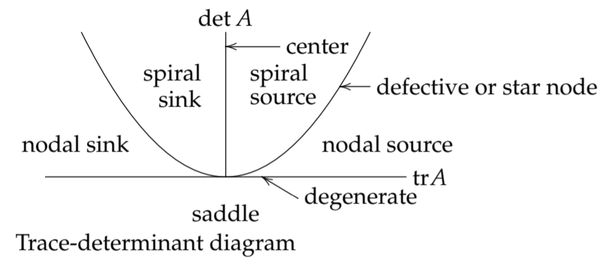

In the previous Note, we described how to get a rough picture of the trajectories of a non-linear system by linearizing at each of its critical points. The basic assumption of the method is that the linearized system will be a good approximation to the original non-linear system if you stay near the critical point.  
The method only works however if the linearized system turns out to be a node, saddle, or spiral. What is it about these geometric types that allows the method to work, and why won't it work if the linearized system turns out to be one of the other possibilities (dismissed as "borderline types" in the previous section)?  
Briefly, the answer is that nodes, saddles, and spirals are *structurally stable*, while the other possibilities are not. We call a system
$$\begin{aligned}
x'=f(x,y)\\y'=g(x,y)
\end{aligned}\tag{1}$$
**Structurally Stability:** We say a system is structural if small changes in the system parameters (i.e., the constants that enter into the functions on the right hand side) do not change the geometric type or stability of its critical points (or its limit cycles, which will be defined in a later session - don't worry about them for now).  
**Theorem.** The $2 \times 2$ autonomous linear system
$$\begin{aligned}
x'=ax+by\\y'=cx+dy
\end{aligned}\tag{2}$$
is structurally stable if it is a spiral, saddle, or node (but not a degenerate or star node).  
**Proof.** The characteristic equation is
$$\lambda^2-(a+d)\lambda+(ad-bc)=0$$
and its roots (the eigenvalues) are
$$\lambda_1,\lambda_2=\frac{(a+d)\plusmn\sqrt{(a+d)^2-4(ad-bc)}}{2}\tag{3}$$
Let's look at the cases one-by-one; assume first that the roots $\lambda_1$ and $\lambda_2$ are real and distinct. The possibilities in the theorem are given by the following (note that since the roots are distinct, the node will not be degenerate or a star node):
$$\begin{aligned}
\lambda_1>0,\lambda_2>0&&&\text{unstable node}\\
\lambda_1<0,\lambda_2<0&&&\text{asymptotically stable node}\\
\lambda_1>0,\lambda_2<0&&&\text{unstable saddle}\\
\end{aligned}$$
The quadratic formula $(3)$ shows that the roots depend continuously on the coefficients $a, b, c, d$. Thus if the coefficients are changed a little, the roots $\lambda_1$ and $\lambda_2$ will also be changed a little to $\lambda_1'$ and $\lambda_2'$ respectively; the new roots will still be real, and will have the same sign if the change is small enough. Thus the changed system will still have the same geometric type and stability.  
If the roots of the characteristic equation are complex, the reasoning is similar. Let us denote the complex roots by $r \plusmn si$; we use the root $\lambda = r + si, s > 0$; then the possibilities to be considered for structural stability are
$$\begin{aligned}
r>0,s>0&&&\text{unstable spiral}\\
r<0,s>0&&&\text{asymptotically stable spiral}
\end{aligned}$$
If $a, b, c, d$ are changed a little, the root is changed to $\lambda'=r'+s'i$, where $r'$ and $s'$ are close to $r$ and $s$ respectively, since the quadratic formula $(3)$ shows $r$ and $s$ depend continuously on the coefficients. If the change is small enough, $r'$ will have the same sign as $r$ and $s'$ will still be positive, so the geometric type of the changed system will still be a spiral, with the same stability type.

### Structural Stability of a non-linear system
**Theorem:** For an autonomous non-linear system, the *linearized* system correctly classifies the crititcal point if the linear system is a spiral node, a nodal source or sink or a saddle.  
It may not however correctly classify a center, defective node, star node or non-isolated critical point. That is, it is correct in open regions of the *trace-determinant* diagram and untrustworthy on the boundary lines.  
  
Idea: small changes in the eigenvalues $\rArr$ don't move far in tracedeterminant diagram.
