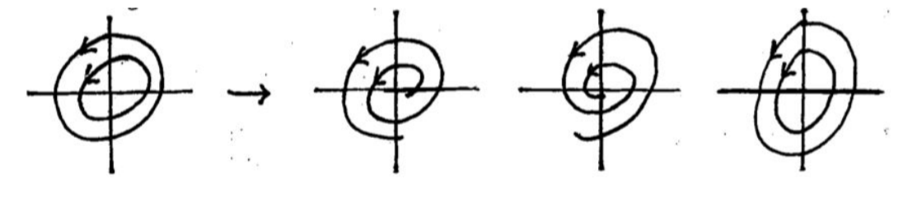
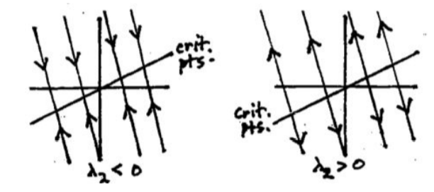
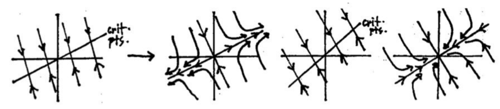
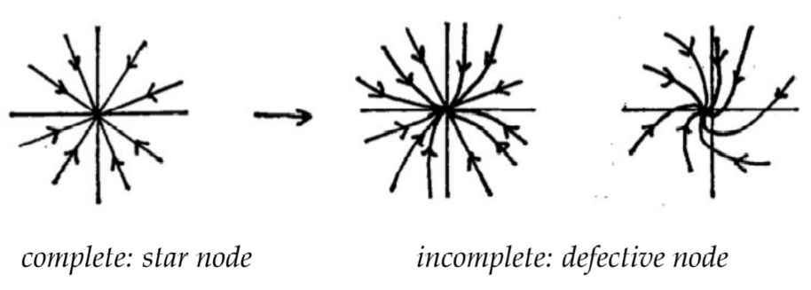

All the other possibilities for the linear system we call borderline types. We will show now that none of them is structurally stable; we begin with the center.  
**Eigenvalues pure imaginary.** Once again we use the eigenvalue with the positive imaginary part: $\lambda = 0 + si, s > 0$. It corresponds to a center: the trajectories are a family of concentric ellipses, centered at the origin. If the coefficients $a, b, c, d$ are changed a little, the eigenvalue $0 + si$ changes a little to $r' + s'i$, where $r' \approx 0, s' \approx s$, and there are three possibilities for the new eigenvalue:
$$\begin{aligned}
&0+si\rarr r'+s'i:&r'>0&&r'<0&&r'=0\\
&s>0&s'>0&&s'>0&&s'>0\\
&\text{center}&\text{source spiral }&&\text{sink spiral}&&\text{center}
\end{aligned}$$
Correspondingly, there are three possibilities for how the geometric picture of the trajectories can change:  
  
**Eigenvalues real; one eigenvalue zero.** Here $\lambda_1 = 0$, and $\lambda_2 > 0$ or $\lambda_2 < 0$. The general solution to the system has the form ($\alpha_1, \alpha_2$ are the eigenvectors)
$$\boldsymbol{x}=c_1\alpha_1+c_2\alpha_2e^{\lambda_2t}$$
If $\lambda_2 < 0$, the geometric picture of its trajectories shows a line of critical points (constant solutions, corresponding to $c_2 = 0$), with all other trajectories being parallel lines ending up (for $t = \infty$) at one of the critical points, as shown below  
  
We continue to assume $\lambda_2 < 0$. As the coefficients of the system change a little, the two eigenvalues change a little also; there are three possibilities, since the eigenvalue $\lambda = 0$ can become positive, negative, or stay zero:
$$\begin{aligned}
&\lambda_1=0\rarr\lambda_1':&\lambda_1'>0&&\lambda_1'=0&&\lambda_1'<0\\
&\lambda_2<0\rarr\lambda_2':&\lambda_2'<0&&\lambda_2'<0&&\lambda_2'<0\\
&\text{critical line}&\text{unstable saddle}&&\text{critical line}&&\text{sink node}
\end{aligned}$$
Here are the corresponding pictures. (The pictures would look the same if we assumed $\lambda_2 > 0$, but the arrows on the trajectories would be reversed.)  
  
**One repeated real eigenvalue.** Finally, we consider the case where $\lambda_1 = \lambda_2$. Here there are a number of possibilities, depending on whether $\lambda_1$ is positive or negative, and whether the repeated eigenvalue is complete (i.e., has two independent eigenvectors), or defective (i.e., incomplete: only one eigenvector). Let us assume that $\lambda_1 < 0$. We vary the coefficients of the system a little. By the same reasoning as before, the eigenvalues change a little, and by the same reasoning as before, we get as the main possibilities (omitting this time the one where the changed eigenvalue is still repeated):
$$\begin{aligned}
&\lambda_1<0&\rarr&&\lambda_1'<0&&r+si\\
&\lambda_2<0&\rarr&&\lambda_2'<0&&r-si\\
&\lambda_1=\lambda_2&&&\lambda_1'\neq\lambda_2'&&r\approx\lambda_1,s\approx 0\\
&\text{sink node}&&&\text{sink node}&&\text{sink spiral}
\end{aligned}$$
Typical corresponding pictures for the complete case and the defective (incomplete) case are (the last one is left for you to experiment with on the computer screen)  
  
**Remarks.** Each of these three cases-one eigenvalue zero, pure imaginary eigenvalues, repeated real eigenvalue-has to be looked on as a borderline linear system: altering the coefficients slightly can give it an entirely different geometric type, and in the first two cases, possibly alter its stability as well.
