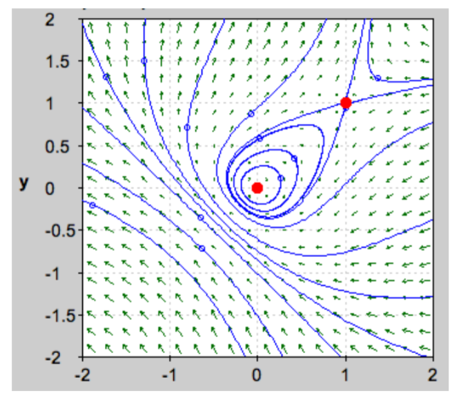
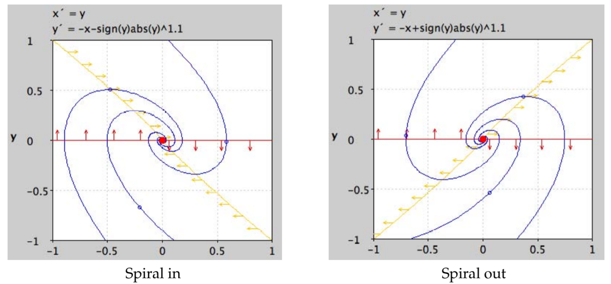

In the preceding note we discussed the structural stability of a linear system. How does it apply to non-linear systems?  
Suppose our non-linear system has a critical point at $P$, and we want to study its trajectories near $P$ by linearizing the system at $P$.  
This linearization is only an approximation to the original system, so if it turns out to be a borderline case, i.e., one sensitive to the exact value of the coefficients, the trajectories near $P$ of the original system can look like any of the types obtainable by slightly changing the coefficients of the linearization.  
It could also look like a combination of types. For instance, if the linearized system had a critical line (i.e., one eigenvalue zero), the original system could have a sink node on one half of the critical line, and an unstable saddle on the other half. (This actually occurs.)  
In other words, the method of linearization to analyze a non-linear system near a critical point doesn't fail entirely, but we don't end up with a definite picture of the non-linear system near P; we only get a list of possibilities. In general one has to rely on computation or more powerful analytic tools to get a clearer answer. The first thing to try is a computer picture of the non-linear system, which often will give the answer.  
**Example.**  
$$\begin{aligned}
x'=y-x^2\\y'=-x+y^2
\end{aligned}$$
Jacobian:
$$J=\begin{pmatrix}
-2x&1\\-1&2y
\end{pmatrix}$$
Crititcal points:
$$y-x^2=0\rArr y=x^2$$
$$-x+y^2=-x+x^4=0\rArr x=0, 1$$
so $(0,0)$ and $(1,1)$ are the critical points.  
$J(1,1)=\begin{pmatrix}-2&1\\-1&2\end{pmatrix}$:  
characteristic equation: $\lambda^2-3=0 \rArr \lambda=\plusmn\sqrt{3}$  
linearized system has a saddle.  
This is *structurally stable* $\rArr$ the nonlinear system has a saddle at $(1,1)$.  
$J(0,0)=\begin{pmatrix}0&1\\-1&0\end{pmatrix}$:  
eigenvalues: $\lambda=\plusmn i$  
a linearized center.  
This is *not structurally stable*. The nonlinear system could be any one of a center, spiral out or spiral in. Using a computer program it appears that $(0,0)$ is in fact a center. (This can be proven using more advanced methods.)  
We can show the trajectories near $(0,0)$ are not spirals by exploiting the symmetry of the picture. First note, if $(x(t), y(t))$ is a solution then so is $(y(-t), x(-t))$. That is, the trajectory is symmetric in the line $x = y$. This implies it can't be a spiral. Since the only other choice choice is that the critical point $(0,0)$ is a center, the trajectories must be closed.  

The following two examples show that a linearized center might also be a spiral in or a spiral out in the nonlinear system.  
**Example a.** $x'=y,y'=-x-y^3$  
**Example b.** $x'=y,y'=-x+y^3$  
In both examples the only critical point is $(0,0)$.  
$$J(0,0)=\begin{pmatrix}
0&1\\-1&-3y^2
\end{pmatrix}=\begin{pmatrix}
0&1\\-1&0
\end{pmatrix}\rArr \lambda=\plusmn i\rArr \text{linearized center}$$
This is not structurally stable.  
In example a the critical point turns out to be a spiral sink. In example b it is a spiral source.  
Below are computer-generated pictures. Because the $y^3$ term causes the spiral to have a lot of turns we 'improved' the pictures by using the power 1.1 instead.  

