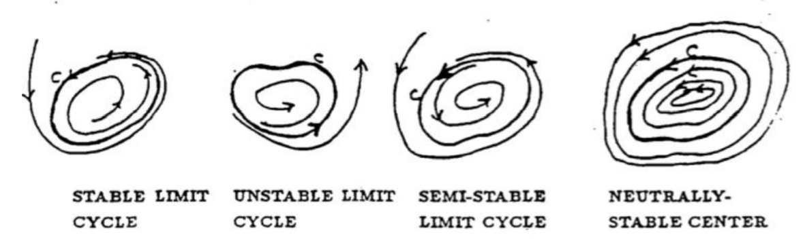

In analyzing non-linear systems in the $xy$-plane, we have so far concentrated on finding the critical points and analysing how the trajectories of the system look in the neighborhood of each critical point. This gives some feeling for how the other trajectories can behave, at least those which pass near anough to critical points.  
Another important possibility which can influence how the trajectories look is if one of the trajectories traces out a closed curve $C$. If this happens, the associated solution $x(t)$ will be geometrically realized by a point which goes round and round the curve $C$ with a certain period $T$. That is, the solution vector
$$\boldsymbol{x}(t)=(x(t),y(t))$$
will be a pair of periodic functions with period $T$:
$$x(t+T)=x(t),y(t+T)=y(t) \text{ for all } t$$
If there is such a closed curve, the nearby trajectories must behave something like $C$. The possibilities are illustrated below. The nearby trajectories can either spiral in toward $C$, they can spiral away from $C$, or they can themselves be closed curves. If the latter case does not hold - in other words, if $C$ is an *isolated* closed curve - then $C$ is called a *limit cycle*: stable, unstable, or semi-stable according to whether the nearby curves spiral towards $C$, away from $C$, or both.  
  
The most important kind of limit cycle is the stable limit cycle, where nearby curves spiral towards $C$ on both sides. Periodic processes in nature can often be represented as stable limit cycles, so that great interest is attached to finding such trajectories if they exist. Unfortunately, surprisingly little is known about how to do this, or how to show that a system has no limit cycles. There is active research in this subject today. We will present a few of the things that are known.  
