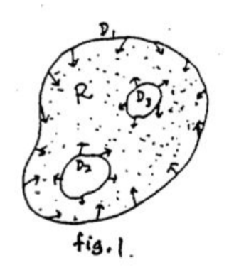
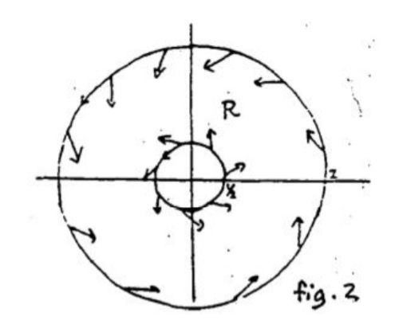

The main tool which historically has been used to show that the system
$$\begin{aligned}
x'=f(x,y)\\y'=g(x,y)
\end{aligned}\tag{1}$$
has a stable limit cycle is the  
**Poincare-Bendixson Theorem** Suppose $R$ is the finite region of the plane lying between two simple closed curves $D_1$ and $D_2$, and $F$ is the velocity vector field for the system $(1)$. If  
(i) at each point of $D_1$ and $D_2$, the field $F$ points toward the interior of $R$, and  
(ii) $R$ contains no critical points,  
then the system $(1)$ has a closed trajectory lying inside $R$.  
The hypotheses of the theorem are illustrated by fig. 1. We will not give the proof of the theorem, which requires a background in Mathematical Analysis. Fortunately, the theorem strongly appeals to intuition. If we start on one of the boundary curves, the solution will enter $R$, since the velocity vector points into the interior of $R$. As time goes on, the solution can never leave $R$, since as it approaches a boundary curve, trying to escape from $R$, the velocity vectors are always pointing inwards, forcing it to stay inside $R$. Since the solution can never leave $R$, the only thing it can do as $t \to \infty$ is either approach a critical point - but there are none, by hypothesis - or spiral in towards a closed trajectory. Thus there is a closed trajectory inside $R$. (It cannot be an unstable limit cycle - it must be one of the other three cases shown above.)  
  
To use the Poincare-Bendixson theorem, one has to search the vector field for closed curves $D$ along which the velocity vectors all point towards the same side. Here is an example where they can be found.  
Example 1. Consider the system
$$\begin{aligned}
x'&=-y+x(1-x^2-y^2)\\
y'&=x+y(1-x^2-y^2)
\end{aligned}\tag{2}$$
  
Figure 2 shows how the associated velocity vector field looks on two circles. On a circle of radius 2 centered at the origin, the vector field points inwards, while on a circle of radius 1/2, the vector field points outwards. To prove this, we write the vector field along a circle of radius $r$ as
$$\boldsymbol{x'}=(-y\boldsymbol{i}+x\boldsymbol{j})+(1-r^2)(x\boldsymbol{i}+y\boldsymbol{j})\tag{3}$$
The first vector on the right side of $(3)$ is tangent to the circle; the second vector points radially *in* for the big circle ($r = 2$), and radially *out* for the small circle ($r = 1/2$). Thus the sum of the two vectors given in $(3)$ points inwards along the big circle and outwards along the small one.  
We would like to conclude that the Poincare-Bendixson theorem applies to the ring-shaped region between the two circles. However, for this we must verify that $R$ contains no critical points of the system. We leave you to show as an exercise that $(0, 0)$ is the only critical point of the system; this shows that the ring-shaped region contains no critical points.  
$$\begin{aligned}
-y&=x(1-x^2-y^2)\\
x&=y(1-x^2-y^2)
\end{aligned}\tag{4}$$
If $1-x^2-y^2=0$, we get $x=0, y=0$, so we get a contradiction.  
From (4), we have
$$-y^2(1-x^2-y^2)=x^2(1-x^2-y^2)$$
$$x^2+y^2=0$$
$$x=0,y=0$$
The above argument shows that the Poincare-Bendixson theorem can be applied to $R$, and we conclude that $R$ contains a closed trajectory. In fact, it is easy to verify that $x = \cos t, y = \sin t$ solves the system, so the unit circle is the locus of a closed trajectory. We leave as another exercise to show that it is actually a stable limit cycle for the system, and the only closed trajectory. For $r>1$, the vector points inwards the closed trajectory, and for $r<1, the vector points outwards the closed trajectory.
