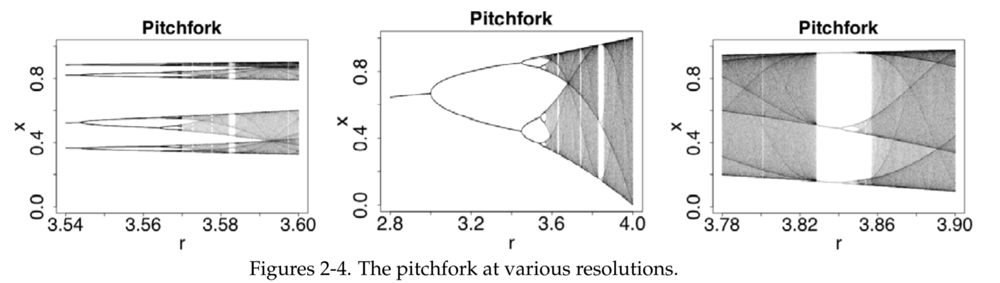
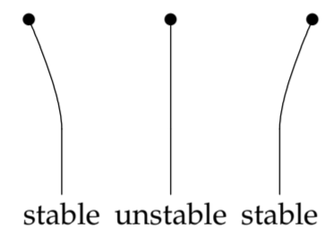
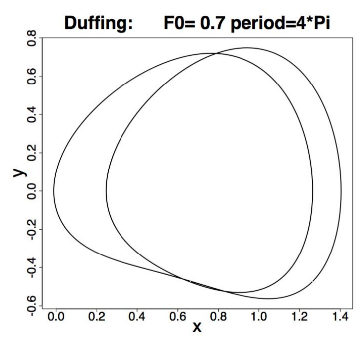
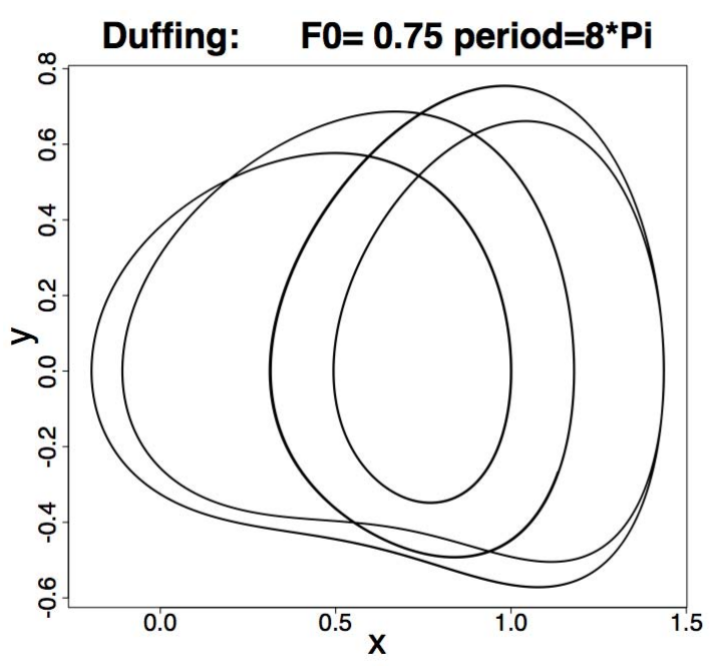
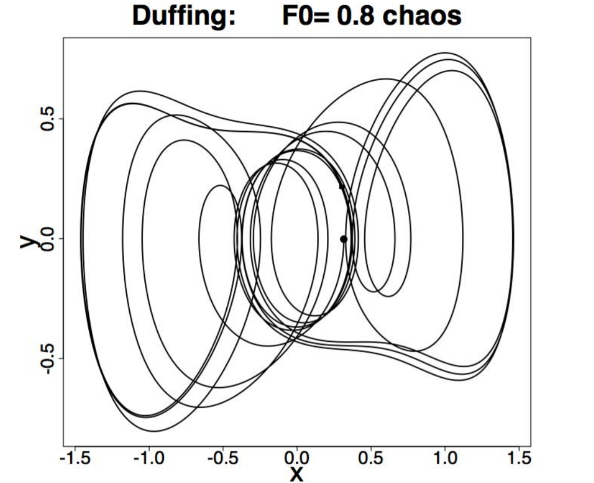
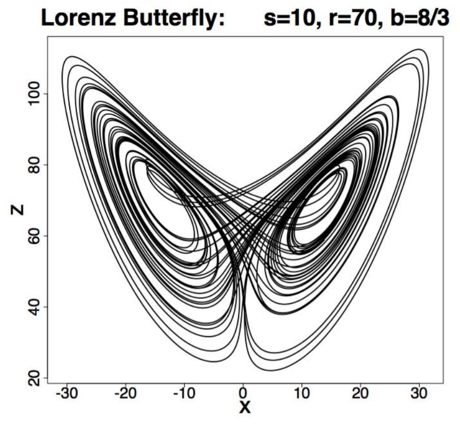

We give a very brief introduction to this subject using DE's as the starting point. The interested reader who wishes to explore this subject further will find many good sources on the web.

### Discrete Logistic Equation
The difference equation $x_{n+1} = rx_n(1 - x_n)$ ($r$ a constant) is the *discrete logistic equation*. One way it arises is as follows  
$\frac{dP}{dt}=aP-bP^2=$ model of logistic population growth.  
Euler's numerical method makes this a discrete system:
$$P_{n+1}=P_n+(aP_n-bP_n^2)h$$
Rewrite this as $P_{n+1}=rP_n-sP_n^2$.  
Let $P_n=\frac{r}{x}x_n \rightsquigarrow x_{n+1}=rx_n(1-x_n)$.  
Since $r = 1 + ah$ we will only consider $r > 1$.  
Given $r$ and $x_0$ iteration gives the sequence
$$x_0,x_1,x_2,\ldots,x_n\ldots$$
This is easy to implement on a computer: Figure 1 shows an $x$ vs. $r$ diagram. To make it we used the following recipe.  
  
1. We choose a value of $r$ and a starting point $x_0 = .5$.
2. We iterate out to $x_500$ in order to eliminate any transient behavior.
3. We then plot 1000 points $(r, x_n)$ for $n = 501 to 1500$.

The darker the plotted point the more times that we got that value of $x$.  
Look for, instance at the value $r = 1.5$. The only $x$ value plotted is the one at $x = .333$. This says that the iterated sequence $x_0, x_1,\ldots$ goes to a limit of .333. The values $r = 2$ and $r = 2.5$ behave similarly.  
At around $r = 3.1$ the diagram *bifurcates*. That is, it splits into two branches. What this means is that the value of $x_n$ is cycles back and forth between two values. In the case $r = 3.1$ we get
$$x_1001 = .5580, x_1002 = .7646, x_1003 = .5580,\ldots$$
We call this a period 2 cycle.  
As $r$ increases from 3.1 we continue to get period 2 cycles until around $r = 3.5$. At this point both branches of the diagram bifurcate and we see four values plotted. This means the values of $x_n$ are cycling between four values. This is called a cycle with period 4 (or a 4-cycle for short).  
This continues as $r$ increases until the next bifurcation point where we get cycles of period 8. As $r$ increases further, this period doubling continues to cycles of period 16, 32, etc.  
Then around $r = 3.57$ something new happens: the periodic behavior disappears and seemingly random behavior occurs. This is called chaos.  
At around $r = 3.83$ periodic behavior returns with cycles of period 3. As $r$ increases we again see period doubling with cycles of period 6, then 12, then 24 etc. until this leads to chaos again.  
After the chaotic region there is a value of $r$ where we see period 5­ cycles. This is followed by period doubling, leading to chaos again. Then 7-cycles followed by period doubling to chaos, etc.  

**Remarks:**
1. This period doubling to chaos is a phenomenon seen in many systems.
2. For any value of $r$ there are fixed points and, often points with other periods. The computer doesn't find them because they are not stable. In fact, there is a theorem that says if there is a point of period 3 then there are points of all orders.

### Feigenbaum constant
If $r_1$ = first bifurcation point, $r_2$ = second etc. then
$$\lim_{k \to \infty}\frac{r_k-r_{k-1}}{r_{k+1}-r_k}=4.6692\ldots = \bold{\text{ the Feigenbaum constant.}}$$
The same value occurs in many 'period doubling' systems.

### The forced Duffing Equation
Period doubling also happens in mechanical systems. If we apply a periodic force to the damped nonlinear spring we get the equation
$$mx''+cx'+ks+\beta x^3=F_0\cos \omega t$$
A mass atop a thin metal wire is modeled by this equation with $k < 0$.  
We look at the forced Duffing equation $x'' + x' - x + x^3 = F_0 \cos t$ and the equivalent nonlinear system
$$\begin{aligned}
x'&=y\\y'&=x-x^3-y+F_0\cos t
\end{aligned}$$
If $F_0 = 0$ (unforced) then there are 3 equilibrium points: $(0, 0)$ - unstable (saddle); $(\plusmn 1, 0)$ - stable (spiral sinks). These are shown in the pictures below.  
  
In a linear spring system the single critical point at the origin is stable and the frequency of the periodic response would equal $\omega$ (which in this case is 1) and doubling the amplitude of the input would simply double the amplitude of the output. In the Duffing system, the behavior is very different.  
The plots below were made by taking $x(0) = 1, x'(0) = 0$, running the ode solver for $t = 0$ to $200$, and plotting for $t = 100 \text{ to } 200$. (We throw away $t = 0 \text{ to } 100$ as transient.)  
Just like the discrete logistic equation, we see period doubling to chaos.  
  
  

### Lorenz Strange Attractor
This example is the Lorenz System. It is a 3 dimensional system
$$\begin{aligned}
x'&=-sx+sy\\
y'&=-xz+rx-y\\
z'&=xy-bz
\end{aligned}$$
where $s, r, b$ are constants.  
The following picture shows the famous 'butterfly'. (The plot should be three dimensional, showing $x, y$ and $z$. In this case we just plotted $z$ vs. $x$.) Like limit cycles or the periodic points in the pitchfork example this trajectory has a limiting set. That is. a set of points that are arbitrarily close to the trajectory for arbitrarily large $t$. In this case, it is called a **strange attractor** because it is such a complicated set.  

