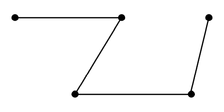
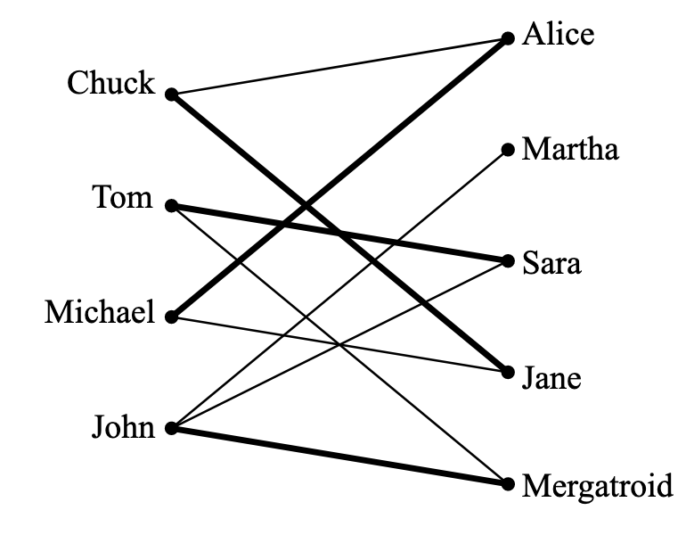
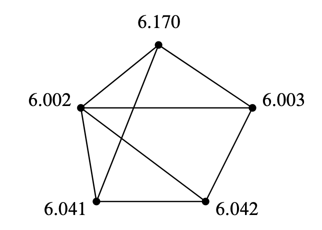
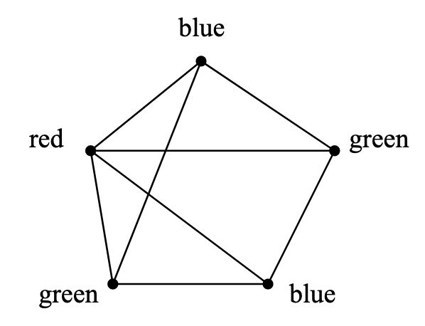

简单图(`simple graphs`)是对对称(`symmetric`)关系的建模，也就是说关系是相互的。比如婚姻关系、说同样的语言、说不同的关系、发生在重叠的时间区间、通过导线相连等等。在调度、约束问题、计算机图形学、通信等等方面都有很多应用，不过为了抓住大家的眼球，我们从专业的性行为调查来展开。准确的说是调查异性伴侣的个数。  
芝加哥大学(`University of Chicago`)的调查结果是男性的异性伴侣数比女性多74%。`ABC News`的结果比这个更夸张，男性平均有20个异性伴侣而女性平均有6个。纽约时报(`New York Times`)的结果是男性有7个女性有4个。你相信那个呢？  
本章的图论知识会告诉你这些调查距离真相都很远。

## Vertex Adjacency and Degrees
简单图的定义和有向图类似，除了边是无向的(`undirected`)，只是连接两点但没有方向。从$v$到$w$的有向边是$\langle v\to w\rangle$，而无向边的表示是$\langle v - w\rangle$。  
**Definition  12.1.1.** 一个简单图(`simple graph`)$G$包含一个非空集合$V(G)$，是$G$的顶点集合，和$E(G)$，是$G$的边的集合。$V(G)$每一个元素称为顶点(`vertex`)，$E(G)$每一个元素称为边(`edge`)。一条边有两个顶点$u\neq v$是其端点(`endpoints`)。这条边能用两个元素的集合$\{u,v\}$来表示。记号$\langle u - v\rangle$表示这条边。  
$\langle u - v\rangle$和$\langle v - u\rangle$表示的同一条边，其端点是$v$和$u$。

  
举个例子，令上图中的图是$H$，有9个点和8条边。  
点的集合$V(H)=\{a,b,c,d,e,f,g,h,i\}$  
边的集合$E(G)=\{\langle a - b\rangle,\langle a - c\rangle,\langle b - d\rangle,\langle c - e\rangle,\langle e - f\rangle,\langle c - d\rangle,\langle e - g\rangle,\langle h - i\rangle\}$

**Definition 12.1.2.** 简单图中两个顶点是邻接的(`adjacent`)当且仅当它们是同一条边的端点。这条边对每条边而言都是入射(`incident`)边。一个顶点$v$的入射边的数量称为度(`degree`)，记为$\deg(v)$。一个顶点的度等价于邻接点的个数。  
对于图$H$，$a$和$b$是邻接的，$b$是$d$的邻接点，边$\langle a - c\rangle$对于端点$a,c$都是入射边。$h$的度是1，$d$的度是2，$\deg(v)=3$。一个顶点的度可以是0，也就是说没有点和它相邻。一个简单图$G$可以一条边都没有，$|E(G)|=0$，也就是每个点的度都是0。不过简单图至少要有一个点，$|V(G)|$至少是1。  
简单图的两点之间的边数不能大于1，自循环(`self-loops`)（起点和终点是同一个点）也是不行的。  
本章说的图就是简单图。  

## Sexual Demographics in America
令$G$包含所有的的美国人，每个人是一个顶点$V$。我们将顶点分成两个子集$M,F$，前者包含所有的男人，后者包含所有的女人。如果两人是性伴侣，那么用一条边连接这连个点。如下图所示：  
  
每一条边的一个端点一定在$M$集合，另一个端点在$F$集合，所以
$$\sum_{x\in M}\deg(x)=\sum_{y\in F}\deg(y)$$
两边同时除以$|M|\cdot |F|$
$$\frac{\sum_{x\in M}\deg(x)}{|M|}\cdot\frac{1}{|F|}=\frac{\sum_{y\in F}\deg(y)}{|F|}\cdot\frac{1}{|M|}$$
等式左边第一项就是男性平均异性伴侣数，右边的第一项是女性平均异性伴侣数。所以
$$\text{Avg. deg in }M=\frac{|F|}{|M|}\text{Avg. deg in }F$$
那么男性和女性的一性伴侣数之比只取决于男女人数比。根据现有数据，$|F|/|M|$之比大约是1.035，也就是说，男性平均异性伴侣数比女性高3.5%，那么引言提到的调查结果都是不准确的。

### Handshaking Lemma
**Lemma 12.2.1.** 顶点的度之和是边数的两倍。  
**Proof.** 每一条边对顶点的度之和的贡献是2。

上面的引理称呼为握手定理(`Handshaking Lemma`)：一个聚会上每个人握手的次数之和是握手发生次数的两倍。

## Some Common Graphs
一些图出现的很频繁就给了命名了。完全图(`complete graph`)$K_n$有$n$个顶点，每两个顶点间都有一条边，共有$n(n-1)/2$条边。$K_5$如下图所示：  


空图(`empty graph`)表示没有任何边的图。五个顶点的空图如下图所示：  


包含$n$个顶点依序有$n-1$条边的图是线图(`line graph`)$L_n$。更正式的说，$L_n$有
$$V(L_n)=\{v_1,v_2,\cdots,v_n\}$$
$$E(L_n)=\{\langle v_1-v_2 \rangle,\langle v_2-v_2 \rangle,\cdots,\langle v_{n-1}-v_n \rangle\}$$
$L_5$如下图所示  
  
线图可以无穷长$L_\infty$，令顶点集合是非负整数集$\mathbb{N}$，那么边分别是$\langle k-(k+1) \rangle, k\in \mathbb{N}$。  
如果我们添加一条边$\langle v_n-v_1 \rangle$到图$L_n$，那么长度为$n$的环(`cycle`)$C_n$。长度为5的环如下图所示：  


## Isomorphism
两个图看起来不一样，但是某种形式上它们是相同的。比如下面两个图，都是有4个顶点和5条边，并且旋转$(a)$图90度就能得到$(b)$图。  


严格地讲，这些图是不同的数学上的对象，但是这种不同不能反映它们能被描述成同样的图片的事实——除了点的标签之外。  
**Definition 12.4.1.** 图$G$和$H$之间的同构是双射$f$：$V(G)\to V(H)$，对所有的$u,v\in V(G)$都有
$$\langle u-v \rangle \in E(G)\text{ IFF } \langle f(u)-f(v) \rangle \in E(G)$$
当两个图之间存在同构，那么这两个图是同构的(`isomorphic`)。  
上图中的两个图存在同构$f$：
$$f(a)=2,f(b)=3,f(c)=4,f(d)=1$$
两个同构的图可以画的差异很大，比如下图中的两个图都是$C_5$。  


如果$f$是$G$到$H$的同构，那么$f^{-1}$是$H$到$G$的同构。同构具有传递性。事实上，同构表示的是等价关系。  
同构保持的是图的连通性的属性。图的一个属性被称为同构保持(`preserved under isomorphism`)如果图$G$有该属性同时所有和$G$同构的图都有该属性。比如点的数量应该一样。点$v$和$f(v)$的度应该一样。如果一个图某个点的度是4，另一个图没有点的度是4，那么这两个图不可能是同构的。实际上，度4的点的个数不一样的话，也不可能是同构的。  
通过保持的属性很容易判断两个图不是同构，或者当同构存在时来指导如何找到。通常来讲，判断两个图是同构的也比较容易，但是，没有一个确定性的算法的时间复杂度是多项式时间。如果有这样的程序的话，很容易就能找到通过给定的分子键找到特殊的分子。  
同构的定义可以应用于无限图，同时本章剩余的大部分内容对无限图也是适用的。但是图论主要集中在对有限图的研究，本章也是。  
图论是对同构保持的属性的研究。

## Bipartite Graphs & Matchings
关于性行为调查的的例子中，所有的点分成了男女两类，且每条边都是从其中一类到另外一类。这样的图有个特殊的名字二分图(`bipartite graphs`)。

**Definition 12.5.1.** 一个二分图的顶点能够分成两个部分$L(G)$和$R(G)$，每条边的一个端点在$L(G)$另外一个端点在$R(G)$。

###  The Bipartite Matching Problem
假设有两个集合，一个男人的集合，一个大于等于男人集合人数的女人的集合。如果某个男的喜欢某个女的，那么两者之间就会有一条边。当前，这个喜欢是单向的，后面会考虑反向。下图是一个示例：  


一个匹配(`matching`)是指每一个男人都和一个女人配对，且不同的男人配对的是不同的女人。下图是其中一个例子：  


### The Matching Condition
`Hall's Matching Theorem`给出了二分图存在匹配的充要条件。  
为了证明这个定理，先定义一下被给定男人集合喜欢的女人集合中的每个女人至少被一个给定的男人集合的男人喜欢。比如男人集合是Tom和John，那么女人集合就是Martha，Sara和Mergatroid。  
匹配条件(`The Matching Condition`)：每一个男人的子集所喜欢的女人的集合至少和该子集一样大。  
举个例子：四个男人组成的集合，喜欢的女人数量是三个，显然不存在匹配。定理告诉我们这个必要条件是充分的，也就是说，匹配条件成立的话，那么该二分图肯定存在一个匹配。

**Theorem 12.5.2.** 对于一个男人集合$M$和女人合计$W$，存在一个匹配，当且仅当匹配条件成立。  
**Proof.** 上述的反例已经证明匹配条件不成立则匹配不存在，那么其逆否命题匹配存在则匹配条件成立也是成立的。下面用归纳法来证明匹配条件成立那么存在匹配。  
基础：$|M|=1$，匹配条件蕴含着这个男人至少喜欢一个女人，显然匹配存在。假设对于$|M|=m\geq 1$都是成立的，现在考虑$|M|=m+1\geq 2$的情况。  
(1) 对于所有至多有$m$个男人的非空子集，都严格地比对应女人的集合要大。显然，我们任意匹配一个男人和他喜欢的女人，那么移除他俩之后剩余的$m$个男人集合和对应的女人集合满足匹配条件，对应的匹配加上新加的一条边，构成了新的匹配。  
(2) 有一些至多有$m$个男人的集合$X$，和其对应的女人集合$Y$一样大。根据递归假设，$X$和$Y$之间存在匹配，那么问题变成了在$M-X$和$W-Y$上找到一个匹配。  
如果存在某个$M_0\subseteq M-X$，对应的女人集合$W_0\subseteq W-Y$人数更少，那么就有$M_0\cup X$的人数小于$W_0\cup Y$的人数，这违背假设。那么不存在某个$M_0$。所以$M-X$和$W-Y$之间的关系也是满足匹配条件的，那么根据递归假设，$M-X$和$W-Y$也存在匹配。

**Theorem 12.5.2**的证明过程给出了一个不高效的寻找匹配的算法。事实上，存在高效的寻找匹配的算法，所以如果一个问题能够转化为在二分图上找匹配这个已知问题的话，那么就能高效地处理了。

下面是匹配和`Hall's Theorem`的正式定义。  
**Definition 12.5.3.** 图$G$的匹配是一个边的集合$M\subseteq E(G)$没有两条边入射到同一个顶点。$M$的边的顶点成为被$M$覆盖(`covered`)。如果一个匹配覆盖了$V(G)$，那么成为完美匹配(`perfect`)。令$N(S)$是某个$S\subseteq V(G)$的邻接点(`neighbors`)集合，即
$$N(S)=\{r|\langle s—r\rangle \in E(G)\text{ for some } s\in S\}$$
$S$被称为瓶颈(`bottleneck`)如果
$$|S|>|N(S)|$$

**Theorem 12.5.4(`Hall's Theorem`).** $G$是二分图。存在一个匹配覆盖$L(G)$等价于$L(G)$的任意子集都不是瓶颈。

二分图的匹配条件要求每一个子集都要满足这个条件。但是子集的个数增长是指数级的，很快就不适用了。有一个关于顶点的度的属性就能确保二分图存在一个匹配。如果左半边的度至少和右半边的度一样大，那么称为度受限(`degree-constrained`)的二分图。  
**Definition 12.5.5.** 一个二分图$G$是度受限的如果有一个整数$d\geq 1$对于所有$l\in L(G),r\in R(G)$都有
$$\deg(l)\geq l\geq\deg(r)$$
**Theorem  12.5.6.** 如果$G$是度受限的二分图，那么存在一个匹配覆盖$L(G)$。  
**Proof** 令$S$是$L(G)$的一个子集，需要证明$S$满足`Hall's condition`：
$$|N|(S)\geq |S|$$
令$D_S$是端点在$S$中的边的集合，由于$S$中的点的度最小是$d$，那么
$$|D_S|\geq d|S|$$
$D_S$的另一个端点在$N(S)$中，而$N(S)$中的点的度最大是$d$，那么
$$d|N(S)|\geq |D_S|$$
所以
$$d|N(S)|\geq d|S|$$
$$|N(S)|\geq |S|$$

如果一个图所有点的度都一样，那么该图是规则的(`regular`)。根据定义，二分规则图满足上面描述的度受限图，所以存在一个完美匹配。

## Coloring
之前我们用边来表示喜欢的关系，下面的例子是表示冲突。

### An Exam Scheduling Problem
MIT教务处要安排考试，显然，不能让同一个学生选择的两门课程放在同一个时间考试，同时，不能一门课一门课的考试，时间太长了。要在尽可能短的时间内排除考试安排，同时保证没有冲突。  
这个问题可以用图来描述，点表示课程，如果有学生同时选择某两门课，则这两门课（点）之间用一条边连起来。下图是一个示例：  
  
接下来我们使用颜色来表示时间槽。比如红色表示星期一上午，蓝色表示星期一下午，绿色表示星期二上午等等。那么冲突就表示成同一条边的两个顶点不能是同一个颜色的，上述应用问题就转化为用尽可能少的颜色来填满整个图。下图是某种染色的例子。  
  
能比三种颜色更少吗？不能。因为图中有个三角形，必须用三种颜色。  
上述就是一个图染色(`graph coloring`)问题：给定一个图$G$，每个点都图一种颜色，合理染色是要保证一条边的两个顶点是不同颜色。可$k$染色($k$-`colorable`)图表示染色最多使用$k$个颜色。  
**Definition 12.6.1.** 图$G$的合理染色的数目最小值被称为染色数(`chromatic number`)，$\chi(G)$。  
可$k$染色图等价于$\chi(G)\leq k$。

### Some Coloring Bounds
有一些简单的属性能够给出染色数的限制。  
最简单的属性是环：偶数长度的环染色数是2，奇数长度的环染色数是3。  
$$\chi(C_{\text{even}})=2$$
$$\chi(C_{\text{odd}})=3$$
完全图$K_n$的染色数是$n$，因为任意两个点都是连接的，不能是同一个颜色。
$$\chi(K_n)=n$$

二分图和染色问题也是有联系的。二分图可以用两种颜色进行染色，左边的集合用一种颜色，右边的集合用另一种颜色；反之，可以根据两种颜色将点集分成两个子集。  
空图没有边，染色书是1，将所有顶点都用一种颜色来进行染色。  
**Lemma 12.6.2.** 非空图$G$是二分图等价于$\chi(G)=2$。

**Theorem 12.6.3.** 一个图的度的最大值是$n$，那么是可$n+1$染色的。  
**Proof** 我们固定$n$，对顶点数$k$进行递归。  
$k=1$时，度是0，染色数是1，命题$P(1)$成立。  
假设命题$P(k)$成立，现在考虑有$k+1$个顶点的图$G$，其度的最大值是$n$。删除一个顶点$v$和相连的边，得到$k$个顶点的图$H$，其度的最大值仍旧是$n$，根据递归假设，图$H$是可$n+1$染色的。  
现在把点$v$加回来，由于$\deg{v}\leq n$，但是有$n+1$个颜色，那么能够选择一个和相邻节点都不同的颜色染色即可。颜色的种类不变，那么$G$是可$n+1$染色的。

这个理论给出的是上限。比如一个图是$K_{n+1}$或者$K_{n+1}$是其子图，那么就必须需要$n$种颜色。但是下图只需要两种颜色就好了，但是度却比较大（相较于颜色的种类）。  


## Walks in Simple Graphs
### Walks, Paths, Cycles
简单图的走(`Walk`)和路径(`Path`)的定义和有向图类似。  
**Definition 12.7.1.** 简单图中的`walk`是指从某点开始走到某个点，包含中间的边。`walk`的长度指的是边的个数。所以`walk`$v$可以记作
$$v=v_0\langle v_0-v_1\rangle v_1\cdots v_{k-1}\langle v_{k-1}-v_k\rangle v_k$$
其中$\langle v_i-v_{i+1}\rangle\in E(G),i\in[0,k)$。这个`walk`从$v_0$开始，终点是$v_k$，其长度$|v|$是$k$。`walk`是一个路径等价于所有的顶点都是不同的，也就是对于$i\neq j,v_i\neq v_j$。  
`walk`的起点和终点是同一个点的话那么是`closed walk`。单独一个点是长度为0的`closed walk`，也是长度为0的路径。  
环(`cycle`)是长度大于等于3、且除了起点和终点外都是不同点的`closed walk`。  
和有向图不同的是，我们不把长度为2的`closed walk`作为作为环，因为在简单图中离开某个点再回来不重要，对此也不感兴趣。简单图也不包含长度为1的`closed walk`因为简单图没有自循环。  
在有向图中，`walk`的长度是边的数量，比顶点数少一。简单图也是类似的。下图有长度为6的路径$abcdefg$，也是最长路径。还包含三个环，分别是$bhecb,cdec,bcdehb$。  


### Cycles as Subgraphs
对于环，我们不去别起点。例如上图中的环$bcdehb$也可以表示成$dehbcd$，同时不关心方向，那么起点$d$的环也可以表示成$dcbhed$。可将环定义为与环图$C_n$同构的子图(`subgraph`)。  
**Definition 12.7.2.** 如果$V(G)\subseteq V(H),E(G)\subseteq E(H)$，那么图$G$是图$H$的子图。  
任意$n$个顶点的空图是$L_n$的的子图，同样地，$L_n$是$C_n$的子图，$C_n$是$K_n$的子图。  
**Definition 12.7.3.** 对于$n\geq 3$，$C_n$有顶点$[0,n)$和边
$$\langle0-1 \rangle,\langle1-2\rangle,\cdots\langle(n-2)-(n-1)\rangle,\langle(n-1)-0\rangle$$
$G$的环是$G$的子图，且同构于$C_n,n\geq 3$。

## Connectivity
**Definition 12.8.1.** 如果两个点之间有一条路径，那么这两点是连通的。习惯上，每个点和自身都是连通的，因为有长度为0的路径。如果一个图的任意两点都是连通的，那么该图是连通的。

### Connected Components
连通性是很好的性质，因为任意两点都是连通的。但是不是所有图都有这个性质。比如北美的城市都是连通的，但是它们和澳大利亚的城市就不连通。再比如有的网络（政府网络、研究病毒的机房）和互联网也不是连通的。  
下图是一个图，但是看起来是三个图，每一部分本身是连通的，但是各个部分之间不连通。一个图的各个连通的部分称为连通分量(`connected components`)。  
  
**Definition 12.8.2.** 一个图的连通分量是由一些点和连接这些点的一些边组成的子图。  
一个图是连通的等价于只有一个连通分量。另一个极端情况是一个$n$个点的图包含$n$个连通分量，每一个连通分量包含一个孤立的点。

### Odd Cycles and 2-Colorability
确定染色数是很有挑战性的事情，但是2染色问题相对比较简单。  
**Theorem 12.8.3.** 以下三个属性是等价的：
1. 包含奇数长度的循环
2. 不是2染色图
3. 包含奇数长度的`closed walk`

也就是说一个图满足上述任意一个属性，也满足其他属性。我们通过证明1蕴含2，2蕴含3，3蕴含1来证明它们之间的等价性。  
1蕴含2：之前有说明，略过。  
2蕴含3：我们可以假设图是连通的，非连通图由多个连通分量组成，不影响命题的成立。  
令$r$是图$G$的任意一点，对其他任意一点$u$存在一个`walk`$w_u$从$u$开始，结束于$r$。对图进行染色
$$\text{color}(u)=\begin{cases}
\text{black}&\text{ if }|w_u|\text{ is even}\\
\text{white}&\text{ otherwise}
\end{cases}$$
由于图$G$不能用两种颜色进行染色，那么一定存在两个相连的点$u,v$是相同颜色的，那么
$$w_u\hat{\text{ }}\text{reverse}(w_v)\hat{\text{ }}\langle v-u\rangle$$
是一个`closed walk`，其长度
$$|w_u|+|w_v|+1$$
是奇数。  
3蕴含2：存在奇数长度的`closed walk`，那么一定存在最短的一个，不妨设为$w$。我们用反证法证明$w$是一个环。那么除了起始点$x$和终点有重合外，还可能会有重合的点。第一种情况，额外的重合点就是起点，那么有两个`walk`都是从起点出发回到起点
$$w=f\hat{x}r$$
又因为
$$|w|=|f|+|r|$$
，$w$的长度是奇数，那么$f,r$必有一个奇数，那么和假设$w$是最短的矛盾。  
第二种情况是重合点不是起点，那么
$$w=f\hat{y}g\hat{y}r$$
，其中$y\neq x$。$g$不是是奇数长度，否则出现了长度小于$w$的`closed walk`。那么$$f\hat{y}r$是奇数长度的`closed walk`，比$w$短，也和假设矛盾。

## Special Walks and Tours
### Euler Tours
你能走遍艺术博物馆的每一个门厅一次吗？门厅用顶点表示，如果联通就增加一条边，那么下图是一个可能的示例：  
  
这个问题最早起源于十七世纪的七桥问题。  
欧拉回路(`Euler tour`)是每条边只包走一次的`closed walk`。

**Theorem 12.9.1.** 一个连通图有欧拉回路等价于每个点的度都是偶数。  
习题`12.43`引导大家给出一个证明。

如果存在一个`walk`不是欧拉回路（起点和终点不一样）也是每条边都只走一次等价于恰好有两个点的度是奇数，其他点的度均为偶数。上图是满足这个条件的图。

### Hamiltonian Cycles
**Definition 12.9.2.** 哈密顿回路(`Hamiltonian cycle`)是一个访问了图$G$中的每个点一次的环。类似的，哈密顿路径(`Hamiltonian path`)是访问每个点一次的路径。  
虽然哈密顿回路和欧拉回路有点像，把边换成了点，但是找到哈密顿回路是一个难得多的问题。至今还没有找到一个简单的特征来判断一个图是否有哈密顿回路；同时，也没有高效的算法来判断这一点。

### The Traveling Salesperson Problem
考虑这样一个例子，城市表示点，城市之间的距离表示边的权重，如何遍历所有的点并且距离最短呢？仿佛找到哈密顿回路还不足够苦难，还要额外增加边的权重这个参数。遍历每个点且使得边的权重的和最小化(`minimum possible sum`)，这就是旅行商人问题。  
你能找到下图中一个权重之和等于15的哈密顿回路吗？  
  
> 试了半天没找到。。。

## $k$-connected Graphs
考虑一个电话网或者输油管道、电网抽象出来的图，我们不仅仅需要研究连通性，还需要关心某些分量失败时的连通性。一个表示连通强度的衡量标准是是在两点不相互连接之前，可以有多少连接失效。如果两个点之间需要$k$个边失败才断连，那么这两点是$k$边连通的(`$k$-edge connected`)。  
**Definition 12.10.1.** 当两个点在图任意去掉$k-1$条边的子图中都是连通的，那么该两点成为$k$边连通。一个图的任意两个点都是$k$边连通的话，那么这个图是$k$边连通的。  
下面会简称为$k$连通。  
图`12.14`中的$c,e$是3连通，$b,e$是2连通，$g,e$是1连通，没有两个点是4连通。所以这个图是1连通的。完全图$K_n$是$k-1$连通的，任意环是2连通的。  
边缘边（或称为桥，更通用）(`cut edge`)的概念能够很好的解释2连通性。  
**Definition 12.10.2.** 如果两个点是连通的，但是移除边$e$之后就不连通了，那么边$e$就是桥。

**Lemma 12.10.3.** 一条边是桥，当且仅当它不在任意环上。

如果两点有$k$个边不相交的路径（没有边出现在两条路径）连接，那么这两点是$k$连通的；根据`Menger's`定理，反之也是成立的。

### The Minimum Number of Edges in a Connected Graph
**Theorem 12.10.4.** 任意图$G$至少有$|V(G)|-|E(G)|$个连通分量。  
**Proof.** 这个定理包含了一个隐含条件，就是边的数量少于顶点的数量。  
基于边数$k$进行递归证明。命题$P(k)$如下  
有$k$条边的图$G$至少有$|V(G)|-k$个连通分量。  
$k=0$时，图$G$一条边都没有，那么每个点都是一个单独的连通分量，那么连通分量数是$|V(G)|=|V(G)|-0$，所以$P(0)$是成立的。  
现在考虑$P(k+1)$。从图$G$移除一条边$e$得到图$G_e$，根据递归假设，图$G_e$有$|V(G)|-k$个连通分量。现在将$e$添加回来。如果边$e$的两个端点在图$G_e$的某个连通分量，那么图$G$有$V|(G)|-k$个连通分量，大于$|V(G)|-(k+1)$。如果边$e$的两个顶点在图$G_e$里面分别在不同连通分量，那么通过边$e$将两个不连通的部分变得连通了，那么连通分量数少了一个，即$|V(G)|-k-1=|V(G)|-(k+1)$。两种情况，都至少有$|V(G)|-(k+1)$个连通分量。

**Corollary 12.10.5.** 任意$n$个顶点的连通图至少有$n-1$条边。

上面定理的证明是基于图的边数进行递归，这种方法和基于图的顶点数进行递归一样，都是图论中常用的证明方法。  
在证明$k+1$的情况时，我们先减小，再增加，看似是不需要的。对于这个证明，可以直接从$k$到$k+1$，但是对于有些命题，先减小再增加是非常必要的。习题40是一个很好的例子。

## Forests & Trees
**Definition 12.11.1.** 无环图被称为森林(`forest`)。连通无环图被称为树(`tree`)。

下图是一个森林，每个连通分量是一个树。  


### Leaves, Parents & Children
**Definition 12.11.2.** 森林中度为1的结点被称为叶子(`leaf`)。

上图有4个叶子，下图有5个叶子。  


### Tree Properties
**Theorem 12.11.3.** 每棵树都有一下属性：
1. 每一个连通子图都是树；
2. 任意两点之前有唯一的一条路径；
3. 在不相邻的两个结点之间加一条边，会形成一个环；
4. 移除任意边会导致树不连通，也就是说，任意边都是桥；
5. 如果一个树至少有两个顶点，那么至少有两个叶子结点；
6. 树的顶点数比边数大一。

**Proof**
1. 子图的环在全图中也是环，逆否命题，那么全图无环则子图无环，又因为其是连通的，那么根据定义，其是树。
2. 树是连通的，那么任意两点之间必然有路径。假设不止一条路径，选择最短的两条不同路径$p,q$，那么$|p|+|q|$最小。再假定两条路径除了起点和终点外还有另外一点$w$是公共顶点，那么取从起点到$w$的两个路径的部分，或者从$w$到终点的两个路径的部分，能够找到更短路径，那么这样的$w$不存在，那么$p\hat{\text{ }}\text{reverse}(q)$是环。
3. 增加的边$\langle u - v \rangle$和$u,v$之间唯一的路径组成了环。
4. 假设移除边$\langle u - v \rangle$。$u,v$之间的路径肯定包含边$\langle u - v \rangle$，移除之后路径就不存在了，破环了连通性。
5. 找到最长的路径，其两端分别是$u,v$。下面证明$u$是叶子结点。终点的意思就是只有一条入射边在最长的路径上，如果$u$不只一条入射边，那么这条路径就能扩展到更长，所以$u$只能有一条入射边，即其实叶子结点。$v$同理。
6. 命题是说$n$个顶点的树有$n-1$条边。1个顶点，那么没有边，命题成立。假设$n$时成立，考虑$n+1$。找到某个叶子结点$v$，删除该点和连接的边，那么还是一个树，根据递归假设，有$n-1$条边，现在把删除的顶点和边加回来，显然有$n$条边。

**Lemma 12.11.4.** 图$G$是树等价于$G$是森林且$V(G)=E(G)+1$。

### Spanning Trees
树无处不在。任意一个连通图总包含着顶点一样的树。这样的树被称为生成树(`spanning tree`)。下图是一个连通图和生成树（加粗）。  


**Definition 12.11.5.** 图$G$的生成子图是包含图$G$的所有顶点的子图。

**Theorem 12.11.6.** 每一个连通图都包含生成树。  
**Proof.** 图$G$自身也是一个连通的生成子图，根据良序原理，一定存在一个边最少的连通的生成子图$T$。  
假设$T$有一个环$C$，根据Lemma 12.10.3，环上的边$e$不是桥，那么删除边$e$不会影响连通性，那么$T$不是边最少的生成子图，所以$T$不能有环，根据定义，无环连通，那么$T$就是一个树，即图$G$的生成树。

### Minimum-Weight Spanning Trees
对于加权图(`weighted  graphs`)而言，其生成树问题是很重要的。加权图的权重之和被称为图的权重(`weight`)。下图展示了一个权重为19的生成树。  


一个通用的问题是找到权重最小的生成树 - 最小生成树(`minimum-weight spanning tree`)(`MST`)。  
上图的左边不是最小生成树，下图是权重17的生成树，它是最小生成树，但是如何证明呢？一般地，如何找到最小生成树？枚举所有的生成树显然不可行，因为图大的话可能的生成树数量太大。  
  
本节其余部分，图$G$是连通加权图。我们会给出一种简单的通用的方式来找到图$G$的最小生成树。

**Definition 12.11.7.** 简单图$G$的黑白染色(`black-white coloring`)将$G$的点分成黑色和白色两个部分。如果两点颜色不同，那么这两点之间的边是灰边(`gray edge`)。  
**Lemma 12.11.8.** 如果$G$是连通图，那么$G$的每一种黑白染色都包含灰边。  
**Proof.** 图$G$是连通的，那么肯定有一条路径，起点是黑色的，终点是白色的，那么这条路径上肯定有一条边，其两个端点是一黑一白的。

加权图$G$的某些边的权重相等这是很常见的，但是后续的证明会基于权重都不相同来进行。这不会损失一般性，对于权重相同的边，我们可以任意给它们分配不同的权重。

**Lemma 12.11.9(Gray Edge Lemma).** 对于连通图$G$的任意黑白染色，灰边中权重最小的边一定是$G$的最小生成树的边。  
找到图$G$的最小生成树就是要找到足够多的最小权重灰边来组成生成树。我们使用
```
最小权重灰边过程
```
来找到最小生成树。  
我们从移除了$G$的所有的边的不连通森林开始。假设$S$是一个某一步生成的森林。如果$S$是不连通的，那么选取一种$G$的黑白染色，其恰好对于$S$的连通分量的所有点都是同一种颜色，然后选择权重最小的灰边加入$S$。直至$S$变得是连通的。

**Theorem 12.11.10.** 最小权重灰边过程会终止并生成最小生成树。  
**Proof** 假设$G$有$n$个顶点，$S$是整个过程中任意一个时刻的最小生成森林。如果$S$不是连通的，那么黑白染色方法选取是$S$内的边的端点都是同色的，那么$S$内部是没有灰边的。  
根据Lemma 12.11.8，一定有灰边，那么肯定有权重最小的灰边。将其加入到$S$，经过$n-1$步，$S$是连通的，是一棵生成树$T$。  
又根据Lemma 12.11.9，$T$的每一条边都在$G$的最小生成树中，这说明所有的最小生成树都和$T$有着一样的边也就是说，都等于$T$。所以$T$是$G$独一无二的最小生成树。

**Corollary 12.11.11.** 各边权重不同的连通图$G$有唯一的最小生成树。

下面说几种不同的最小权重灰边过程。  
**Algorithm 1. *[Prim]*** 添加权重最小的有且只有一个端点属于$S$的边到$S$中。  
这个过程等价到最小权重灰边过程就是所有属于$S$的点是黑色，所有不属于$S$的点是白色，这样灰边就有且只有一个端点属于$S$。  
**Algorithm 2. *[Kruskal]*** 添加权重最小的且使得$S$不形成环的边到$S$中。  
不形成环等价于连接两个不同的连通分量。这个算法是相当于把不同的连通分量染成不同的颜色。  
下面是一个比算法1更灵活的算法。  
**Algorithm 3.** 任意挑选一个连通分量，添加到离开这个连通分量的权重最小的边到$S$中。  
这个算法使得各个连通分量可以并行的独立的增长。在分布式计算中是很有用的。

**Lemma 12.11.12. *[Gray Edge Swap]*** 令$G$是连通加权图，边$e$是$G$的某种黑白染色的最小权重灰边。假设$C$是$G$的生成子图，但$e$不是$C$的一条边，那么$C$中存在一条边$g$满足
* $weight(e)<weight(g)$
* $C-g+c$是连通的  

**Proof.** 由于$C$是连通生成子图，那么在$C$中存在一条路径$p$，连接了$e$的两端，$e$是灰边，两端颜色不同，那么$p$中存在一条边是灰边$g\neq c$。由于$e$是最小权重灰边，那么显然$weight(e)<weight(g)$。  
$p+e$形成了一个环，移除$g$，$g$的两个端点仍旧被环的其余部分连接着，所有$C-g+c$是连通的。
